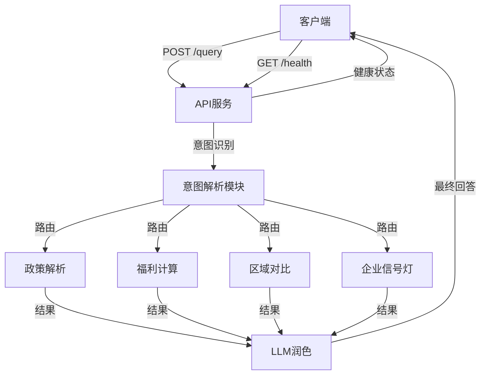
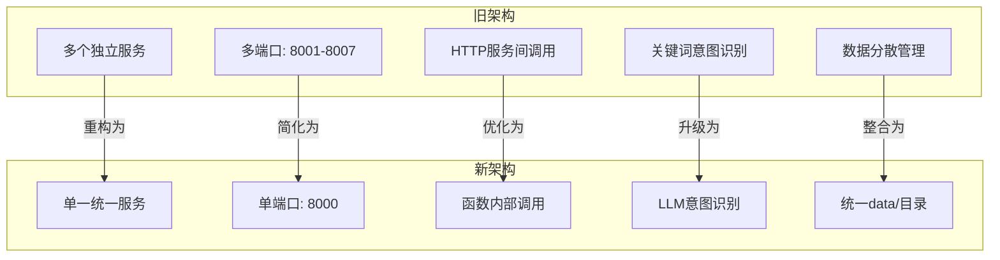

# API参考

<cite>
**本文档引用的文件**  
- [app.py](file://app.py)
- [workflows/intent_parser.py](file://workflows/intent_parser.py)
- [workflows/policy_parser.py](file://workflows/policy_parser.py)
- [workflows/welfare_calculator.py](file://workflows/welfare_calculator.py)
- [workflows/regional_comparator.py](file://workflows/regional_comparator.py)
- [workflows/company_signal.py](file://workflows/company_signal.py)
- [workflows/llm_writer.py](file://workflows/llm_writer.py)
- [test_query.py](file://test_query.py)
- [test_service.py](file://test_service.py)
- [重构完成说明.md](file://重构完成说明.md)
- [新架构说明.md](file://新架构说明.md)
</cite>

## 目录
1. [简介](#简介)
2. [核心API端点](#核心api端点)
3. [POST /query 接口详细说明](#post-query-接口详细说明)
4. [GET /health 健康检查接口](#get-health-健康检查接口)
5. [新旧架构对比](#新旧架构对比)
6. [请求/响应示例](#请求响应示例)
7. [认证与安全](#认证与安全)
8. [错误处理](#错误处理)
9. [集成建议](#集成建议)

## 简介

本API参考文档详细描述了"泉策通智能体服务"对外暴露的公共接口。该服务是一个基于大模型的政策咨询智能体，能够处理政策解析、福利计算、区域对比和企业投资信号分析等复杂查询。系统采用FastAPI框架构建，提供统一的RESTful接口。

服务主要包含两个核心端点：
- `POST /query`：主查询接口，用于提交用户问题并获取结构化响应
- `GET /health`：健康检查接口，用于验证服务运行状态

系统通过LLM驱动的意图识别，将用户查询路由到不同的工作流模块，并最终生成自然语言回答。

**本节来源**  
- [app.py](file://app.py#L1-L155)

## 核心API端点

### 统一查询接口
- **HTTP方法**: POST
- **URL路径**: `/query`
- **内容类型**: `application/json`
- **功能**: 接收用户查询，进行意图识别，执行相应工作流，并返回结构化结果和自然语言回答

### 健康检查接口
- **HTTP方法**: GET
- **URL路径**: `/health`
- **功能**: 返回服务健康状态，用于监控和运维



**图示来源**  
- [app.py](file://app.py#L37-L110)
- [workflows/intent_parser.py](file://workflows/intent_parser.py#L16-L124)

## POST /query 接口详细说明

### 请求规范

#### 请求头
- `Content-Type: application/json`（必需）

#### 请求体 (JSON Schema)
```json
{
  "query": "string",
  "user_context": "object"
}
```

**字段说明**：
- `query` (string, 必需): 用户的自然语言查询文本
- `user_context` (object, 可选): 用户上下文信息，用于多轮对话

**本节来源**  
- [app.py](file://app.py#L19-L35)

### 响应规范

#### 成功响应 (200 OK)
返回 `QueryResponse` 对象，包含以下字段：

| 字段 | 类型 | 说明 |
|------|------|------|
| `success` | boolean | 操作是否成功 |
| `intent` | string | 识别的意图类型 |
| `raw_text` | string | 原始查询文本 |
| `entities` | object | 提取的实体信息 |
| `result` | object | 工作流执行结果 |
| `final_answer` | string | LLM生成的最终回答 |
| `citations` | string | 引用的政策来源 |
| `error` | string | 错误信息（仅在失败时存在） |

#### 意图类型
系统支持四种主要意图：
- `policy_parse`: 政策智能解析
- `personal_welfare`: 个人福利计算
- `regional_compare`: 区域政策对比
- `investment_signal`: 企业投资信号灯

#### 实体信息
意图解析模块会提取以下实体：
- `location`: 地点（如济南、青岛）
- `product`: 产品类型（如空调、手机）
- `company`: 公司名称
- `industry`: 行业分类
- `time`: 时间范围
- `price_paid`: 购买价格
- `energy_efficiency_level`: 能效等级

**本节来源**  
- [app.py](file://app.py#L25-L35)
- [workflows/intent_parser.py](file://workflows/intent_parser.py#L21-L30)

## GET /health 健康检查接口

### 请求规范
- **HTTP方法**: GET
- **URL路径**: `/health`
- **请求头**: 无特殊要求
- **请求体**: 无

### 响应规范
返回JSON对象，包含服务状态信息：

```json
{
  "status": "ok",
  "service": "泉策通智能体",
  "version": "2.0"
}
```

**字段说明**：
- `status`: 服务状态（"ok"表示正常）
- `service`: 服务名称
- `version`: 服务版本号

此接口可用于：
- 服务健康监控
- 负载均衡健康检查
- 部署验证

**本节来源**  
- [app.py](file://app.py#L130-L137)

## 新旧架构对比

系统从旧架构升级到新架构，主要变化如下：



**详细对比**：

| 对比项 | 旧架构 | 新架构 |
|--------|--------|--------|
| 服务数量 | 7个独立服务 | 1个统一服务 |
| 端口数量 | 8001-8007 | 8000 |
| 意图识别 | 关键词匹配 | 大模型（LLM）驱动 |
| 数据管理 | 散落根目录 | 统一data/目录 |
| 节点调用 | HTTP请求 | 函数调用 |
| 输出格式 | 嵌套字典 | 扁平JSON |
| 启动复杂度 | 需启动7个服务 | 启动1个服务 |
| 响应延迟 | 高（多次HTTP） | 低（函数调用） |

**优势**：
1. **简化部署**: 只需管理一个服务实例
2. **降低延迟**: 消除服务间HTTP调用开销
3. **提高可靠性**: 减少网络依赖
4. **易于维护**: 统一代码库和配置

**本节来源**  
- [重构完成说明.md](file://重构完成说明.md#L171-L183)
- [app.py](file://app.py#L1-L155)

## 请求/响应示例

### 示例1: 政策解析
**请求**：
```json
{
  "query": "济南市2025年家电以旧换新政策是什么？"
}
```

**响应**：
```json
{
  "success": true,
  "intent": "policy_parse",
  "raw_text": "济南市2025年家电以旧换新政策是什么？",
  "entities": {
    "location": "济南",
    "product": "家电",
    "industry": "appliance",
    "time": "2025年"
  },
  "result": {
    "policy_title": "济南市推动消费品以旧换新实施方案",
    "benefit_type": "以旧换新补贴",
    "benefit_amount": "最高2000元",
    "region": "济南",
    "effective_period": "2025-01-01 至 2025-12-31",
    "conditions": "购买一级能效家电，旧家电需回收",
    "procedures": "线上申请，提供购买凭证",
    "required_materials": "身份证、购买发票、旧家电回收证明",
    "claiming_platform": "泉城消费平台"
  },
  "final_answer": "根据济南市2025年家电以旧换新政策...",
  "citations": "济南市商务局等17部门关于印发《济南市推动消费品以旧换新实施方案》的通知"
}
```

### 示例2: 福利计算
**请求**：
```json
{
  "query": "在济南买了3000元的空调，能领多少补贴？"
}
```

**响应**：
```json
{
  "success": true,
  "intent": "personal_welfare",
  "raw_text": "在济南买了3000元的空调，能领多少补贴？",
  "entities": {
    "location": "济南",
    "product": "空调",
    "industry": "appliance",
    "price_paid": 3000
  },
  "result": {
    "subsidy_amount": 600,
    "subsidy_breakdown": "基础补贴15%: 450元; 以旧换新5%: 150元",
    "total_benefit": 600,
    "constraints": "需提供旧家电回收证明",
    "required_materials": "身份证、购买发票、旧家电回收证明",
    "claiming_platform": "泉城消费平台"
  },
  "final_answer": "您在济南购买3000元的空调...",
  "citations": "济南市2025年家电以旧换新补贴活动公告"
}
```

### 示例3: 区域对比
**请求**：
```json
{
  "query": "济南和青岛的手机购买补贴政策对比"
}
```

**响应**：
```json
{
  "success": true,
  "intent": "regional_compare",
  "raw_text": "济南和青岛的手机购买补贴政策对比",
  "entities": {
    "location": "济南|青岛",
    "product": "手机",
    "industry": "digital"
  },
  "result": {
    "regions_compared": ["济南", "青岛"],
    "comparison_table": [
      {
        "region": "济南",
        "policy_title": "济南市手机购新补贴",
        "benefit_amount": "最高500元",
        "conditions": "购买指定品牌手机",
        "claiming_platform": "泉城消费平台"
      },
      {
        "region": "青岛",
        "policy_title": "青岛市数码产品补贴",
        "benefit_amount": "最高800元",
        "conditions": "购买5G手机",
        "claiming_platform": "青岛消费券平台"
      }
    ],
    "summary": "青岛补贴力度更大，济南限制条件较少"
  },
  "final_answer": "济南和青岛的手机购买补贴政策对比如下...",
  "citations": "济南市2025年手机购新补贴活动公告|青岛市数码产品补贴政策"
}
```

### 示例4: 企业信号灯
**请求**：
```json
{
  "query": "家电行业有哪些值得招商的企业？"
}
```

**响应**：
```json
{
  "success": true,
  "intent": "investment_signal",
  "raw_text": "家电行业有哪些值得招商的企业？",
  "entities": {
    "industry": "appliance"
  },
  "result": {
    "recommended_companies": [
      {
        "company_name": "海尔集团",
        "industry": "appliance",
        "location": "山东 青岛",
        "main_products": "冰箱、洗衣机、空调",
        "innovation_score": 95,
        "expansion_willingness": "high",
        "total_score": 89.5
      }
    ],
    "industry_summary": "家电行业共23家企业，平均评分78.2，推荐Top 10家",
    "investment_signal": "绿灯（推荐投资）"
  },
  "final_answer": "根据企业投资信号灯分析，家电行业推荐投资绿灯...",
  "citations": ""
}
```

**本节来源**  
- [test_query.py](file://test_query.py#L68-L73)
- [test_service.py](file://test_service.py#L57-L66)
- [重构完成说明.md](file://重构完成说明.md#L138-L168)

## 认证与安全

### 认证机制
当前API接口**不强制要求认证**，但系统内部使用API Key进行大模型调用。

#### 后端LLM认证
系统通过环境变量配置大模型API认证信息：

**.env文件配置**：
```
DASHSCOPE_API_BASE_URL=https://dashscope.aliyuncs.com/compatible-mode/v1
DASHSCOPE_API_KEY=your_api_key_here
DASHSCOPE_CHAT_MODEL=qwen-plus
DASHSCOPE_EMBED_MODEL=text-embedding-v3
```

这些配置用于：
- 意图识别 (`workflows/intent_parser.py`)
- 结果润色 (`workflows/llm_writer.py`)
- 向量检索 (`workflows/rag_retriever.py`)

#### 前端集成建议
对于生产环境，建议在API网关层添加以下安全措施：
- API Key认证
- 请求频率限制
- IP白名单
- HTTPS加密

**本节来源**  
- [workflows/intent_parser.py](file://workflows/intent_parser.py#L10-L13)
- [workflows/llm_writer.py](file://workflows/llm_writer.py#L9-L12)
- [workflows/rag_retriever.py](file://workflows/rag_retriever.py#L10-L12)

## 错误处理

### 错误响应格式
当请求失败时，返回的JSON对象包含`success: false`和错误信息：

```json
{
  "success": false,
  "intent": "unknown",
  "raw_text": "查询内容",
  "entities": {},
  "result": {},
  "final_answer": "处理失败: 错误详情",
  "error": "错误详情"
}
```

### 常见错误码
| 错误类型 | HTTP状态码 | 错误详情 | 说明 |
|---------|-----------|---------|------|
| 输入为空 | 400 | "查询内容不能为空" | query字段为空或仅空白字符 |
| 未知意图 | 400 | "未知意图: xxx" | 无法识别用户查询意图 |
| 服务器错误 | 500 | "处理失败: xxx" | 内部服务异常 |

### 特定错误
- **E_INPUT_EMPTY**: 当`query`字段为空时触发
- **E_UNKNOWN_INTENT**: 当意图识别模块无法确定意图时触发
- **E_POLICY_NOT_FOUND**: 当RAG检索未找到相关政策时触发
- **E_MISSING_PRICE**: 当福利计算缺少价格信息时触发

**本节来源**  
- [app.py](file://app.py#L49-L50)
- [app.py](file://app.py#L89-L90)
- [workflows/welfare_calculator.py](file://workflows/welfare_calculator.py#L51-L60)

## 集成建议

### 开发者集成指南
1. **环境准备**
   - 确保服务运行在`http://127.0.0.1:8000`
   - 安装Python依赖：`pip install -r requirements.txt`

2. **测试连接**
   ```bash
   # 测试健康检查
   curl http://127.0.0.1:8000/health
   
   # 测试查询
   curl -X POST http://127.0.0.1:8000/query \
        -H "Content-Type: application/json" \
        -d '{"query": "济南市家电补贴政策"}'
   ```

3. **错误处理**
   - 实现重试机制（建议指数退避）
   - 记录错误日志用于调试
   - 提供用户友好的错误提示

### 性能优化建议
- **连接池**: 复用HTTP连接以减少开销
- **缓存**: 缓存常见查询结果
- **批量处理**: 对于大量查询，考虑批量处理
- **超时设置**: 设置合理的请求超时（建议30秒）

### 最佳实践
1. **输入验证**: 在调用API前验证`query`字段
2. **上下文管理**: 对于多轮对话，使用`user_context`传递上下文
3. **结果解析**: 优先使用`final_answer`字段展示给用户
4. **引用展示**: 在结果页面展示`citations`来源信息

**本节来源**  
- [test_service.py](file://test_service.py#L7-L40)
- [test_query.py](file://test_query.py#L13-L54)
- [重构完成说明.md](file://重构完成说明.md#L128-L135)