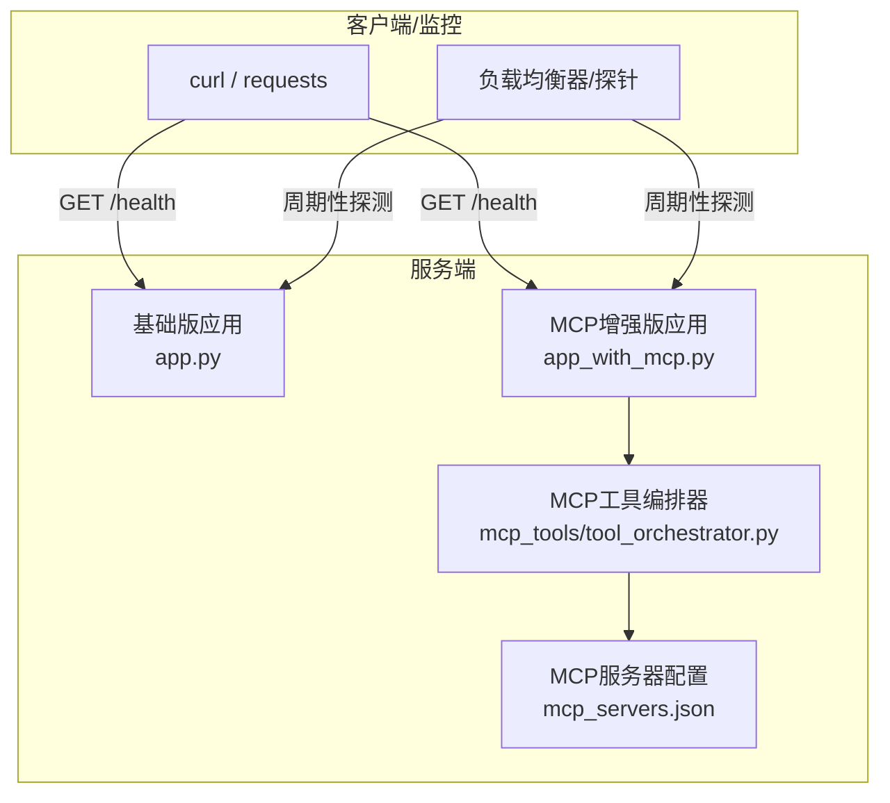
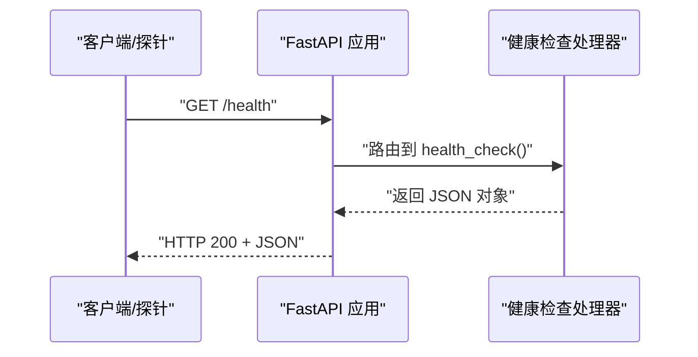
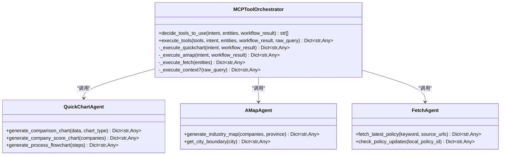
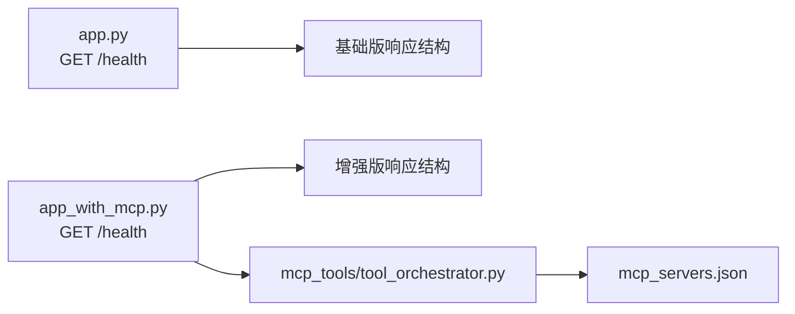

# GET /health 接口

<cite>
**本文引用的文件**
- [app.py](file://app.py)
- [app_with_mcp.py](file://app_with_mcp.py)
- [test_service.py](file://test_service.py)
- [start.bat](file://start.bat)
- [start_new.sh](file://start_new.sh)
- [快速开始.md](file://快速开始.md)
- [重构完成说明.md](file://重构完成说明.md)
- [mcp_servers.json](file://mcp_servers.json)
- [mcp_tools/tool_orchestrator.py](file://mcp_tools/tool_orchestrator.py)
- [mcp_tools/quickchart_agent.py](file://mcp_tools/quickchart_agent.py)
- [mcp_tools/amap_agent.py](file://mcp_tools/amap_agent.py)
- [mcp_tools/fetch_agent.py](file://mcp_tools/fetch_agent.py)
- [mcp_tools/context_manager.py](file://mcp_tools/context_manager.py)
</cite>

## 目录
1. [简介](#简介)
2. [项目结构](#项目结构)
3. [核心组件](#核心组件)
4. [架构总览](#架构总览)
5. [详细组件分析](#详细组件分析)
6. [依赖关系分析](#依赖关系分析)
7. [性能考量](#性能考量)
8. [故障排查指南](#故障排查指南)
9. [结论](#结论)
10. [附录](#附录)

## 简介
本文件聚焦于服务的健康检查接口 GET /health，用于服务健康状态检查与心跳探测。该接口无需认证，返回标准 JSON 结构，包含服务状态、服务名称、版本号，并在 MCP 增强版中额外包含可用的 MCP 工具清单。本文档将明确接口行为、响应结构、部署与监控用途、请求与响应示例，以及与负载均衡的配合方式。

## 项目结构
- 基础版服务（未集成 MCP）：提供 GET /health，返回基础版服务信息与版本。
- MCP 增强版服务：提供 GET /health，返回增强版服务信息、版本与可用 MCP 工具清单。
- 健康检查测试脚本与启动脚本：演示如何调用 /health 并验证服务状态。

**图表来源**
- [app.py](file://app.py#L130-L137)
- [app_with_mcp.py](file://app_with_mcp.py#L190-L198)
- [mcp_tools/tool_orchestrator.py](file://mcp_tools/tool_orchestrator.py#L1-L228)
- [mcp_servers.json](file://mcp_servers.json#L1-L20)

**章节来源**
- [app.py](file://app.py#L130-L137)
- [app_with_mcp.py](file://app_with_mcp.py#L190-L198)
- [start.bat](file://start.bat#L23-L31)
- [start_new.sh](file://start_new.sh#L21-L31)
- [快速开始.md](file://快速开始.md#L142-L144)

## 核心组件
- 基础版健康检查端点：位于基础版应用中，返回基础版服务名称与版本。
- MCP 增强版健康检查端点：位于增强版应用中，返回增强版服务名称、版本与可用 MCP 工具清单。
- 健康检查测试脚本：演示如何发起 GET /health 请求并断言状态码为 200。
- 启动脚本与文档：提供服务地址与健康检查地址，便于自动化部署与监控。

**章节来源**
- [app.py](file://app.py#L130-L137)
- [app_with_mcp.py](file://app_with_mcp.py#L190-L198)
- [test_service.py](file://test_service.py#L7-L17)
- [start.bat](file://start.bat#L23-L31)
- [start_new.sh](file://start_new.sh#L21-L31)
- [快速开始.md](file://快速开始.md#L142-L144)

## 架构总览
GET /health 的调用链路简洁清晰：客户端或探针直接向服务端发起 GET 请求，服务端返回固定 JSON 结构。MCP 增强版在返回中包含 MCP 工具清单，供上层系统了解当前可用能力。

**图表来源**
- [app.py](file://app.py#L130-L137)
- [app_with_mcp.py](file://app_with_mcp.py#L190-L198)

## 详细组件分析

### 基础版健康检查（app.py）
- HTTP 方法：GET
- URL 路径：/health
- 作用：服务健康状态检查与心跳探测
- 认证：无需认证
- 成功响应：HTTP 200，JSON 包含字段
  - status：字符串，正常时为 "ok"
  - service：字符串，服务名称，基础版为 "泉策通智能体"
  - version：字符串，服务版本号，基础版为 "2.0"
- 失败场景：基础版未实现 mcp_tools 字段，因此不会包含该字段
- 部署与监控用途：作为存活探针、就绪探针与健康检查端点，常用于容器编排平台与负载均衡器的心跳探测

**章节来源**
- [app.py](file://app.py#L130-L137)

### MCP 增强版健康检查（app_with_mcp.py）
- HTTP 方法：GET
- URL 路径：/health
- 作用：服务健康状态检查与心跳探测
- 认证：无需认证
- 成功响应：HTTP 200，JSON 包含字段
  - status：字符串，正常时为 "ok"
  - service：字符串，服务名称，增强版为 "泉策通智能体（MCP增强）"
  - version：字符串，服务版本号，增强版为 "2.1"
  - mcp_tools：数组，列出所有可用的 MCP 工具，包括 quickchart、amap、fetch、context7
- 失败场景：增强版未实现 mcp_tools 字段，因此不会包含该字段
- 部署与监控用途：作为存活探针、就绪探针与健康检查端点；同时向监控系统暴露可用 MCP 工具清单，便于运维侧了解增强能力

**章节来源**
- [app_with_mcp.py](file://app_with_mcp.py#L190-L198)

### 响应字段详解
- status
  - 类型：字符串
  - 含义：服务状态标识，正常时为 "ok"
  - 来源：基础版与增强版健康检查函数
- service
  - 类型：字符串
  - 含义：服务名称
  - 基础版：泉策通智能体
  - 增强版：泉策通智能体（MCP增强）
  - 来源：基础版与增强版健康检查函数
- version
  - 类型：字符串
  - 含义：服务版本号
  - 基础版：2.0
  - 增强版：2.1
  - 来源：基础版与增强版健康检查函数
- mcp_tools（仅增强版）
  - 类型：数组
  - 含义：可用 MCP 工具清单
  - 值：["quickchart", "amap", "fetch", "context7"]
  - 来源：增强版健康检查函数

**章节来源**
- [app.py](file://app.py#L130-L137)
- [app_with_mcp.py](file://app_with_mcp.py#L190-L198)

### 请求与响应示例
- 请求
  - 方法：GET
  - 路径：/health
  - 请求体：无
- 成功响应（基础版）
  - 状态码：200
  - 示例结构：
    - status: "ok"
    - service: "泉策通智能体"
    - version: "2.0"
- 成功响应（增强版）
  - 状态码：200
  - 示例结构：
    - status: "ok"
    - service: "泉策通智能体（MCP增强）"
    - version: "2.1"
    - mcp_tools: ["quickchart", "amap", "fetch", "context7"]

**章节来源**
- [app.py](file://app.py#L130-L137)
- [app_with_mcp.py](file://app_with_mcp.py#L190-L198)

### 与 MCP 工具的关系
- 增强版健康检查返回的 mcp_tools 列表与实际可用工具一致，来源于工具编排器对工具的决策与执行能力。
- 工具编排器会根据意图与实体决定是否调用 quickchart、amap、fetch、context7，并在查询响应中体现增强结果；健康检查端点则提供静态的能力清单。

**图表来源**
- [mcp_tools/tool_orchestrator.py](file://mcp_tools/tool_orchestrator.py#L1-L228)
- [mcp_tools/quickchart_agent.py](file://mcp_tools/quickchart_agent.py#L1-L128)
- [mcp_tools/amap_agent.py](file://mcp_tools/amap_agent.py#L1-L92)
- [mcp_tools/fetch_agent.py](file://mcp_tools/fetch_agent.py#L1-L78)

**章节来源**
- [mcp_tools/tool_orchestrator.py](file://mcp_tools/tool_orchestrator.py#L1-L228)
- [mcp_tools/quickchart_agent.py](file://mcp_tools/quickchart_agent.py#L1-L128)
- [mcp_tools/amap_agent.py](file://mcp_tools/amap_agent.py#L1-L92)
- [mcp_tools/fetch_agent.py](file://mcp_tools/fetch_agent.py#L1-L78)

### 健康检查在部署、监控与负载均衡中的用途
- 存活探针（Liveness Probe）：确认进程仍在运行
- 就绪探针（Readiness Probe）：确认服务已准备好接收流量
- 健康检查端点：作为统一的健康检查入口，便于运维与自动化系统统一管理
- 负载均衡：结合 mcp_tools 字段，可在健康检查阶段识别增强能力，指导流量分发或功能开关

**章节来源**
- [重构完成说明.md](file://重构完成说明.md#L205-L206)
- [快速开始.md](file://快速开始.md#L142-L144)

## 依赖关系分析
- 基础版应用与增强版应用分别定义了 /health 端点，二者互不影响。
- 增强版应用依赖 MCP 工具编排器，但健康检查端点本身不执行工具，仅返回静态清单。
- MCP 服务器配置文件提供工具服务地址，健康检查端点不直接使用该配置。

**图表来源**
- [app.py](file://app.py#L130-L137)
- [app_with_mcp.py](file://app_with_mcp.py#L190-L198)
- [mcp_tools/tool_orchestrator.py](file://mcp_tools/tool_orchestrator.py#L1-L228)
- [mcp_servers.json](file://mcp_servers.json#L1-L20)

**章节来源**
- [app.py](file://app.py#L130-L137)
- [app_with_mcp.py](file://app_with_mcp.py#L190-L198)
- [mcp_tools/tool_orchestrator.py](file://mcp_tools/tool_orchestrator.py#L1-L228)
- [mcp_servers.json](file://mcp_servers.json#L1-L20)

## 性能考量
- 健康检查为轻量级端点，不涉及复杂业务逻辑，通常响应延迟极低。
- 增强版返回 mcp_tools 清单为静态构造，开销可忽略。
- 建议探针间隔与超时设置合理，避免频繁探测造成不必要的压力。

[本节为通用性能建议，不直接分析具体文件]

## 故障排查指南
- 健康检查返回非 200：检查服务是否正常启动、端口是否被占用、防火墙是否放行。
- 响应字段缺失：确认使用的是对应版本的应用（基础版 vs 增强版）。
- MCP 增强版缺少 mcp_tools：确认应用为增强版，且未被修改移除该字段。
- 自动化测试：可参考测试脚本中的 GET /health 调用方式，断言状态码为 200。

**章节来源**
- [test_service.py](file://test_service.py#L7-L17)
- [start.bat](file://start.bat#L23-L31)
- [start_new.sh](file://start_new.sh#L21-L31)

## 结论
GET /health 是服务健康检查与心跳探测的核心端点。基础版与增强版分别提供不同的服务信息与版本号；增强版额外返回 MCP 工具清单，便于运维与上层系统识别增强能力。该接口无需认证，返回 HTTP 200，适合作为存活、就绪与健康检查的统一入口，并与负载均衡和自动化监控体系良好配合。

[本节为总结性内容，不直接分析具体文件]

## 附录

### 请求与响应规范
- 请求
  - 方法：GET
  - 路径：/health
  - 请求体：无
- 响应
  - 状态码：200
  - 内容类型：application/json
  - 基础版字段：
    - status: "ok"
    - service: "泉策通智能体"
    - version: "2.0"
  - 增强版字段：
    - status: "ok"
    - service: "泉策通智能体（MCP增强）"
    - version: "2.1"
    - mcp_tools: ["quickchart", "amap", "fetch", "context7"]

**章节来源**
- [app.py](file://app.py#L130-L137)
- [app_with_mcp.py](file://app_with_mcp.py#L190-L198)