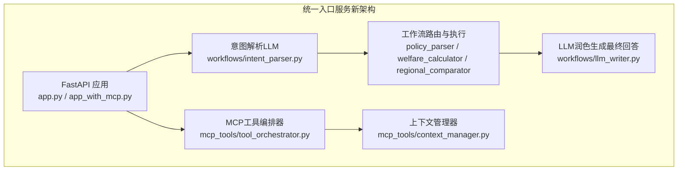
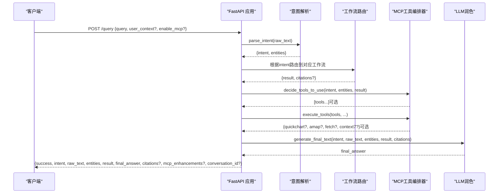
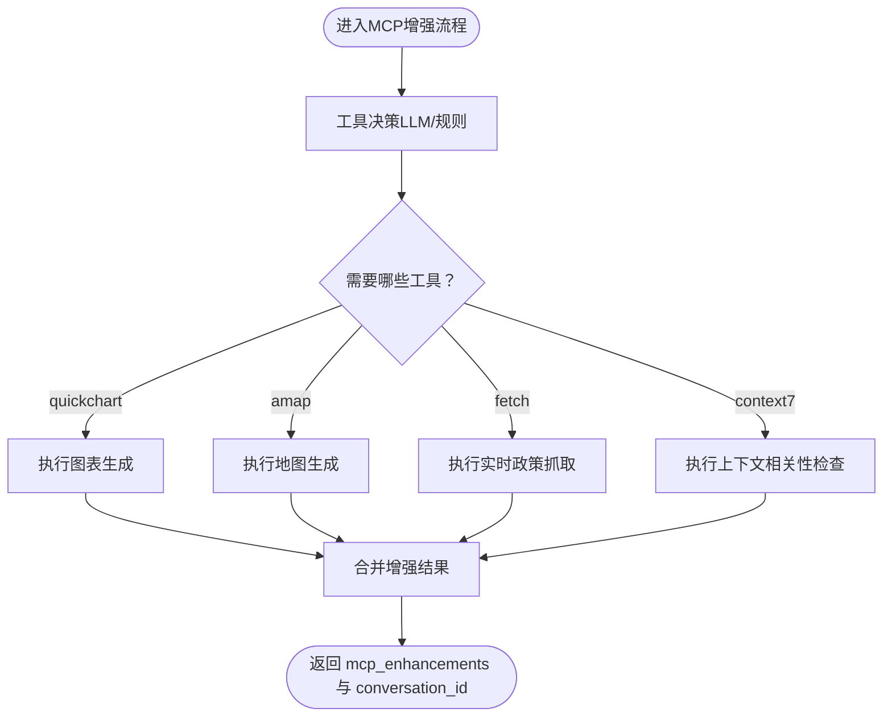
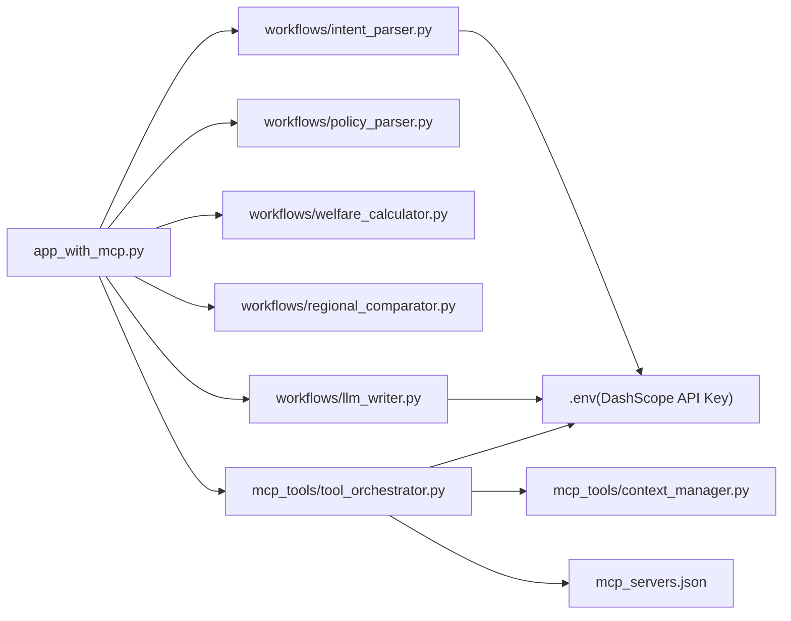

# POST /query 接口

<cite>
**本文引用的文件**
- [app.py](file://app.py)
- [app_with_mcp.py](file://app_with_mcp.py)
- [新架构说明.md](file://新架构说明.md)
- [test_query.py](file://test_query.py)
- [test_mcp.py](file://test_mcp.py)
- [workflows/intent_parser.py](file://workflows/intent_parser.py)
- [workflows/policy_parser.py](file://workflows/policy_parser.py)
- [workflows/welfare_calculator.py](file://workflows/welfare_calculator.py)
- [workflows/regional_comparator.py](file://workflows/regional_comparator.py)
- [workflows/llm_writer.py](file://workflows/llm_writer.py)
- [mcp_tools/tool_orchestrator.py](file://mcp_tools/tool_orchestrator.py)
- [mcp_tools/context_manager.py](file://mcp_tools/context_manager.py)
- [mcp_servers.json](file://mcp_servers.json)
- [工具调用指南.md](file://工具调用指南.md)
</cite>

## 目录
1. [简介](#简介)
2. [项目结构](#项目结构)
3. [核心组件](#核心组件)
4. [架构总览](#架构总览)
5. [详细组件分析](#详细组件分析)
6. [依赖关系分析](#依赖关系分析)
7. [性能考量](#性能考量)
8. [故障排查指南](#故障排查指南)
9. [结论](#结论)
10. [附录](#附录)

## 简介
本文件为 POST /query 接口的权威API文档，聚焦于统一智能体服务的查询入口。该接口采用单端口、统一入口的设计，支持四种意图（政策解析、个人福利计算、区域对比、企业信号灯），并在MCP增强版本中提供图表生成、地图可视化、实时政策抓取与上下文对话管理等能力。文档明确请求与响应的JSON Schema、错误码、认证方式、架构差异与集成实践，帮助开发者快速、准确地对接系统。

## 项目结构
- 新架构采用单一服务（8000端口）与统一入口（POST /query），内部完成意图识别、工作流路由、LLM润色与可选MCP增强。
- 旧架构为多端口（8001-8007）与多服务协作，现已迁移至统一入口服务。

**图表来源**
- [app.py](file://app.py#L1-L155)
- [app_with_mcp.py](file://app_with_mcp.py#L1-L222)
- [workflows/intent_parser.py](file://workflows/intent_parser.py#L1-L175)
- [workflows/policy_parser.py](file://workflows/policy_parser.py#L1-L83)
- [workflows/welfare_calculator.py](file://workflows/welfare_calculator.py#L1-L123)
- [workflows/regional_comparator.py](file://workflows/regional_comparator.py#L1-L91)
- [workflows/llm_writer.py](file://workflows/llm_writer.py#L1-L145)
- [mcp_tools/tool_orchestrator.py](file://mcp_tools/tool_orchestrator.py#L1-L228)
- [mcp_tools/context_manager.py](file://mcp_tools/context_manager.py#L1-L152)

**章节来源**
- [新架构说明.md](file://新架构说明.md#L1-L149)
- [app.py](file://app.py#L1-L155)
- [app_with_mcp.py](file://app_with_mcp.py#L1-L222)

## 核心组件
- 请求模型（QueryRequest）
  - query: 字符串，必填，用户查询内容
  - user_context: 对象，可选，传递用户上下文信息
  - enable_mcp: 布尔，默认true，控制是否启用MCP工具增强
- 响应模型（QueryResponse）
  - success: 布尔，请求是否成功
  - intent: 字符串，解析出的意图
  - raw_text: 字符串，原始查询
  - entities: 对象，抽取的实体
  - result: 对象，工作流处理结果
  - final_answer: 字符串，最终自然语言回答
  - citations: 字符串，引用来源（可选）
  - error: 字符串，错误详情（可选）
  - mcp_enhancements: 对象，MCP工具增强结果（可选）
  - conversation_id: 字符串，对话ID（可选）

**章节来源**
- [app.py](file://app.py#L19-L35)
- [app_with_mcp.py](file://app_with_mcp.py#L24-L45)

## 架构总览
POST /query 的处理流程如下：
- 输入校验与预处理
- 意图解析（LLM）
- 工作流路由（policy_parse/personal_welfare/regional_compare/investment_signal）
- 可选MCP增强（工具决策、执行与结果融合）
- LLM润色生成最终回答
- 返回统一响应

**图表来源**
- [app_with_mcp.py](file://app_with_mcp.py#L47-L188)
- [workflows/intent_parser.py](file://workflows/intent_parser.py#L16-L120)
- [workflows/llm_writer.py](file://workflows/llm_writer.py#L15-L145)
- [mcp_tools/tool_orchestrator.py](file://mcp_tools/tool_orchestrator.py#L29-L155)

## 详细组件分析

### 请求与响应Schema
- 请求体（JSON）
  - query: 字符串，必填
  - user_context: 对象，可选
  - enable_mcp: 布尔，默认true
- 成功响应体（JSON）
  - success: 布尔
  - intent: 字符串
  - raw_text: 字符串
  - entities: 对象
  - result: 对象
  - final_answer: 字符串
  - citations: 字符串（可选）
  - error: 字符串（可选）
  - mcp_enhancements: 对象（可选）
  - conversation_id: 字符串（可选）

**章节来源**
- [app.py](file://app.py#L19-L35)
- [app_with_mcp.py](file://app_with_mcp.py#L24-L45)

### 意图解析与实体抽取
- 意图类型：policy_parse、personal_welfare、regional_compare、investment_signal
- 实体类型：location、product、company、industry、time、price_paid、energy_efficiency_level
- LLM驱动的严格JSON输出，失败时降级为规则识别

**章节来源**
- [workflows/intent_parser.py](file://workflows/intent_parser.py#L16-L120)
- [workflows/intent_parser.py](file://workflows/intent_parser.py#L127-L175)

### 工作流路由与结果
- policy_parse：政策智能解析，返回政策标题、类型、金额、地区、有效期、条件、流程、材料、申领平台、引用来源等
- personal_welfare：个人福利计算，返回可领金额、明细、总福利、约束条件、所需材料、申领平台、引用来源等
- regional_compare：区域对比，返回对比地区列表、对比表、总结、引用来源等
- investment_signal：企业信号灯，返回投资信号、行业概览、推荐企业Top 5等

**章节来源**
- [workflows/policy_parser.py](file://workflows/policy_parser.py#L6-L83)
- [workflows/welfare_calculator.py](file://workflows/welfare_calculator.py#L7-L123)
- [workflows/regional_comparator.py](file://workflows/regional_comparator.py#L6-L91)

### MCP工具增强（MCP增强版）
- 工具决策：根据意图、实体与工作流结果决定是否启用 quickchart、amap、fetch、context7
- 工具执行：生成对比/评分/流程图、产业分布地图、实时政策抓取、上下文相关性检查
- 结果融合：将图表URL、地图标注数量、抓取结果、上下文信息写入 mcp_enhancements，并在最终回答中提示
- 对话ID：保存对话历史并返回 conversation_id

**图表来源**
- [mcp_tools/tool_orchestrator.py](file://mcp_tools/tool_orchestrator.py#L29-L155)
- [mcp_tools/context_manager.py](file://mcp_tools/context_manager.py#L119-L152)

**章节来源**
- [app_with_mcp.py](file://app_with_mcp.py#L66-L188)
- [mcp_tools/tool_orchestrator.py](file://mcp_tools/tool_orchestrator.py#L1-L228)
- [mcp_tools/context_manager.py](file://mcp_tools/context_manager.py#L1-L152)

### LLM润色与最终回答
- 根据不同意图生成结构化上下文，再由LLM生成友好、专业的自然语言回答
- 若有引用来源，自动追加参考来源
- LLM调用失败时降级为直接返回结构化上下文

**章节来源**
- [workflows/llm_writer.py](file://workflows/llm_writer.py#L15-L145)

## 依赖关系分析
- 组件耦合
  - app_with_mcp.py 依赖 workflows/* 与 mcp_tools/*
  - workflows/* 依赖 .env 中的 DashScope API Key 与模型配置
  - mcp_tools/* 依赖 mcp_servers.json 中的外部服务地址
- 外部依赖
  - DashScope API（LLM推理与嵌入）
  - 外部MCP服务（QuickChart、Amap、Fetch、Context7）

**图表来源**
- [app_with_mcp.py](file://app_with_mcp.py#L1-L222)
- [workflows/intent_parser.py](file://workflows/intent_parser.py#L1-L175)
- [workflows/llm_writer.py](file://workflows/llm_writer.py#L1-L145)
- [mcp_tools/tool_orchestrator.py](file://mcp_tools/tool_orchestrator.py#L1-L228)
- [mcp_servers.json](file://mcp_servers.json#L1-L20)

**章节来源**
- [app_with_mcp.py](file://app_with_mcp.py#L1-L222)
- [mcp_servers.json](file://mcp_servers.json#L1-L20)

## 性能考量
- 单端口统一入口减少跨服务调用开销，函数内调用优于HTTP请求
- LLM调用设置合理超时与温度参数，避免阻塞
- MCP工具按需决策，避免不必要的外部调用
- 建议对高频查询引入缓存策略（如向量检索结果缓存）

[本节为通用建议，无需列出具体文件来源]

## 故障排查指南
- 常见错误码
  - 400：输入为空（查询内容不能为空）
  - 其他：内部异常捕获并返回 error 字段
- 排查步骤
  - 确认 Content-Type: application/json
  - 检查 .env 中 DashScope API Key 配置
  - 检查 MCP 服务地址（mcp_servers.json）与网络连通性
  - 查看响应中的 error 字段与最终回答中的错误提示
- 开发者测试
  - 使用内置测试脚本验证接口行为

**章节来源**
- [app.py](file://app.py#L47-L127)
- [app_with_mcp.py](file://app_with_mcp.py#L62-L188)
- [test_query.py](file://test_query.py#L1-L80)
- [test_mcp.py](file://test_mcp.py#L1-L91)

## 结论
POST /query 接口通过统一入口与模块化工作流，实现了意图驱动的政策解析、福利计算、区域对比与企业信号灯等能力，并在MCP增强版中提供图表、地图、实时政策与上下文管理等扩展能力。新架构显著简化了部署与调用复杂度，同时保持了良好的可扩展性与稳定性。

[本节为总结性内容，无需列出具体文件来源]

## 附录

### API定义
- 方法与路径
  - POST /query
- 请求头
  - Content-Type: application/json
- 请求体（JSON）
  - query: 字符串，必填
  - user_context: 对象，可选
  - enable_mcp: 布尔，默认true
- 成功响应体（JSON）
  - success: 布尔
  - intent: 字符串
  - raw_text: 字符串
  - entities: 对象
  - result: 对象
  - final_answer: 字符串
  - citations: 字符串（可选）
  - error: 字符串（可选）
  - mcp_enhancements: 对象（可选）
  - conversation_id: 字符串（可选）
- 错误响应
  - 400：输入无效（如查询内容为空）
  - 其他：内部异常，返回 error 字段

**章节来源**
- [app.py](file://app.py#L19-L35)
- [app_with_mcp.py](file://app_with_mcp.py#L24-L45)
- [app.py](file://app.py#L47-L127)
- [app_with_mcp.py](file://app_with_mcp.py#L62-L188)

### 请求/响应示例
- 政策解析（示例查询：济南市2025年电冰箱以旧换新政策是什么？）
  - 请求：包含 query 字段
  - 响应：intent 为 policy_parse，result 包含政策标题、金额、地区、有效期、条件、流程、材料、申领平台、引用来源等
- 福利计算（示例查询：在济南买了3000元的空调，能领多少补贴？）
  - 请求：包含 query 字段
  - 响应：intent 为 personal_welfare，result 包含可领金额、明细、总福利、约束条件、所需材料、申领平台、引用来源等
- 区域对比（示例查询：济南和青岛的手机购买补贴政策对比）
  - 请求：包含 query 字段
  - 响应：intent 为 regional_compare，result 包含对比地区列表、对比表、总结、引用来源等
- 企业信号（示例查询：家电行业有哪些值得招商的企业？）
  - 请求：包含 query 字段
  - 响应：intent 为 investment_signal，result 包含投资信号、行业概览、推荐企业Top 5等

**章节来源**
- [test_query.py](file://test_query.py#L1-L80)
- [workflows/policy_parser.py](file://workflows/policy_parser.py#L6-L83)
- [workflows/welfare_calculator.py](file://workflows/welfare_calculator.py#L7-L123)
- [workflows/regional_comparator.py](file://workflows/regional_comparator.py#L6-L91)

### 架构差异（旧架构 vs 新架构）
- 旧架构：多端口（8001-8007），多服务协作，端口与路由分散
- 新架构：单端口（8000），统一入口（POST /query），内部完成所有工作流调用

**章节来源**
- [新架构说明.md](file://新架构说明.md#L123-L134)

### 认证与环境配置
- 接口层：无鉴权
- 后端LLM调用：通过 .env 中的 DashScope API Key 与模型配置进行认证
- MCP服务：通过 mcp_servers.json 中的服务地址进行外部调用

**章节来源**
- [新架构说明.md](file://新架构说明.md#L115-L121)
- [mcp_servers.json](file://mcp_servers.json#L1-L20)

### MCP工具清单与调用约定
- 工具清单：QuickChart（图表生成）、Amap（地图可视化）、Fetch（实时政策更新）、Context7（上下文对话管理）
- 调用约定：统一 POST /infer，扁平字段，结构化内容以 *_json 字符串返回，多值引用用 | 分隔
- 错误与重试：网络错误重试1-2次；数据错误返回 E_INPUT_INVALID；渲染失败返回 E_RENDER_FAIL 并给出简化文本结果

**章节来源**
- [工具调用指南.md](file://工具调用指南.md#L1-L143)