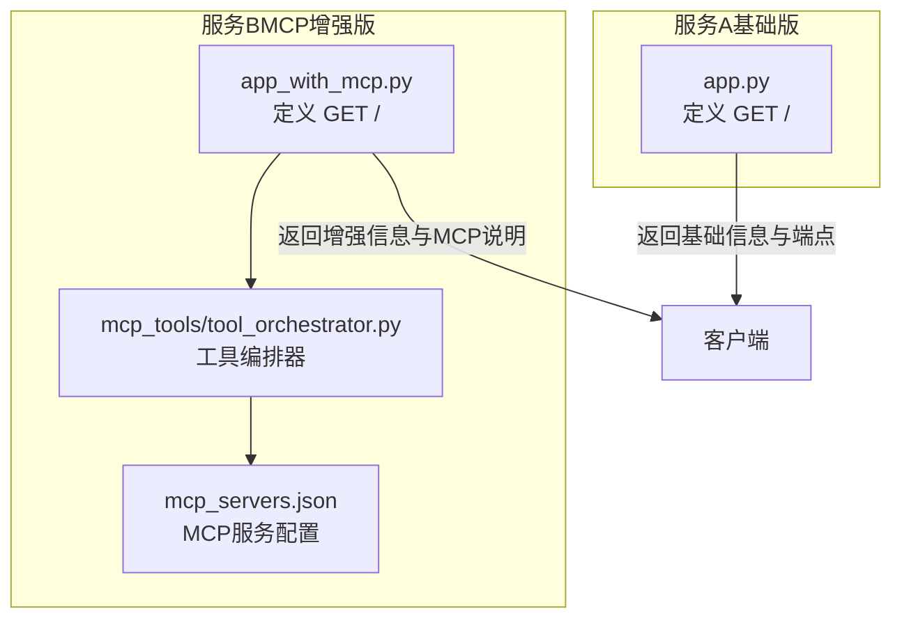
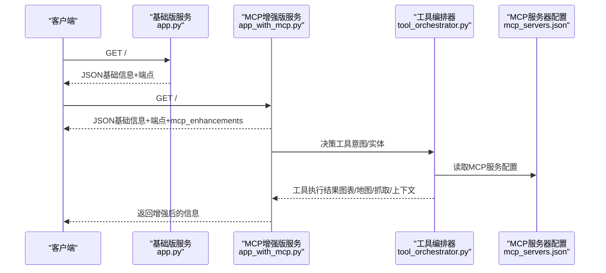
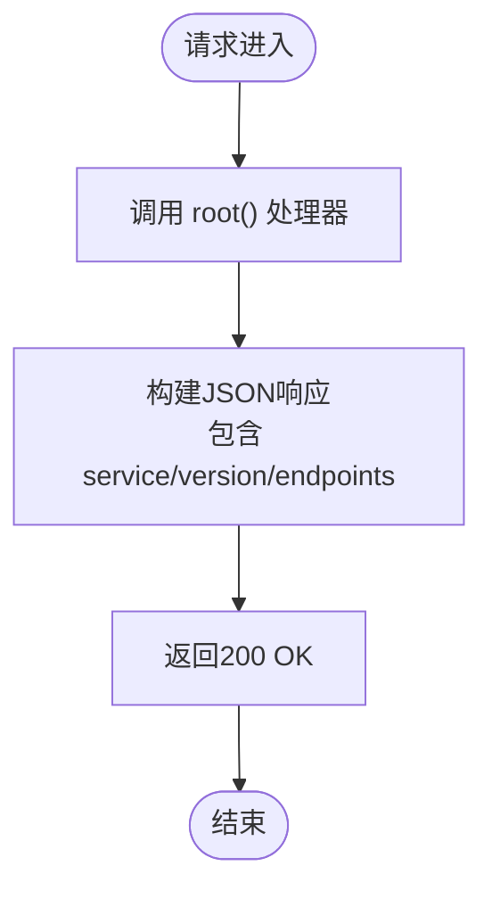
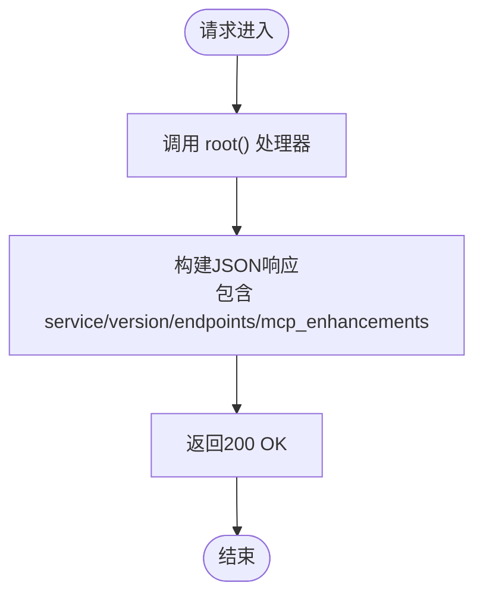
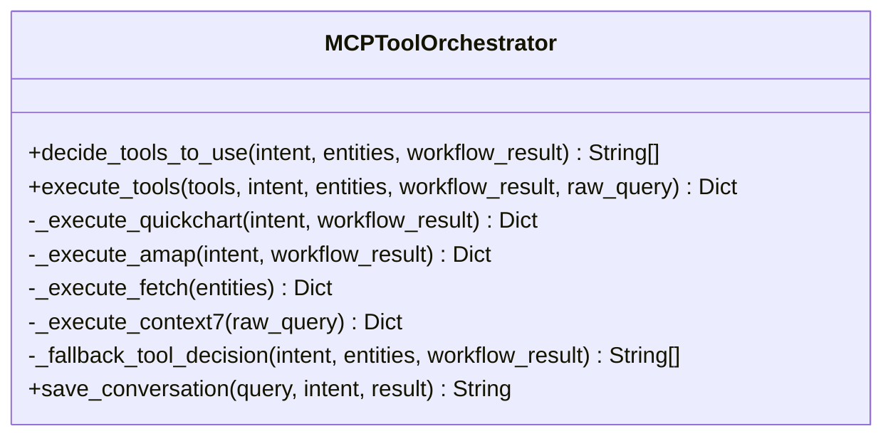
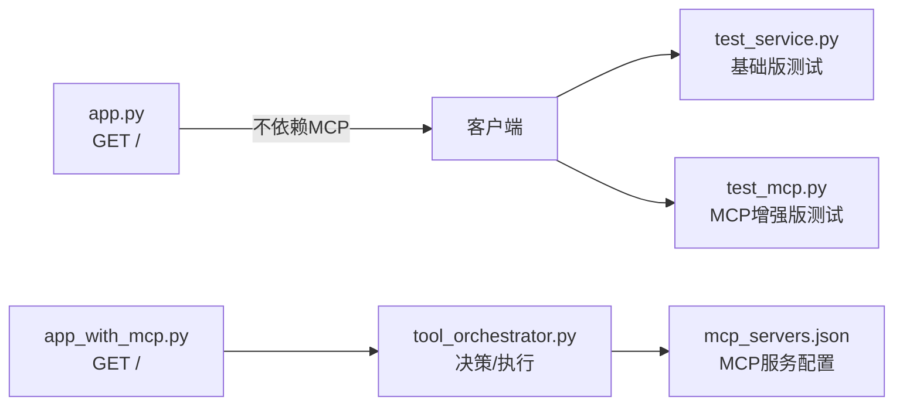

# 根路径 /

<cite>
**本文引用的文件**
- [app.py](file://app.py)
- [app_with_mcp.py](file://app_with_mcp.py)
- [mcp_servers.json](file://mcp_servers.json)
- [mcp_tools/tool_orchestrator.py](file://mcp_tools/tool_orchestrator.py)
- [test_service.py](file://test_service.py)
- [test_mcp.py](file://test_mcp.py)
- [requirements.txt](file://requirements.txt)
</cite>

## 目录
1. [简介](#简介)
2. [项目结构](#项目结构)
3. [核心组件](#核心组件)
4. [架构总览](#架构总览)
5. [详细组件分析](#详细组件分析)
6. [依赖关系分析](#依赖关系分析)
7. [性能考虑](#性能考虑)
8. [故障排查指南](#故障排查指南)
9. [结论](#结论)
10. [附录](#附录)

## 简介
本文件为根路径 GET / 接口的详细API文档。该接口用于提供服务的基本信息与可用端点概览，便于开发者快速了解服务能力与探索API。接口无需认证，常用于调试与服务发现。

- HTTP方法：GET
- URL路径：/
- 功能概述：返回服务名称、版本号，并列出主要端点；在MCP增强版中，额外提供MCP工具增强能力说明，帮助开发者理解图表生成、地图可视化、实时政策抓取与上下文对话管理等增强功能。

## 项目结构
- 根路径接口位于两个服务实现中：
  - 基础版：app.py 中定义了 GET / 路由，返回基础信息与端点列表。
  - MCP增强版：app_with_mcp.py 中定义了 GET / 路由，返回增强信息与MCP工具说明。
- MCP工具编排器位于 mcp_tools/tool_orchestrator.py，负责根据意图与实体决定是否调用QuickChart、高德地图、Fetch与Context7等工具。
- MCP服务器配置位于 mcp_servers.json，声明各MCP服务的类型与访问地址。
- 测试脚本 test_service.py 与 test_mcp.py 提供了对基础版与MCP增强版的调用示例。

**图表来源**
- [app.py](file://app.py#L140-L150)
- [app_with_mcp.py](file://app_with_mcp.py#L201-L217)
- [mcp_tools/tool_orchestrator.py](file://mcp_tools/tool_orchestrator.py#L23-L228)
- [mcp_servers.json](file://mcp_servers.json#L1-L21)

**章节来源**
- [app.py](file://app.py#L140-L150)
- [app_with_mcp.py](file://app_with_mcp.py#L201-L217)
- [mcp_tools/tool_orchestrator.py](file://mcp_tools/tool_orchestrator.py#L23-L228)
- [mcp_servers.json](file://mcp_servers.json#L1-L21)

## 核心组件
- 根路径处理器（基础版）：返回服务名、版本与端点列表。
- 根路径处理器（MCP增强版）：在基础信息基础上，新增 mcp_enhancements 字段，描述各MCP工具的功能与典型用途。
- MCP工具编排器：根据意图与实体决策是否调用工具，并执行相应操作。
- MCP服务器配置：声明QuickChart、高德地图、Fetch、Context7等服务的访问地址。

**章节来源**
- [app.py](file://app.py#L140-L150)
- [app_with_mcp.py](file://app_with_mcp.py#L201-L217)
- [mcp_tools/tool_orchestrator.py](file://mcp_tools/tool_orchestrator.py#L23-L228)
- [mcp_servers.json](file://mcp_servers.json#L1-L21)

## 架构总览
下图展示了根路径接口在不同服务中的角色与交互关系。

**图表来源**
- [app.py](file://app.py#L140-L150)
- [app_with_mcp.py](file://app_with_mcp.py#L201-L217)
- [mcp_tools/tool_orchestrator.py](file://mcp_tools/tool_orchestrator.py#L23-L228)
- [mcp_servers.json](file://mcp_servers.json#L1-L21)

## 详细组件分析

### 基础版根路径接口（GET /）
- 处理器位置：app.py 的 root 函数
- 返回内容：
  - service：服务全称
  - version：当前版本
  - endpoints：主要端点列表，包含 query 与 health 的路径
- 认证要求：无需认证
- 使用场景：服务发现、调试、快速了解可用端点

**图表来源**
- [app.py](file://app.py#L140-L150)

**章节来源**
- [app.py](file://app.py#L140-L150)

### MCP增强版根路径接口（GET /）
- 处理器位置：app_with_mcp.py 的 root 函数
- 返回内容：
  - service：服务全称
  - version：当前版本
  - endpoints：主要端点列表（query、health）
  - mcp_enhancements：MCP工具增强说明，包括 quickchart（图表生成）、amap（地图可视化）、fetch（实时政策更新）、context7（上下文对话管理）
- 认证要求：无需认证
- 使用场景：在MCP增强版中，帮助开发者理解各工具的典型用途与触发条件

**图表来源**
- [app_with_mcp.py](file://app_with_mcp.py#L201-L217)

**章节来源**
- [app_with_mcp.py](file://app_with_mcp.py#L201-L217)

### MCP工具编排器（决策与执行）
- 决策逻辑：
  - 根据意图与实体，判断是否需要调用工具（QuickChart、Amap、Fetch、Context7）
  - 若LLM决策失败，采用降级规则进行决策
- 执行逻辑：
  - 调用 QuickChart 生成对比图、柱状图、流程图
  - 调用 Amap 生成产业分布地图
  - 调用 Fetch 抓取实时政策
  - 调用 Context7 进行上下文相关性判断与对话历史保存
- 配置来源：mcp_servers.json 提供各MCP服务的访问地址

**图表来源**
- [mcp_tools/tool_orchestrator.py](file://mcp_tools/tool_orchestrator.py#L23-L228)

**章节来源**
- [mcp_tools/tool_orchestrator.py](file://mcp_tools/tool_orchestrator.py#L23-L228)
- [mcp_servers.json](file://mcp_servers.json#L1-L21)

## 依赖关系分析
- 基础版服务（app.py）直接提供 GET /，不依赖MCP工具。
- MCP增强版服务（app_with_mcp.py）依赖工具编排器与MCP服务器配置。
- 工具编排器依赖 mcp_servers.json 中的服务配置，用于调用外部MCP服务。
- 测试脚本 test_service.py 与 test_mcp.py 分别演示基础版与MCP增强版的调用方式。

**图表来源**
- [app.py](file://app.py#L140-L150)
- [app_with_mcp.py](file://app_with_mcp.py#L201-L217)
- [mcp_tools/tool_orchestrator.py](file://mcp_tools/tool_orchestrator.py#L23-L228)
- [mcp_servers.json](file://mcp_servers.json#L1-L21)
- [test_service.py](file://test_service.py#L1-L75)
- [test_mcp.py](file://test_mcp.py#L1-L91)

**章节来源**
- [app.py](file://app.py#L140-L150)
- [app_with_mcp.py](file://app_with_mcp.py#L201-L217)
- [mcp_tools/tool_orchestrator.py](file://mcp_tools/tool_orchestrator.py#L23-L228)
- [mcp_servers.json](file://mcp_servers.json#L1-L21)
- [test_service.py](file://test_service.py#L1-L75)
- [test_mcp.py](file://test_mcp.py#L1-L91)

## 性能考虑
- 根路径接口为轻量级信息返回，通常响应时间短，开销低。
- 在MCP增强版中，若启用工具增强，会引入外部服务调用，可能带来延迟与网络抖动影响。建议：
  - 合理设置超时与重试策略
  - 在不需要时关闭MCP增强（enable_mcp=false）
  - 对外部服务进行限流与熔断保护

[本节为通用性能建议，不直接分析具体文件]

## 故障排查指南
- 无法访问根路径：
  - 确认服务已启动且监听端口正确
  - 参考测试脚本中的调用方式验证连通性
- 响应内容不符合预期：
  - 基础版：确认返回字段包含 service、version、endpoints
  - MCP增强版：确认返回字段包含 mcp_enhancements
- MCP工具未生效：
  - 检查 mcp_servers.json 中的MCP服务地址是否可达
  - 确认工具编排器的决策逻辑是否命中所需工具

**章节来源**
- [test_service.py](file://test_service.py#L1-L75)
- [test_mcp.py](file://test_mcp.py#L1-L91)
- [mcp_servers.json](file://mcp_servers.json#L1-L21)

## 结论
根路径 GET / 接口为开发者提供了服务基本信息与端点概览，是服务发现与调试的重要入口。在MCP增强版中，该接口还提供了MCP工具增强能力说明，帮助开发者理解图表生成、地图可视化、实时政策抓取与上下文对话管理等功能的典型用途与触发条件。

[本节为总结性内容，不直接分析具体文件]

## 附录

### 请求与响应规范
- 请求
  - 方法：GET
  - 路径：/
  - 请求体：无
- 响应
  - 成功：200 OK，返回JSON对象
  - 失败：根据服务实现返回相应状态码与错误信息

**章节来源**
- [app.py](file://app.py#L140-L150)
- [app_with_mcp.py](file://app_with_mcp.py#L201-L217)

### 响应字段说明
- 基础版（app.py）
  - service：服务全称
  - version：当前版本
  - endpoints：主要端点列表（如 query、health）
- MCP增强版（app_with_mcp.py）
  - service：服务全称
  - version：当前版本
  - endpoints：主要端点列表（如 query、health）
  - mcp_enhancements：MCP工具增强说明
    - quickchart：图表生成（对比图、柱状图、流程图）
    - amap：地图可视化（产业分布）
    - fetch：实时政策更新
    - context7：上下文对话管理

**章节来源**
- [app.py](file://app.py#L140-L150)
- [app_with_mcp.py](file://app_with_mcp.py#L201-L217)

### 请求示例（无请求体）
- 基础版
  - curl 示例：curl -i http://127.0.0.1:8000/
- MCP增强版
  - curl 示例：curl -i http://127.0.0.1:8001/

**章节来源**
- [test_service.py](file://test_service.py#L1-L75)
- [test_mcp.py](file://test_mcp.py#L1-L91)

### 成功响应示例
- 基础版（示例结构）
  - {
      "service": "泉策通智能体服务",
      "version": "2.0",
      "endpoints": {
          "query": "POST /query",
          "health": "GET /health"
      }
    }
- MCP增强版（示例结构）
  - {
      "service": "泉策通智能体服务（MCP增强版）",
      "version": "2.1",
      "endpoints": {
          "query": "POST /query",
          "health": "GET /health"
      },
      "mcp_enhancements": {
          "quickchart": "图表生成（对比图、柱状图、流程图）",
          "amap": "地图可视化（产业分布）",
          "fetch": "实时政策更新",
          "context7": "上下文对话管理"
      }
    }

**章节来源**
- [app.py](file://app.py#L140-L150)
- [app_with_mcp.py](file://app_with_mcp.py#L201-L217)

### 开发者最佳实践
- 使用根路径接口快速了解服务能力与端点
- 在调试阶段优先使用基础版，确认服务可用后再切换至MCP增强版
- 如需MCP增强功能，确保 mcp_servers.json 配置正确且网络可达

**章节来源**
- [mcp_servers.json](file://mcp_servers.json#L1-L21)

### 依赖与环境
- 依赖包：FastAPI、Uvicorn、Pydantic、httpx、python-dotenv 等
- 环境变量：DashScope API相关配置（在MCP工具编排器中使用）

**章节来源**
- [requirements.txt](file://requirements.txt#L1-L7)
- [mcp_tools/tool_orchestrator.py](file://mcp_tools/tool_orchestrator.py#L18-L21)