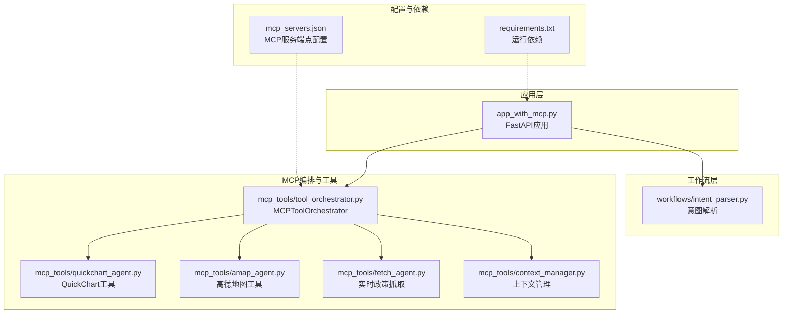
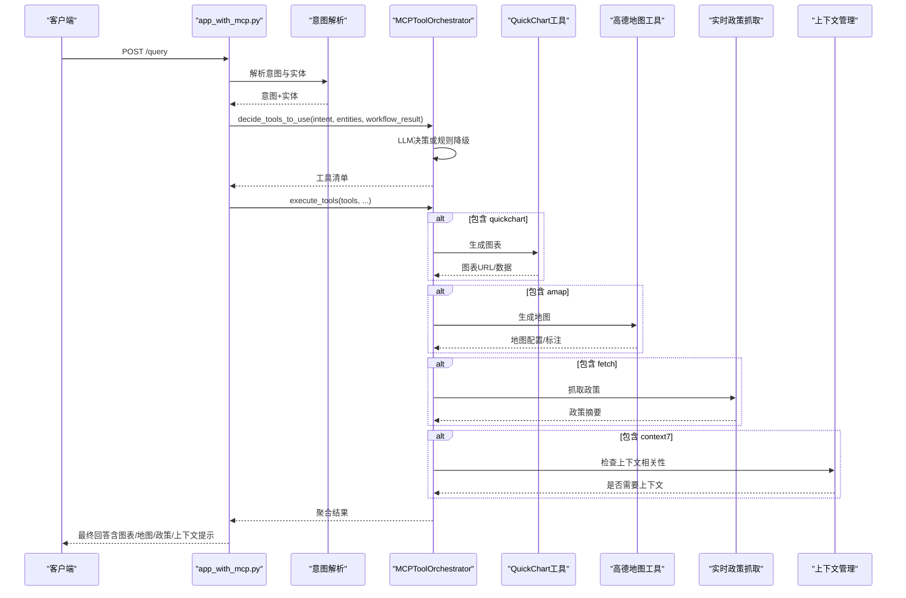
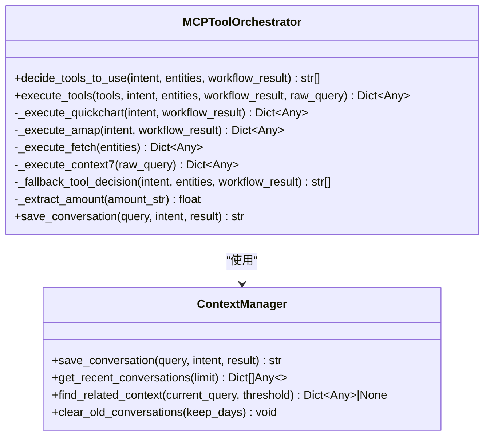
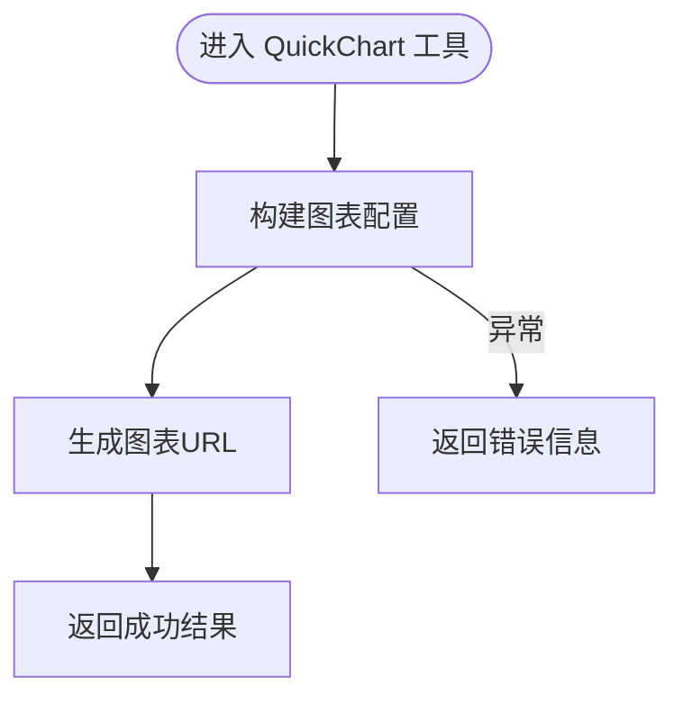
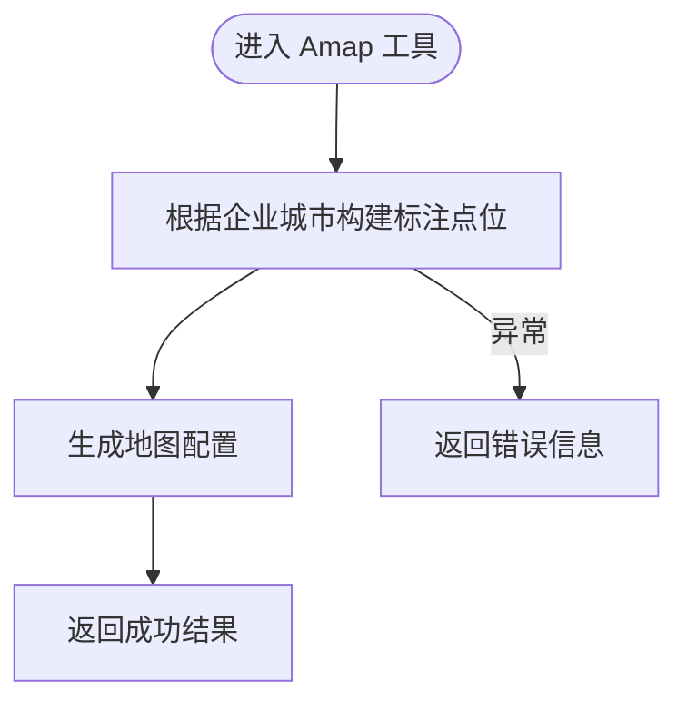
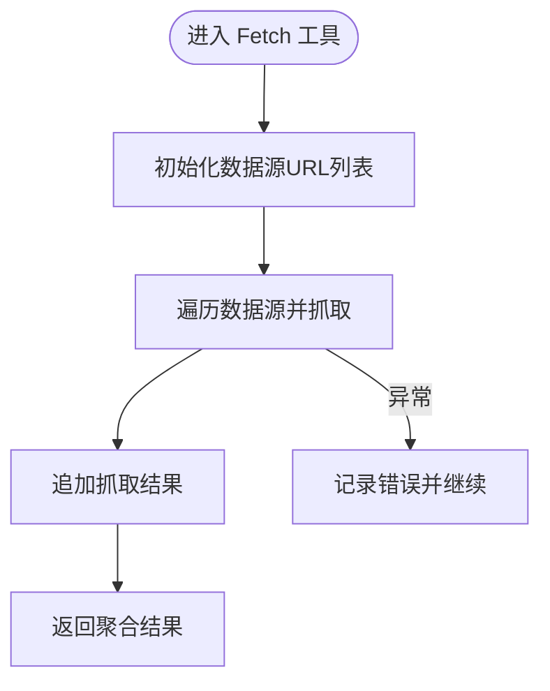
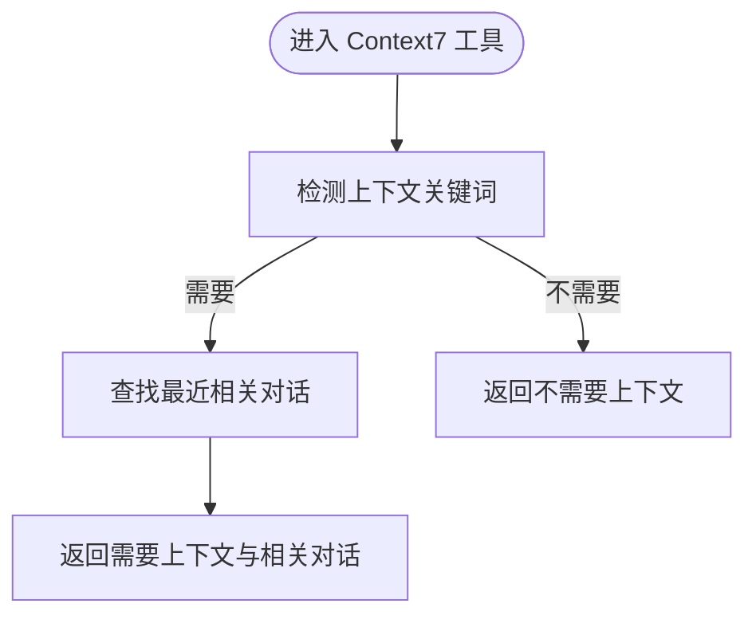
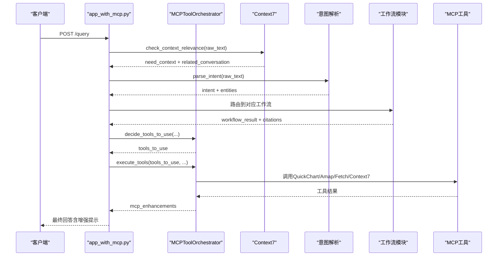
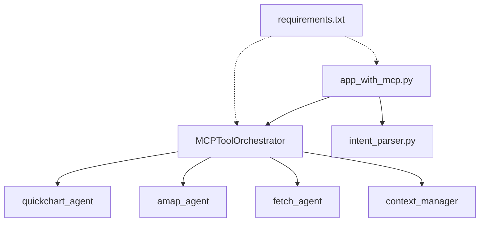

# MCP工具编排器

<cite>
**本文引用的文件**
- [mcp_tools/tool_orchestrator.py](file://mcp_tools/tool_orchestrator.py)
- [mcp_tools/quickchart_agent.py](file://mcp_tools/quickchart_agent.py)
- [mcp_tools/amap_agent.py](file://mcp_tools/amap_agent.py)
- [mcp_tools/fetch_agent.py](file://mcp_tools/fetch_agent.py)
- [mcp_tools/context_manager.py](file://mcp_tools/context_manager.py)
- [mcp_servers.json](file://mcp_servers.json)
- [app_with_mcp.py](file://app_with_mcp.py)
- [workflows/intent_parser.py](file://workflows/intent_parser.py)
- [requirements.txt](file://requirements.txt)
- [test_mcp.py](file://test_mcp.py)
</cite>

## 目录
1. [简介](#简介)
2. [项目结构](#项目结构)
3. [核心组件](#核心组件)
4. [架构总览](#架构总览)
5. [详细组件分析](#详细组件分析)
6. [依赖关系分析](#依赖关系分析)
7. [性能考量](#性能考量)
8. [故障排查指南](#故障排查指南)
9. [结论](#结论)
10. [附录](#附录)

## 简介
本文件面向“MCP工具编排器（MCPToolOrchestrator）”的使用者与维护者，系统化阐述其作为系统扩展能力调度中枢的设计与实现。MCPToolOrchestrator负责：
- 基于用户意图与实体信息，智能决策需要调用的外部工具（如QuickChart、Amap、Fetch、Context7）。
- 协调执行这些工具，并将结果融合到最终回答中。
- 通过mcp_servers.json配置文件中的URL端点发起HTTP请求，形成插件式架构，便于未来扩展新的MCP服务。

本文还提供在app_with_mcp.py中被初始化与调用的完整上下文示例，展示从意图识别到工具执行再到结果融合的全链路。

## 项目结构
围绕MCP工具编排器的关键目录与文件如下：
- mcp_tools：MCP工具与编排器所在模块
  - tool_orchestrator.py：编排器主体
  - quickchart_agent.py：QuickChart图表生成工具
  - amap_agent.py：高德地图工具
  - fetch_agent.py：实时政策抓取工具
  - context_manager.py：上下文对话管理
- mcp_servers.json：MCP服务端点配置
- app_with_mcp.py：FastAPI应用入口，集成编排器
- workflows/intent_parser.py：意图解析（LLM驱动）
- test_mcp.py：MCP功能测试脚本
- requirements.txt：运行依赖

**图表来源**
- [app_with_mcp.py](file://app_with_mcp.py#L1-L222)
- [workflows/intent_parser.py](file://workflows/intent_parser.py#L1-L175)
- [mcp_tools/tool_orchestrator.py](file://mcp_tools/tool_orchestrator.py#L1-L228)
- [mcp_tools/quickchart_agent.py](file://mcp_tools/quickchart_agent.py#L1-L128)
- [mcp_tools/amap_agent.py](file://mcp_tools/amap_agent.py#L1-L92)
- [mcp_tools/fetch_agent.py](file://mcp_tools/fetch_agent.py#L1-L78)
- [mcp_tools/context_manager.py](file://mcp_tools/context_manager.py#L1-L152)
- [mcp_servers.json](file://mcp_servers.json#L1-L21)
- [requirements.txt](file://requirements.txt#L1-L7)

**章节来源**
- [app_with_mcp.py](file://app_with_mcp.py#L1-L222)
- [mcp_tools/tool_orchestrator.py](file://mcp_tools/tool_orchestrator.py#L1-L228)
- [mcp_servers.json](file://mcp_servers.json#L1-L21)

## 核心组件
- MCPToolOrchestrator：编排器类，负责工具决策与执行，以及上下文管理。
- QuickChart工具：生成对比图、企业评分柱状图、流程图。
- 高德地图工具：生成产业分布地图与城市边界（模拟）。
- 实时政策抓取工具：抓取最新政策信息与检查更新。
- 上下文管理器：本地对话历史存储与相关上下文检索。

关键职责与行为：
- decide_tools_to_use：基于意图、实体与工作流结果，决定调用哪些工具（优先LLM决策，失败时走规则降级）。
- execute_tools：按需执行QuickChart、Amap、Fetch、Context7，并聚合结果。
- _execute_quickchart/_execute_amap/_execute_fetch/_execute_context7：具体工具执行逻辑。
- save_conversation：保存对话记录，供后续上下文关联。

**章节来源**
- [mcp_tools/tool_orchestrator.py](file://mcp_tools/tool_orchestrator.py#L23-L228)
- [mcp_tools/quickchart_agent.py](file://mcp_tools/quickchart_agent.py#L1-L128)
- [mcp_tools/amap_agent.py](file://mcp_tools/amap_agent.py#L1-L92)
- [mcp_tools/fetch_agent.py](file://mcp_tools/fetch_agent.py#L1-L78)
- [mcp_tools/context_manager.py](file://mcp_tools/context_manager.py#L1-L152)

## 架构总览
MCPToolOrchestrator采用插件式架构，通过mcp_servers.json中的URL端点与各工具模块交互。整体调用链路如下：

**图表来源**
- [app_with_mcp.py](file://app_with_mcp.py#L47-L188)
- [workflows/intent_parser.py](file://workflows/intent_parser.py#L16-L125)
- [mcp_tools/tool_orchestrator.py](file://mcp_tools/tool_orchestrator.py#L29-L155)
- [mcp_tools/quickchart_agent.py](file://mcp_tools/quickchart_agent.py#L8-L128)
- [mcp_tools/amap_agent.py](file://mcp_tools/amap_agent.py#L8-L92)
- [mcp_tools/fetch_agent.py](file://mcp_tools/fetch_agent.py#L9-L78)
- [mcp_tools/context_manager.py](file://mcp_tools/context_manager.py#L119-L152)

## 详细组件分析

### MCPToolOrchestrator 类
- 设计要点
  - 插件式架构：通过导入各工具模块，按需调用，便于新增MCP服务。
  - LLM驱动决策：使用DashScope API进行工具选择，失败时回退到规则决策。
  - 结果聚合：将QuickChart、Amap、Fetch、Context7的结果合并返回。
  - 上下文持久化：保存对话记录，供后续上下文相关性检查使用。

- 决策流程（LLM + 规则降级）
  - LLM决策：构造包含意图、实体、工作流结果的prompt，要求返回JSON格式的工具清单。
  - 规则降级：当LLM不可用时，依据意图与工作流结果的结构特征进行规则判断（如区域对比、企业信号灯等）。

- 执行流程
  - QuickChart：根据意图生成对比图、企业评分柱状图或流程图。
  - Amap：根据企业推荐结果生成产业分布地图。
  - Fetch：根据实体关键词抓取最新政策摘要。
  - Context7：根据当前查询关键词判断是否需要上下文，并检索历史对话。

**图表来源**
- [mcp_tools/tool_orchestrator.py](file://mcp_tools/tool_orchestrator.py#L23-L228)
- [mcp_tools/context_manager.py](file://mcp_tools/context_manager.py#L1-L152)

**章节来源**
- [mcp_tools/tool_orchestrator.py](file://mcp_tools/tool_orchestrator.py#L23-L228)

### QuickChart 工具
- 功能
  - 生成对比图（区域政策对比、企业评分对比等）。
  - 生成企业评分柱状图。
  - 生成流程图（基于Mermaid）。
- 输出
  - 成功时返回图表URL与配置；失败时返回错误信息。

**图表来源**
- [mcp_tools/quickchart_agent.py](file://mcp_tools/quickchart_agent.py#L8-L128)

**章节来源**
- [mcp_tools/quickchart_agent.py](file://mcp_tools/quickchart_agent.py#L1-L128)

### 高德地图工具
- 功能
  - 生成产业分布地图（企业光点标注）。
  - 获取城市边界（模拟数据）。
- 输出
  - 成功时返回地图配置与标注数量；失败时返回错误信息。

**图表来源**
- [mcp_tools/amap_agent.py](file://mcp_tools/amap_agent.py#L8-L92)

**章节来源**
- [mcp_tools/amap_agent.py](file://mcp_tools/amap_agent.py#L1-L92)

### 实时政策抓取工具
- 功能
  - 抓取最新政策信息（默认来源：济南市商务局、山东省商务厅等）。
  - 检查本地政策版本更新。
- 输出
  - 成功时返回抓取结果与统计；失败时返回错误信息。

**图表来源**
- [mcp_tools/fetch_agent.py](file://mcp_tools/fetch_agent.py#L9-L78)

**章节来源**
- [mcp_tools/fetch_agent.py](file://mcp_tools/fetch_agent.py#L1-L78)

### 上下文对话管理
- 功能
  - 本地存储对话历史（JSONL文件）。
  - 查找相关上下文（基于关键词相似度）。
  - 判断当前查询是否需要上下文（关键词规则）。
- 输出
  - 返回是否需要上下文、相关对话与理由。

**图表来源**
- [mcp_tools/context_manager.py](file://mcp_tools/context_manager.py#L119-L152)

**章节来源**
- [mcp_tools/context_manager.py](file://mcp_tools/context_manager.py#L1-L152)

### 与 mcp_servers.json 的依赖关系
- mcp_servers.json定义了各MCP服务的类型与URL端点，编排器通过导入各工具模块间接使用这些端点。
- 当前配置包含：
  - quickchart：图表生成
  - amap-maps：地图服务
  - fetch：实时政策抓取
  - context7-mcp：上下文服务

注意：当前编排器直接调用各工具模块函数，未显式读取mcp_servers.json中的URL。若需完全解耦，可在编排器中读取配置并按服务名映射到具体工具实现。

**章节来源**
- [mcp_servers.json](file://mcp_servers.json#L1-L21)
- [mcp_tools/tool_orchestrator.py](file://mcp_tools/tool_orchestrator.py#L1-L28)

### 在 app_with_mcp.py 中的初始化与调用
- 初始化：在应用启动时创建MCPToolOrchestrator实例。
- 调用链路：
  1) 上下文检查（Context7）：若启用MCP，先检查当前查询是否需要上下文，必要时融合历史对话。
  2) 意图解析（LLM）：调用parse_intent获取意图与实体。
  3) 工作流路由：根据意图调用相应工作流（政策解析、个人福利、区域对比、企业信号灯）。
  4) MCP工具增强：调用编排器的decide_tools_to_use与execute_tools，按需生成图表、地图、抓取政策、检查上下文。
  5) LLM润色：调用generate_final_text生成最终回答，并在回答中附加图表/地图/政策/上下文提示。
  6) 保存对话：调用编排器的save_conversation保存本次对话。

**图表来源**
- [app_with_mcp.py](file://app_with_mcp.py#L47-L188)
- [workflows/intent_parser.py](file://workflows/intent_parser.py#L16-L125)
- [mcp_tools/tool_orchestrator.py](file://mcp_tools/tool_orchestrator.py#L29-L155)

**章节来源**
- [app_with_mcp.py](file://app_with_mcp.py#L1-L222)
- [workflows/intent_parser.py](file://workflows/intent_parser.py#L1-L175)

## 依赖关系分析
- 外部依赖
  - httpx：异步HTTP客户端，用于调用LLM与外部工具。
  - python-dotenv：加载环境变量（如DashScope API基础地址、密钥、模型）。
  - fastapi/uvicorn/pydantic/requests：Web框架与测试脚本依赖。
- 内部依赖
  - 编排器依赖各工具模块（quickchart_agent、amap_agent、fetch_agent、context_manager）。
  - 应用层依赖编排器与工作流模块。

**图表来源**
- [mcp_tools/tool_orchestrator.py](file://mcp_tools/tool_orchestrator.py#L1-L28)
- [app_with_mcp.py](file://app_with_mcp.py#L1-L222)
- [requirements.txt](file://requirements.txt#L1-L7)

**章节来源**
- [requirements.txt](file://requirements.txt#L1-L7)
- [mcp_tools/tool_orchestrator.py](file://mcp_tools/tool_orchestrator.py#L1-L28)

## 性能考量
- 异步并发：编排器与各工具均使用异步HTTP调用，有利于提升吞吐。
- LLM调用成本：LLM决策与意图解析均为外部调用，建议在生产环境中设置合理的超时与重试策略。
- 结果缓存：可考虑对常用图表与地图结果进行缓存，减少重复生成开销。
- 网络稳定性：外部工具端点可能不稳定，建议增加重试与降级策略（当前已具备规则降级）。

[本节为通用指导，无需特定文件引用]

## 故障排查指南
- LLM调用失败
  - 现象：工具决策或意图解析抛出异常。
  - 排查：检查环境变量（API基础地址、密钥、模型）是否正确；确认网络可达性。
  - 参考路径：[LLM调用与降级逻辑](file://mcp_tools/tool_orchestrator.py#L67-L95)，[意图解析降级](file://workflows/intent_parser.py#L121-L125)。
- 工具执行异常
  - 现象：QuickChart/Amap/Fetch返回错误信息。
  - 排查：检查各工具模块的异常处理与返回结构；确认输入数据格式正确。
  - 参考路径：[QuickChart异常处理](file://mcp_tools/quickchart_agent.py#L42-L54)，[Amap异常处理](file://mcp_tools/amap_agent.py#L69-L73)，[Fetch异常处理](file://mcp_tools/fetch_agent.py#L55-L59)。
- 上下文相关性判断
  - 现象：Context7未命中相关对话。
  - 排查：确认关键词匹配逻辑与历史对话文件是否存在；可适当降低相似度阈值。
  - 参考路径：[上下文相关性判断](file://mcp_tools/context_manager.py#L119-L152)。
- 端点配置
  - 现象：编排器无法访问MCP服务。
  - 排查：确认mcp_servers.json中URL正确；若编排器未读取配置，请在编排器中实现读取与映射逻辑。
  - 参考路径：[mcp_servers.json](file://mcp_servers.json#L1-L21)，[编排器导入工具模块](file://mcp_tools/tool_orchestrator.py#L7-L14)。

**章节来源**
- [mcp_tools/tool_orchestrator.py](file://mcp_tools/tool_orchestrator.py#L67-L95)
- [workflows/intent_parser.py](file://workflows/intent_parser.py#L121-L125)
- [mcp_tools/quickchart_agent.py](file://mcp_tools/quickchart_agent.py#L42-L54)
- [mcp_tools/amap_agent.py](file://mcp_tools/amap_agent.py#L69-L73)
- [mcp_tools/fetch_agent.py](file://mcp_tools/fetch_agent.py#L55-L59)
- [mcp_tools/context_manager.py](file://mcp_tools/context_manager.py#L119-L152)
- [mcp_servers.json](file://mcp_servers.json#L1-L21)

## 结论
MCPToolOrchestrator以插件式架构为核心，结合LLM驱动的工具决策与规则降级，实现了对QuickChart、Amap、Fetch、Context7等外部工具的统一调度与结果融合。通过mcp_servers.json的端点配置与应用层的完整调用链路，系统能够灵活扩展新的MCP服务，满足从意图识别到可视化呈现的多样化需求。

[本节为总结性内容，无需特定文件引用]

## 附录
- 快速开始与测试
  - 使用提供的测试脚本对MCP增强查询进行验证，观察工具增强结果与最终回答。
  - 参考路径：[测试脚本](file://test_mcp.py#L1-L90)。

**章节来源**
- [test_mcp.py](file://test_mcp.py#L1-L90)