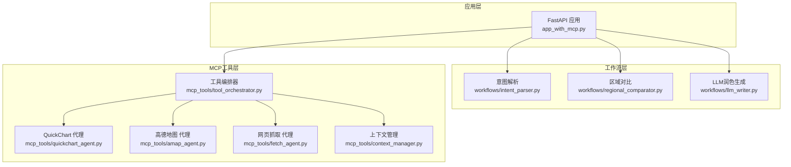
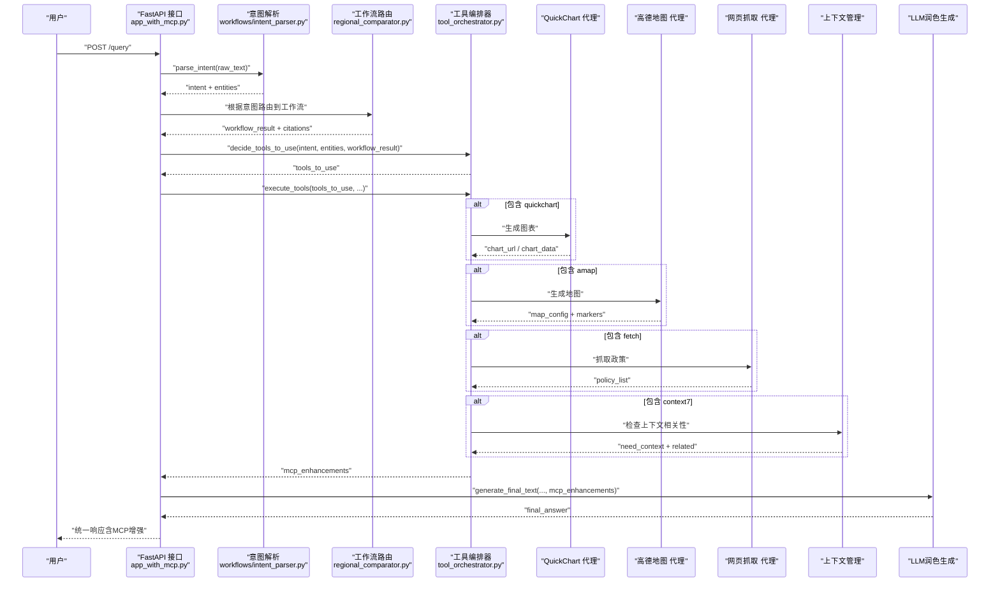
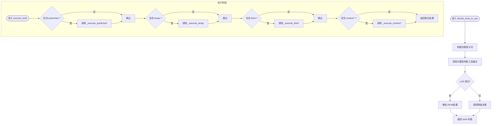
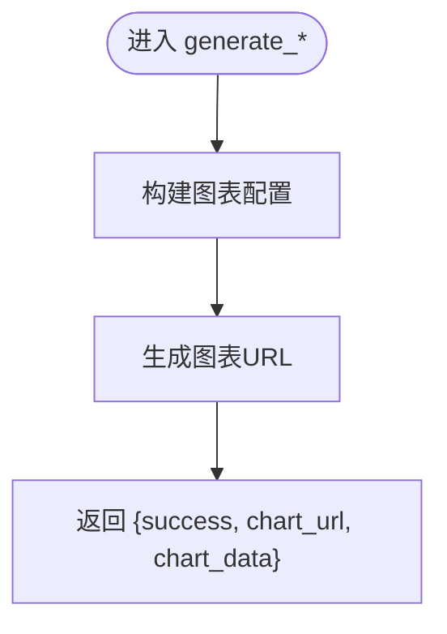
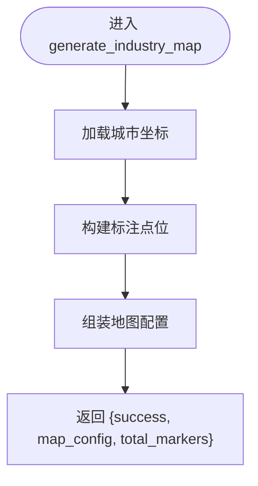
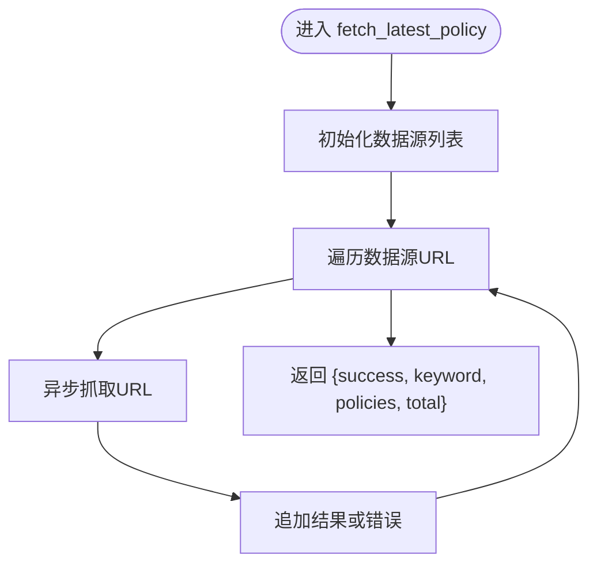
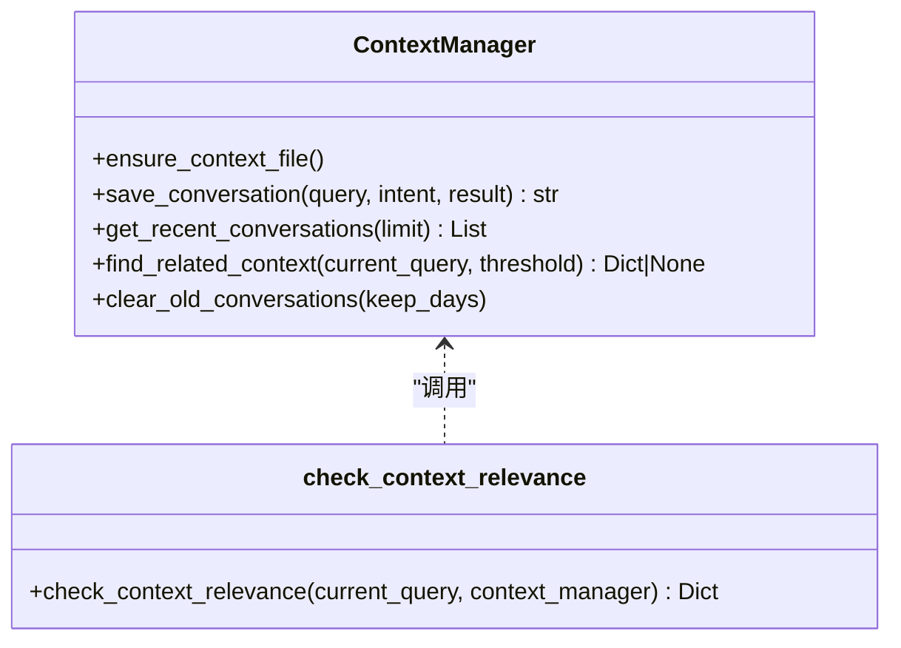
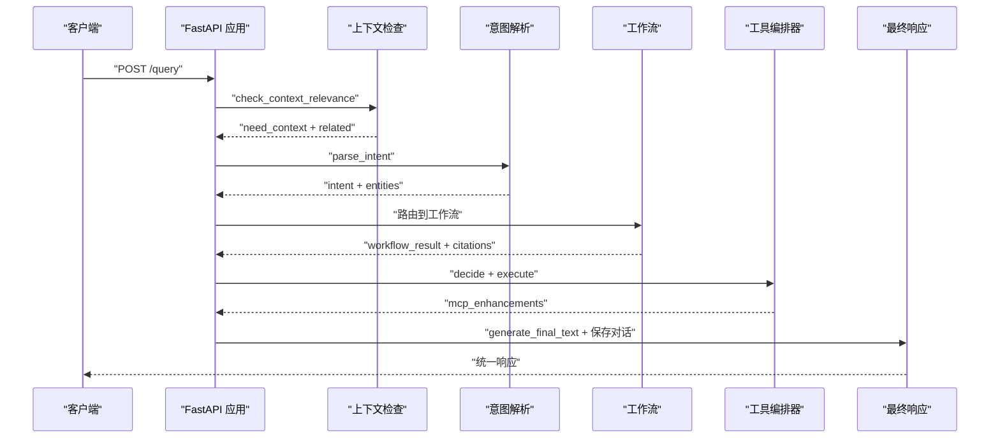
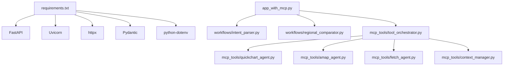

# MCP工具集成

<cite>
**本文引用的文件**
- [app_with_mcp.py](file://app_with_mcp.py)
- [mcp_servers.json](file://mcp_servers.json)
- [mcp_tools/tool_orchestrator.py](file://mcp_tools/tool_orchestrator.py)
- [mcp_tools/quickchart_agent.py](file://mcp_tools/quickchart_agent.py)
- [mcp_tools/amap_agent.py](file://mcp_tools/amap_agent.py)
- [mcp_tools/fetch_agent.py](file://mcp_tools/fetch_agent.py)
- [mcp_tools/context_manager.py](file://mcp_tools/context_manager.py)
- [workflows/regional_comparator.py](file://workflows/regional_comparator.py)
- [workflows/intent_parser.py](file://workflows/intent_parser.py)
- [requirements.txt](file://requirements.txt)
- [test_mcp.py](file://test_mcp.py)
- [工具调用指南.md](file://工具调用指南.md)
- [快速开始.md](file://快速开始.md)
</cite>

## 目录
1. [简介](#简介)
2. [项目结构](#项目结构)
3. [核心组件](#核心组件)
4. [架构总览](#架构总览)
5. [组件详解](#组件详解)
6. [依赖关系分析](#依赖关系分析)
7. [性能与可靠性](#性能与可靠性)
8. [故障排查](#故障排查)
9. [结论](#结论)
10. [附录](#附录)

## 简介
本文件面向“MCP（模块化代码插件）工具集成”的实现与使用，系统化说明如何通过独立的FastAPI服务（如QuickChart图表、高德地图、网页抓取、上下文管理）为系统提供扩展能力。文档覆盖以下要点：
- MCP架构设计理念：以“工具即服务”的方式，将图表生成、地图标注、实时抓取、上下文管理等能力抽象为可编排的MCP工具。
- 工具代理（Agent）功能：amap_agent用于地图标注与位置服务，quickchart_agent用于生成对比图、柱状图、流程图等，fetch_agent用于实时抓取外部网页内容，context_manager用于管理对话上下文。
- tool_orchestrator如何统一调度这些工具：根据意图、实体与工作流结果，决定是否调用工具以及调用顺序与参数。
- mcp_servers.json配置文件结构：定义各MCP工具的服务名、类型与访问端点。
- 在工作流中调用MCP工具的典型场景：区域对比中生成图表、报告生成中插入图表、企业信号灯中生成地图与评分图等。

## 项目结构
整体采用“工作流 + MCP工具编排”的分层设计：
- 应用入口：FastAPI服务，负责意图解析、工作流路由、MCP工具编排与最终答案生成。
- 工作流模块：按意图拆分，如区域对比、企业信号灯、政策解析、个人福利等。
- MCP工具模块：独立的工具代理，封装对第三方服务（QuickChart、高德、网页抓取、上下文）的调用。
- 配置与测试：mcp_servers.json集中声明MCP服务端点；test_mcp.py提供端到端调用示例。

**图表来源**
- [app_with_mcp.py](file://app_with_mcp.py#L47-L188)
- [workflows/intent_parser.py](file://workflows/intent_parser.py#L16-L120)
- [workflows/regional_comparator.py](file://workflows/regional_comparator.py#L6-L91)
- [mcp_tools/tool_orchestrator.py](file://mcp_tools/tool_orchestrator.py#L23-L155)
- [mcp_tools/quickchart_agent.py](file://mcp_tools/quickchart_agent.py#L1-L128)
- [mcp_tools/amap_agent.py](file://mcp_tools/amap_agent.py#L1-L92)
- [mcp_tools/fetch_agent.py](file://mcp_tools/fetch_agent.py#L1-L78)
- [mcp_tools/context_manager.py](file://mcp_tools/context_manager.py#L1-L152)

**章节来源**
- [app_with_mcp.py](file://app_with_mcp.py#L1-L222)
- [mcp_servers.json](file://mcp_servers.json#L1-L21)

## 核心组件
- 工具编排器（MCPToolOrchestrator）：负责根据意图、实体与工作流结果，决策是否调用MCP工具，并统一执行与聚合结果。
- 工具代理（Agent）：
  - quickchart_agent：生成对比图、企业评分柱状图、流程图。
  - amap_agent：生成产业分布地图与城市边界数据。
  - fetch_agent：抓取最新政策信息与检查更新。
  - context_manager：上下文对话管理与相关性检查。
- 配置文件（mcp_servers.json）：集中声明MCP服务的名称、类型与URL，便于统一接入与维护。
- 应用入口（app_with_mcp.py）：统一查询接口，串联意图解析、工作流路由、MCP工具增强与最终答案生成。

**章节来源**
- [mcp_tools/tool_orchestrator.py](file://mcp_tools/tool_orchestrator.py#L23-L228)
- [mcp_tools/quickchart_agent.py](file://mcp_tools/quickchart_agent.py#L1-L128)
- [mcp_tools/amap_agent.py](file://mcp_tools/amap_agent.py#L1-L92)
- [mcp_tools/fetch_agent.py](file://mcp_tools/fetch_agent.py#L1-L78)
- [mcp_tools/context_manager.py](file://mcp_tools/context_manager.py#L1-L152)
- [mcp_servers.json](file://mcp_servers.json#L1-L21)
- [app_with_mcp.py](file://app_with_mcp.py#L47-L188)

## 架构总览
MCP工具集成采用“意图驱动 + 工具编排”的模式：
- 意图解析：从用户查询中识别意图与实体，作为后续工作流与工具决策的输入。
- 工作流路由：根据意图将查询路由到相应的工作流模块，产出工作流结果与知识引用。
- 工具决策：编排器基于意图、实体与工作流结果，决定是否调用MCP工具（QuickChart、Amap、Fetch、Context7）。
- 工具执行：按需调用各工具代理，生成图表、地图或抓取网页内容。
- 结果融合：将MCP增强结果与工作流结果融合，交由LLM润色生成最终回答。
- 上下文管理：在对话中识别上下文相关性，必要时融合历史对话，提升交互连贯性。

**图表来源**
- [app_with_mcp.py](file://app_with_mcp.py#L47-L188)
- [workflows/intent_parser.py](file://workflows/intent_parser.py#L16-L120)
- [workflows/regional_comparator.py](file://workflows/regional_comparator.py#L6-L91)
- [mcp_tools/tool_orchestrator.py](file://mcp_tools/tool_orchestrator.py#L29-L155)
- [mcp_tools/quickchart_agent.py](file://mcp_tools/quickchart_agent.py#L1-L128)
- [mcp_tools/amap_agent.py](file://mcp_tools/amap_agent.py#L1-L92)
- [mcp_tools/fetch_agent.py](file://mcp_tools/fetch_agent.py#L1-L78)
- [mcp_tools/context_manager.py](file://mcp_tools/context_manager.py#L119-L152)

## 组件详解

### 工具编排器（MCPToolOrchestrator）
- 职责
  - 决策阶段：基于意图、实体与工作流结果，构建提示词并通过大模型判断需要调用的工具集合；若大模型不可用，则回退到规则决策。
  - 执行阶段：按工具清单依次执行，分别调用QuickChart、Amap、Fetch与Context7，聚合结果。
  - 辅助功能：保存对话记录，供后续上下文管理使用。
- 关键逻辑
  - 工具决策：针对区域对比与企业信号灯等场景，自动选择图表与地图工具；对包含“最新/更新/现在”等时间词的查询，倾向选择Fetch；对包含“刚才/那个/继续”等上下文词的查询，倾向选择Context7。
  - 执行策略：按需调用，避免不必要的网络开销；对异常进行捕获与降级。
  - 结果聚合：将各工具返回的图表URL、地图配置、抓取结果等，统一放入增强结果字典，供最终回答融合。

**图表来源**
- [mcp_tools/tool_orchestrator.py](file://mcp_tools/tool_orchestrator.py#L29-L155)

**章节来源**
- [mcp_tools/tool_orchestrator.py](file://mcp_tools/tool_orchestrator.py#L23-L228)

### QuickChart 代理（图表生成）
- 功能
  - 生成对比图（柱状图等）：用于区域对比场景，将工作流中的对比数据转换为图表URL。
  - 生成企业评分柱状图：用于企业信号灯场景，展示推荐企业的评分。
  - 生成流程图：用于政策解析场景，将流程步骤转换为可渲染的流程图。
- 参数与返回
  - 输入：数据结构、图表类型等；返回包含成功标志、图表URL与图表配置。
- 集成点
  - 编排器在区域对比、企业信号灯、政策解析等场景调用相应函数生成图表。

**图表来源**
- [mcp_tools/quickchart_agent.py](file://mcp_tools/quickchart_agent.py#L1-L128)

**章节来源**
- [mcp_tools/quickchart_agent.py](file://mcp_tools/quickchart_agent.py#L1-L128)

### 高德地图代理（amap_agent）
- 功能
  - 生成产业分布地图：接收企业列表（名称、城市、行业、评分），基于城市坐标生成标注点位与地图配置。
  - 获取城市边界：提供城市边界数据（示例返回，实际可对接高德API）。
- 参数与返回
  - 输入：企业列表、省份名称；返回包含成功标志、地图配置与标注数量。

**图表来源**
- [mcp_tools/amap_agent.py](file://mcp_tools/amap_agent.py#L1-L92)

**章节来源**
- [mcp_tools/amap_agent.py](file://mcp_tools/amap_agent.py#L1-L92)

### 网页抓取代理（fetch_agent）
- 功能
  - 抓取最新政策：根据关键词与默认数据源，发起异步抓取，汇总抓取结果与状态。
  - 检查政策更新：返回本地版本与最新版本信息（示例返回，实际可对接版本控制）。
- 参数与返回
  - 输入：关键词、数据源列表；返回包含成功标志、抓取结果列表与总数。

**图表来源**
- [mcp_tools/fetch_agent.py](file://mcp_tools/fetch_agent.py#L1-L78)

**章节来源**
- [mcp_tools/fetch_agent.py](file://mcp_tools/fetch_agent.py#L1-L78)

### 上下文管理（context_manager）
- 功能
  - 保存对话：将查询、意图、结果写入本地JSONL文件，生成对话ID。
  - 获取最近对话：读取最近N条对话记录。
  - 查找相关上下文：基于关键词相似度（Jaccard）查找最相关的历史对话。
  - 相关性检查：判断当前查询是否需要上下文融合。
- 参数与返回
  - 保存：返回conversation_id。
  - 查找：返回相关对话或None。
  - 相关性检查：返回need_context、related_conversation与理由。

**图表来源**
- [mcp_tools/context_manager.py](file://mcp_tools/context_manager.py#L1-L152)

**章节来源**
- [mcp_tools/context_manager.py](file://mcp_tools/context_manager.py#L1-L152)

### 应用入口（app_with_mcp.py）
- 统一查询接口：接收查询文本、用户上下文与是否启用MCP开关，返回统一响应。
- 工作流串联：意图解析 → 工作流路由 → MCP工具增强 → LLM润色 → 保存对话历史。
- MCP增强展示：在最终回答中提示图表URL与地图标注数量，便于前端渲染。

**图表来源**
- [app_with_mcp.py](file://app_with_mcp.py#L47-L188)

**章节来源**
- [app_with_mcp.py](file://app_with_mcp.py#L47-L188)

## 依赖关系分析
- 外部依赖
  - FastAPI、Uvicorn、Pydantic、httpx、python-dotenv等，用于Web服务、类型校验与HTTP调用。
- 内部依赖
  - 工具编排器依赖各工具代理与上下文管理器。
  - 应用入口依赖工作流模块与工具编排器。
  - 工具代理之间相互独立，仅通过编排器耦合。

**图表来源**
- [requirements.txt](file://requirements.txt#L1-L7)
- [app_with_mcp.py](file://app_with_mcp.py#L1-L222)
- [mcp_tools/tool_orchestrator.py](file://mcp_tools/tool_orchestrator.py#L1-L228)

**章节来源**
- [requirements.txt](file://requirements.txt#L1-L7)
- [app_with_mcp.py](file://app_with_mcp.py#L1-L222)
- [mcp_tools/tool_orchestrator.py](file://mcp_tools/tool_orchestrator.py#L1-L228)

## 性能与可靠性
- 异步调用：工具代理普遍采用异步HTTP客户端，降低等待时间，提高吞吐。
- 超时与重试：建议在调用外部服务时设置合理超时与指数退避重试策略，避免阻塞主流程。
- 降级策略：当大模型或外部服务不可用时，编排器提供规则降级与异常捕获，保证系统可用性。
- 输出格式：统一返回结构化字段，便于前端渲染与二次加工。

[本节为通用指导，无需列出具体文件来源]

## 故障排查
- 常见问题
  - API Key或服务地址配置错误：检查环境变量与大模型服务端点。
  - 网络超时或外部服务不可达：检查防火墙、DNS与代理设置。
  - 工具返回失败：查看工具代理的错误字段与异常堆栈。
- 定位手段
  - 使用统一响应中的错误字段与traceback信息定位问题。
  - 在编排器与工具代理中增加日志输出，便于追踪调用链。
- 建议
  - 对外部服务调用增加超时与重试；对返回数据进行严格校验与默认值兜底。

**章节来源**
- [app_with_mcp.py](file://app_with_mcp.py#L172-L188)
- [mcp_tools/tool_orchestrator.py](file://mcp_tools/tool_orchestrator.py#L83-L95)

## 结论
通过MCP工具集成，系统实现了“意图驱动 + 工具编排”的灵活扩展能力。工具代理以独立服务的形式提供图表、地图与抓取等能力，编排器根据业务意图与上下文动态调度，最终由LLM润色生成自然语言回答。该架构具备良好的可维护性与可扩展性，适合在政策咨询、数据分析与可视化场景中持续演进。

[本节为总结性内容，无需列出具体文件来源]

## 附录

### MCP配置文件（mcp_servers.json）
- 结构说明
  - mcpServers：包含多个MCP服务项，每项包含服务名、类型与URL。
  - 类型：streamable_http，表示可通过HTTP流式访问。
  - URL：指向具体的MCP服务端点。
- 使用建议
  - 将服务名与编排器中的工具标识保持一致，便于统一管理。
  - 如需切换服务端点，只需修改该文件，无需改动业务代码。

**章节来源**
- [mcp_servers.json](file://mcp_servers.json#L1-L21)

### 在工作流中调用MCP工具的典型场景
- 区域对比中生成图表
  - 场景：用户询问不同地区政策对比，系统在工作流中生成对比表格后，自动调用QuickChart生成柱状图。
  - 调用路径：工作流 → 编排器（区域对比）→ QuickChart → 返回图表URL。
- 报告生成中插入图表
  - 场景：在政策解析或企业信号灯报告中，自动插入流程图或评分图，提升可读性。
  - 调用路径：工作流 → 编排器（政策解析/信号灯）→ QuickChart → 返回图表URL。
- 企业信号灯中生成地图
  - 场景：在推荐企业列表中，自动调用高德地图生成产业分布图，标注企业位置。
  - 调用路径：工作流 → 编排器（信号灯）→ 高德地图 → 返回地图配置与标注数量。
- 上下文对话管理
  - 场景：用户连续提问，系统识别上下文相关性，融合历史对话，提升交互连贯性。
  - 调用路径：编排器 → 上下文管理 → 返回相关对话或空。

**章节来源**
- [mcp_tools/tool_orchestrator.py](file://mcp_tools/tool_orchestrator.py#L117-L207)
- [mcp_tools/quickchart_agent.py](file://mcp_tools/quickchart_agent.py#L1-L128)
- [mcp_tools/amap_agent.py](file://mcp_tools/amap_agent.py#L1-L92)
- [mcp_tools/context_manager.py](file://mcp_tools/context_manager.py#L119-L152)

### 代码示例（调用路径与文件定位）
- 统一查询接口
  - 路径：[app_with_mcp.py](file://app_with_mcp.py#L47-L188)
  - 说明：POST /query，返回统一响应，包含MCP增强字段。
- 工具编排器调用
  - 路径：[mcp_tools/tool_orchestrator.py](file://mcp_tools/tool_orchestrator.py#L117-L155)
  - 说明：decide_tools_to_use与execute_tools的调用链。
- QuickChart图表生成
  - 路径：[mcp_tools/quickchart_agent.py](file://mcp_tools/quickchart_agent.py#L1-L128)
  - 说明：generate_comparison_chart、generate_company_score_chart、generate_process_flowchart。
- 高德地图生成
  - 路径：[mcp_tools/amap_agent.py](file://mcp_tools/amap_agent.py#L1-L92)
  - 说明：generate_industry_map、get_city_boundary。
- 网页抓取
  - 路径：[mcp_tools/fetch_agent.py](file://mcp_tools/fetch_agent.py#L1-L78)
  - 说明：fetch_latest_policy、check_policy_updates。
- 上下文管理
  - 路径：[mcp_tools/context_manager.py](file://mcp_tools/context_manager.py#L1-L152)
  - 说明：ContextManager类与check_context_relevance函数。
- 端到端测试
  - 路径：[test_mcp.py](file://test_mcp.py#L1-L91)
  - 说明：演示启用/禁用MCP、查看增强结果与对话ID。

**章节来源**
- [app_with_mcp.py](file://app_with_mcp.py#L47-L188)
- [mcp_tools/tool_orchestrator.py](file://mcp_tools/tool_orchestrator.py#L117-L207)
- [mcp_tools/quickchart_agent.py](file://mcp_tools/quickchart_agent.py#L1-L128)
- [mcp_tools/amap_agent.py](file://mcp_tools/amap_agent.py#L1-L92)
- [mcp_tools/fetch_agent.py](file://mcp_tools/fetch_agent.py#L1-L78)
- [mcp_tools/context_manager.py](file://mcp_tools/context_manager.py#L1-L152)
- [test_mcp.py](file://test_mcp.py#L1-L91)

### 参考文档与指南
- 工具调用指南（QuickChart / Amap-Maps / Fetch / Context7-MCP）
  - 路径：[工具调用指南.md](file://工具调用指南.md#L1-L143)
  - 说明：通用调用约定、各工具入参与响应示例、端口整合策略与错误重试约定。
- 快速开始
  - 路径：[快速开始.md](file://快速开始.md#L1-L149)
  - 说明：安装依赖、启动服务、核心接口与常见问题。

**章节来源**
- [工具调用指南.md](file://工具调用指南.md#L1-L143)
- [快速开始.md](file://快速开始.md#L1-L149)