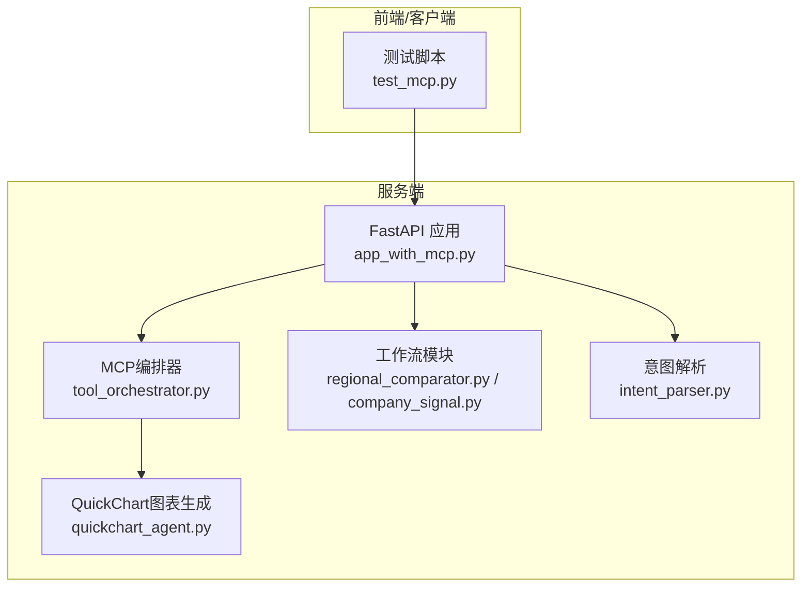
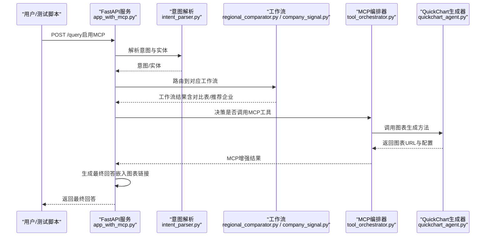
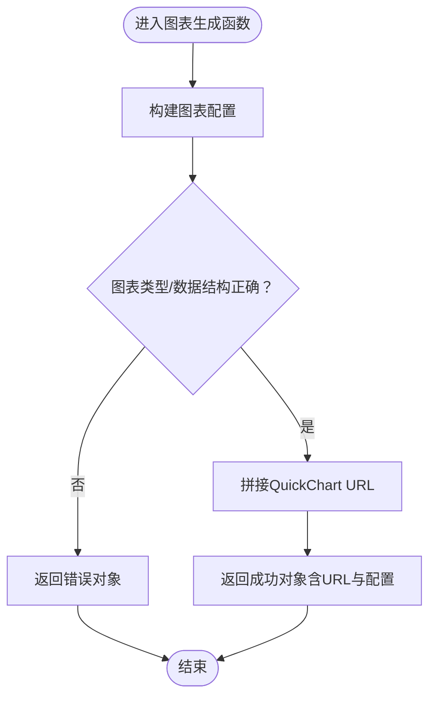
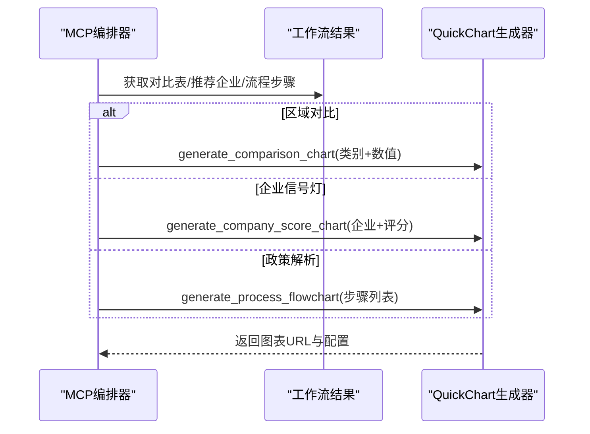
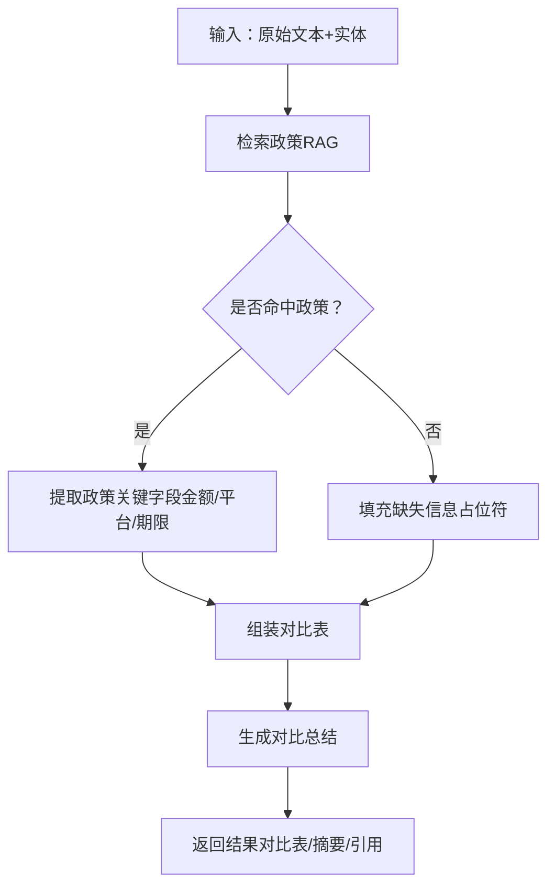
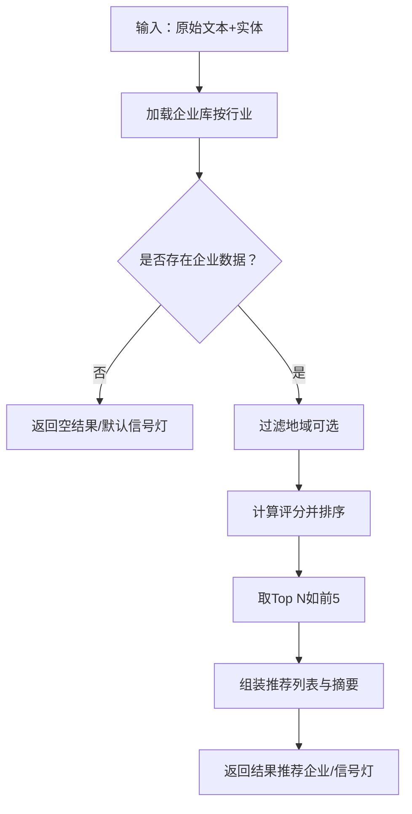
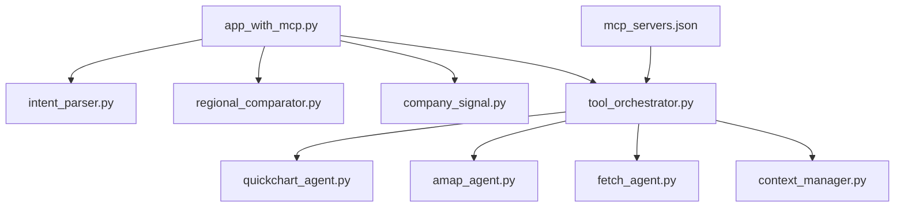

# QuickChart图表生成

<cite>
**本文档引用的文件**
- [quickchart_agent.py](file://mcp_tools/quickchart_agent.py)
- [tool_orchestrator.py](file://mcp_tools/tool_orchestrator.py)
- [app_with_mcp.py](file://app_with_mcp.py)
- [test_mcp.py](file://test_mcp.py)
- [regional_comparator.py](file://workflows/regional_comparator.py)
- [company_signal.py](file://workflows/company_signal.py)
- [intent_parser.py](file://workflows/intent_parser.py)
- [mcp_servers.json](file://mcp_servers.json)
- [companies_appliance.jsonl](file://data/companies/companies_appliance.jsonl)
- [policies.jsonl](file://data/policies/policies.jsonl)
</cite>

## 目录
1. [简介](#简介)
2. [项目结构](#项目结构)
3. [核心组件](#核心组件)
4. [架构总览](#架构总览)
5. [详细组件分析](#详细组件分析)
6. [依赖关系分析](#依赖关系分析)
7. [性能考量](#性能考量)
8. [故障排查指南](#故障排查指南)
9. [结论](#结论)
10. [附录](#附录)

## 简介
本文件系统化说明QuickChart MCP工具在本项目中的实现与使用方式，重点覆盖以下三个核心方法：
- generate_comparison_chart：生成区域政策对比柱状图（支持柱状/条形/雷达等类型）
- generate_company_score_chart：生成企业评分雷达图（企业信号灯场景）
- generate_process_flowchart：生成政策申领流程图（Mermaid流程图）

该工具通过调用外部QuickChart服务生成图表，并将图表URL嵌入最终回答，显著提升可读性与信息密度。文档同时结合测试用例，给出在“区域对比”和“企业信号灯”两类场景下的触发与使用示例。

## 项目结构
QuickChart工具位于mcp_tools模块，与意图解析、工作流、MCP编排器、FastAPI服务端协同工作。测试脚本test_mcp.py演示了如何通过HTTP接口触发MCP增强查询，并在最终回答中展示QuickChart图表链接。

图表来源
- [app_with_mcp.py](file://app_with_mcp.py#L47-L171)
- [tool_orchestrator.py](file://mcp_tools/tool_orchestrator.py#L117-L186)
- [quickchart_agent.py](file://mcp_tools/quickchart_agent.py#L8-L128)
- [regional_comparator.py](file://workflows/regional_comparator.py#L6-L91)
- [company_signal.py](file://workflows/company_signal.py#L62-L150)
- [intent_parser.py](file://workflows/intent_parser.py#L16-L121)

章节来源
- [app_with_mcp.py](file://app_with_mcp.py#L47-L171)
- [tool_orchestrator.py](file://mcp_tools/tool_orchestrator.py#L117-L186)
- [quickchart_agent.py](file://mcp_tools/quickchart_agent.py#L8-L128)
- [regional_comparator.py](file://workflows/regional_comparator.py#L6-L91)
- [company_signal.py](file://workflows/company_signal.py#L62-L150)
- [intent_parser.py](file://workflows/intent_parser.py#L16-L121)

## 核心组件
- QuickChart图表生成器（quickchart_agent.py）
  - generate_comparison_chart：生成对比图表，支持柱状/条形/雷达等类型，输入为类别与数值列表，输出包含成功标志、图表URL与图表配置。
  - generate_company_score_chart：生成企业评分柱状图，输入为企业列表（名称与分数），输出包含成功标志、图表URL与图表配置。
  - generate_process_flowchart：生成流程图（Mermaid语法），输入为步骤列表，输出包含成功标志、图表URL与Mermaid代码。
- MCP编排器（tool_orchestrator.py）
  - 根据意图与工作流结果决定是否调用QuickChart，并在合适时机调用上述三个方法。
  - 将图表结果注入最终回答（通过附加图表链接）。
- 工作流
  - 区域对比工作流（regional_comparator.py）：从知识库检索政策，提取补贴金额等关键指标，形成对比表。
  - 企业信号灯工作流（company_signal.py）：加载企业数据，计算评分并排序，输出推荐企业列表与信号灯等级。
- 意图解析（intent_parser.py）
  - 识别用户查询的意图（区域对比、企业信号灯等），并抽取实体（地点、产品、行业等）。
- 测试脚本（test_mcp.py）
  - 通过HTTP POST /query触发查询，启用MCP增强，观察最终回答中是否包含QuickChart图表链接。

章节来源
- [quickchart_agent.py](file://mcp_tools/quickchart_agent.py#L8-L128)
- [tool_orchestrator.py](file://mcp_tools/tool_orchestrator.py#L156-L186)
- [regional_comparator.py](file://workflows/regional_comparator.py#L6-L91)
- [company_signal.py](file://workflows/company_signal.py#L62-L150)
- [intent_parser.py](file://workflows/intent_parser.py#L16-L121)
- [test_mcp.py](file://test_mcp.py#L1-L91)

## 架构总览
下图展示了从用户查询到最终回答中嵌入QuickChart图表的关键路径。

图表来源
- [app_with_mcp.py](file://app_with_mcp.py#L47-L171)
- [intent_parser.py](file://workflows/intent_parser.py#L16-L121)
- [regional_comparator.py](file://workflows/regional_comparator.py#L6-L91)
- [company_signal.py](file://workflows/company_signal.py#L62-L150)
- [tool_orchestrator.py](file://mcp_tools/tool_orchestrator.py#L117-L186)
- [quickchart_agent.py](file://mcp_tools/quickchart_agent.py#L8-L128)

## 详细组件分析

### QuickChart图表生成器（quickchart_agent.py）
- generate_comparison_chart
  - 输入：对比数据列表（每项包含类别与数值），图表类型（柱状/条形/雷达等）
  - 输出：包含成功标志、图表URL与图表配置的对象
  - 作用：将对比数据转换为QuickChart图表配置，返回可访问的图表URL
- generate_company_score_chart
  - 输入：企业列表（每项包含名称与评分）
  - 输出：包含成功标志、图表URL与图表配置的对象
  - 作用：生成横向柱状图，直观展示企业评分
- generate_process_flowchart
  - 输入：步骤列表（字符串数组）
  - 输出：包含成功标志、图表URL与Mermaid代码的对象
  - 作用：将步骤序列转换为Mermaid流程图，便于展示政策申领流程

图表来源
- [quickchart_agent.py](file://mcp_tools/quickchart_agent.py#L8-L128)

章节来源
- [quickchart_agent.py](file://mcp_tools/quickchart_agent.py#L8-L128)

### MCP编排器（tool_orchestrator.py）
- 决策逻辑
  - 区域对比（regional_compare）：当存在对比表时，调用generate_comparison_chart生成对比柱状图
  - 企业信号灯（investment_signal）：当存在推荐企业时，调用generate_company_score_chart生成企业评分柱状图
  - 政策解析（policy_parse）：当存在流程描述时，调用generate_process_flowchart生成流程图
- 执行流程
  - _execute_quickchart：根据意图与工作流结果，构造输入数据并调用QuickChart生成器
  - _extract_amount：从补贴金额字符串中提取数值，用于对比图表的Y轴
- 结果注入
  - 将图表URL写入最终回答，便于用户点击查看

图表来源
- [tool_orchestrator.py](file://mcp_tools/tool_orchestrator.py#L156-L186)
- [quickchart_agent.py](file://mcp_tools/quickchart_agent.py#L8-L128)

章节来源
- [tool_orchestrator.py](file://mcp_tools/tool_orchestrator.py#L156-L186)

### 区域对比工作流（regional_comparator.py）
- 功能：从知识库检索政策，提取补贴金额、申领平台等关键信息，形成对比表
- 数据来源：policies.jsonl（政策明细）
- 输出：regions_compared、comparison_table、summary、kb_citations
- 与QuickChart集成：编排器从comparison_table提取“地区”与“补贴金额”，调用generate_comparison_chart生成对比柱状图

图表来源
- [regional_comparator.py](file://workflows/regional_comparator.py#L6-L91)

章节来源
- [regional_comparator.py](file://workflows/regional_comparator.py#L6-L91)
- [policies.jsonl](file://data/policies/policies.jsonl#L1-L9)

### 企业信号灯工作流（company_signal.py）
- 功能：加载企业数据，计算评分并排序，输出推荐企业列表与信号灯等级
- 数据来源：companies_appliance.jsonl（企业评分字段）
- 输出：recommended_companies、industry_summary、investment_signal、kb_citations
- 与QuickChart集成：编排器从recommended_companies提取“企业名称”与“总评分”，调用generate_company_score_chart生成企业评分柱状图

图表来源
- [company_signal.py](file://workflows/company_signal.py#L62-L150)

章节来源
- [company_signal.py](file://workflows/company_signal.py#L62-L150)
- [companies_appliance.jsonl](file://data/companies/companies_appliance.jsonl#L1-L70)

### 意图解析（intent_parser.py）
- 功能：识别查询意图（区域对比、企业信号灯等），并抽取实体（地点、产品、行业等）
- 输出：包含intent与实体字段的扁平化JSON
- 作用：为编排器提供决策依据（如是否调用QuickChart）

章节来源
- [intent_parser.py](file://workflows/intent_parser.py#L16-L121)

### 测试脚本（test_mcp.py）
- 功能：通过HTTP POST /query触发查询，启用MCP增强，打印最终回答与MCP增强结果（含QuickChart图表链接）
- 示例场景：
  - 区域对比：查询“济南和青岛的电脑补贴政策对比”，期望触发QuickChart对比柱状图
  - 企业信号灯：查询“餐饮行业有哪些值得招商的企业？”，期望触发QuickChart企业评分柱状图与Amap地图（若编排器判定需要）

章节来源
- [test_mcp.py](file://test_mcp.py#L1-L91)

## 依赖关系分析
- 外部服务
  - QuickChart服务：通过URL参数传递图表配置，返回可访问的图表URL
  - MCP服务器配置：mcp_servers.json定义了QuickChart等MCP服务的URL
- 内部模块耦合
  - app_with_mcp.py：统一入口，负责意图解析、工作流路由、MCP编排与最终回答生成
  - tool_orchestrator.py：根据意图与工作流结果决定是否调用QuickChart，并将结果注入最终回答
  - quickchart_agent.py：封装QuickChart调用细节，提供三个图表生成方法
  - workflows：提供数据源与工作流结果，作为图表输入

图表来源
- [app_with_mcp.py](file://app_with_mcp.py#L47-L171)
- [tool_orchestrator.py](file://mcp_tools/tool_orchestrator.py#L117-L186)
- [quickchart_agent.py](file://mcp_tools/quickchart_agent.py#L8-L128)
- [mcp_servers.json](file://mcp_servers.json#L1-L21)

章节来源
- [app_with_mcp.py](file://app_with_mcp.py#L47-L171)
- [tool_orchestrator.py](file://mcp_tools/tool_orchestrator.py#L117-L186)
- [quickchart_agent.py](file://mcp_tools/quickchart_agent.py#L8-L128)
- [mcp_servers.json](file://mcp_servers.json#L1-L21)

## 性能考量
- 图表生成延迟：QuickChart为外部服务，网络延迟与渲染时间会影响响应时间。建议在MCP编排器中增加超时与重试策略（当前实现未显式设置超时，可在扩展时加入）
- 数据规模：对比图表与企业评分图表的数据量较小（通常为数个到十数个数据点），生成与传输开销低
- 并发与缓存：若同一查询多次触发相同图表，可考虑在应用层缓存图表URL，避免重复生成

## 故障排查指南
- 图表未生成
  - 检查意图解析是否识别为“区域对比”或“企业信号灯”
  - 检查工作流是否返回有效数据（对比表/推荐企业）
  - 检查MCP编排器是否调用了QuickChart（可通过日志或调试输出确认）
- 图表URL无法访问
  - 确认QuickChart服务可达，检查网络与防火墙
  - 检查图表配置是否合法（类型、数据结构）
- 最终回答未包含图表链接
  - 确认app_with_mcp.py在生成最终回答时是否注入了mcp_enhancements中的图表URL

章节来源
- [app_with_mcp.py](file://app_with_mcp.py#L136-L151)
- [tool_orchestrator.py](file://mcp_tools/tool_orchestrator.py#L156-L186)
- [quickchart_agent.py](file://mcp_tools/quickchart_agent.py#L8-L128)

## 结论
QuickChart MCP工具通过将对比数据与企业评分转化为直观的可视化图表，显著提升了最终回答的可读性与信息密度。编排器根据意图与工作流结果自动决策是否生成图表，并将图表URL嵌入最终回答。测试脚本验证了在“区域对比”和“企业信号灯”场景下的可用性。未来可在超时与重试、缓存与并发等方面进一步优化。

## 附录

### 输入数据结构与输出格式
- generate_comparison_chart
  - 输入：data（列表，每项包含“category”与“value”）
  - 输出：包含“success”“chart_url”“chart_data”的对象
- generate_company_score_chart
  - 输入：companies（列表，每项包含“name”“score”）
  - 输出：包含“success”“chart_url”“chart_data”的对象
- generate_process_flowchart
  - 输入：steps（字符串数组）
  - 输出：包含“success”“chart_url”“mermaid_code”的对象

章节来源
- [quickchart_agent.py](file://mcp_tools/quickchart_agent.py#L8-L128)

### 场景示例与触发路径
- 区域对比（“济南和青岛的电脑补贴政策对比”）
  - 意图解析：识别为“regional_compare”
  - 工作流：compare_regions返回comparison_table
  - 编排器：调用generate_comparison_chart生成对比柱状图
  - 最终回答：嵌入图表URL
- 企业信号灯（“餐饮行业有哪些值得招商的企业？”）
  - 意图解析：识别为“investment_signal”
  - 工作流：analyze_company_signal返回recommended_companies
  - 编排器：调用generate_company_score_chart生成企业评分柱状图
  - 最终回答：嵌入图表URL

章节来源
- [test_mcp.py](file://test_mcp.py#L70-L91)
- [intent_parser.py](file://workflows/intent_parser.py#L16-L121)
- [regional_comparator.py](file://workflows/regional_comparator.py#L6-L91)
- [company_signal.py](file://workflows/company_signal.py#L62-L150)
- [tool_orchestrator.py](file://mcp_tools/tool_orchestrator.py#L156-L186)
- [app_with_mcp.py](file://app_with_mcp.py#L136-L151)