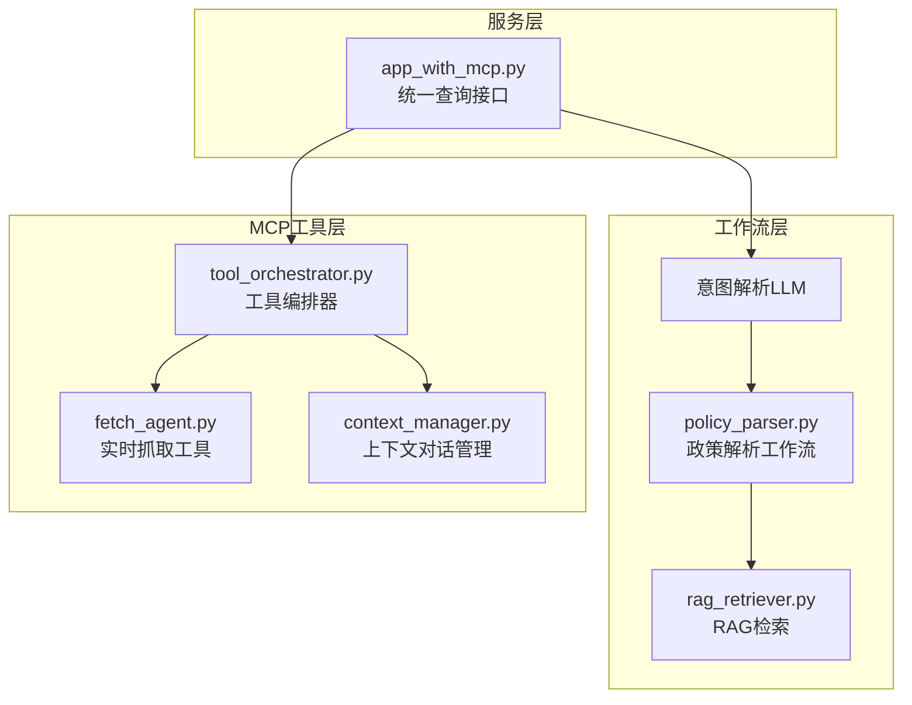
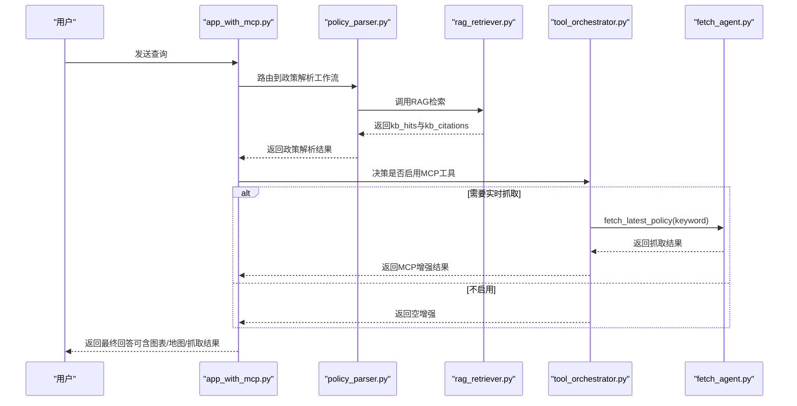
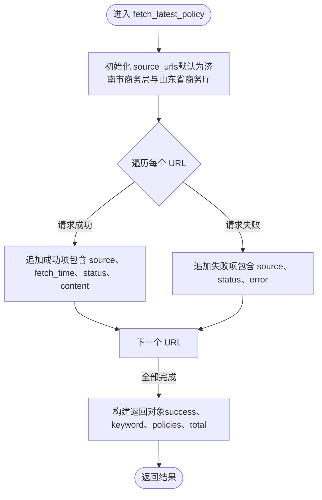
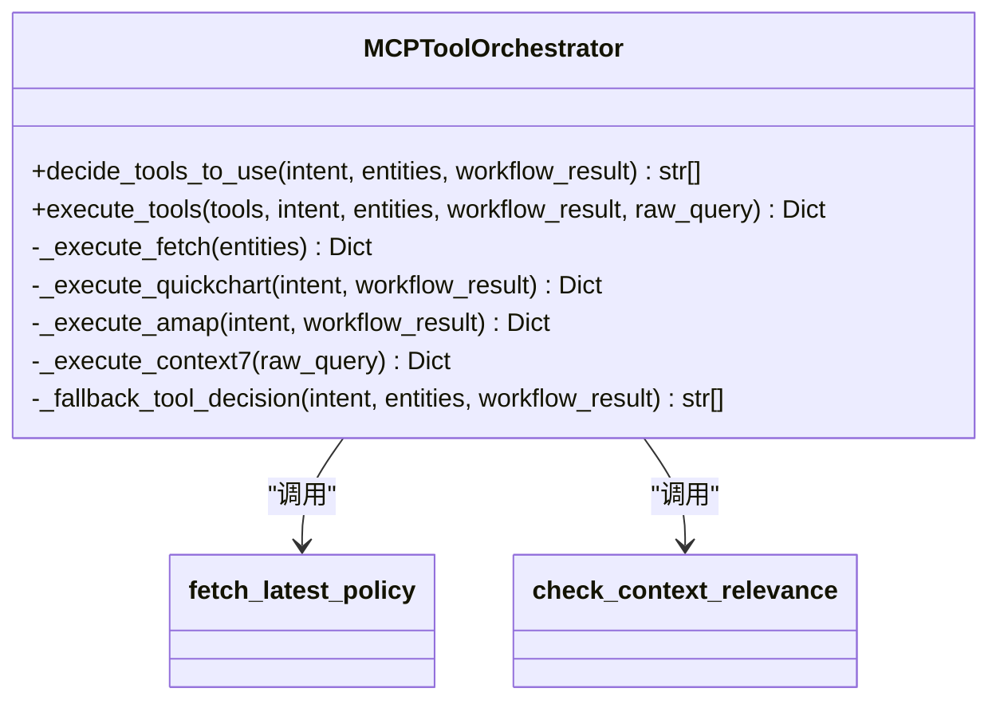
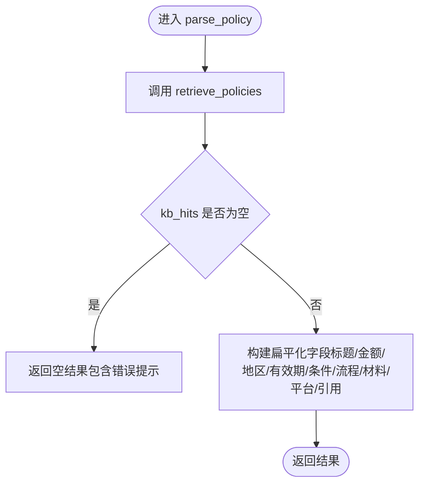
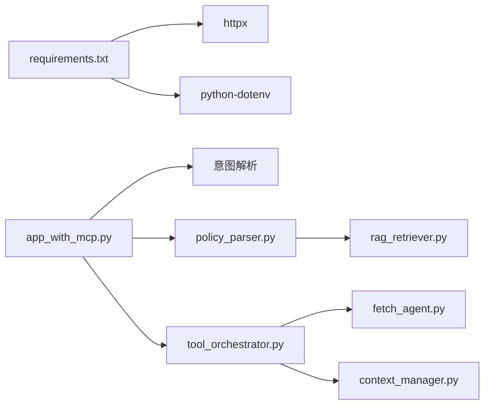

# 实时网页抓取

<cite>
**本文引用的文件**
- [mcp_tools/fetch_agent.py](file://mcp_tools/fetch_agent.py)
- [mcp_tools/tool_orchestrator.py](file://mcp_tools/tool_orchestrator.py)
- [app_with_mcp.py](file://app_with_mcp.py)
- [workflows/policy_parser.py](file://workflows/policy_parser.py)
- [workflows/rag_retriever.py](file://workflows/rag_retriever.py)
- [mcp_tools/context_manager.py](file://mcp_tools/context_manager.py)
- [requirements.txt](file://requirements.txt)
- [test_mcp.py](file://test_mcp.py)
</cite>

## 目录
1. [简介](#简介)
2. [项目结构](#项目结构)
3. [核心组件](#核心组件)
4. [架构总览](#架构总览)
5. [组件详解](#组件详解)
6. [依赖关系分析](#依赖关系分析)
7. [性能考量](#性能考量)
8. [故障排查指南](#故障排查指南)
9. [结论](#结论)
10. [附录](#附录)

## 简介
本文件围绕“实时网页抓取（Fetch）MCP工具”展开，重点说明其通过 fetch_latest_policy 和 check_policy_updates 方法从外部网站抓取最新政策内容的能力，并阐述其作为 RAG 系统补充的作用。尽管当前逻辑中未默认启用 fetch，但系统已具备在检测到可能需要最新信息时主动获取并验证政策更新的机制。文档还覆盖抓取目标、返回数据格式、与现有政策解析工作流的潜在集成方式，以及在保证信息准确性方面的价值与可能的性能开销。

## 项目结构
本项目采用“统一入口 + 工作流模块 + MCP 工具编排”的架构设计。与实时抓取直接相关的关键文件包括：
- MCP 工具实现：mcp_tools/fetch_agent.py
- 工具编排器：mcp_tools/tool_orchestrator.py
- 主服务入口：app_with_mcp.py
- 政策解析工作流：workflows/policy_parser.py
- RAG 检索模块：workflows/rag_retriever.py
- 上下文管理器：mcp_tools/context_manager.py
- 依赖声明：requirements.txt
- 测试脚本：test_mcp.py

**图表来源**
- [app_with_mcp.py](file://app_with_mcp.py#L47-L188)
- [workflows/policy_parser.py](file://workflows/policy_parser.py#L1-L83)
- [workflows/rag_retriever.py](file://workflows/rag_retriever.py#L215-L327)
- [mcp_tools/tool_orchestrator.py](file://mcp_tools/tool_orchestrator.py#L1-L228)
- [mcp_tools/fetch_agent.py](file://mcp_tools/fetch_agent.py#L1-L78)
- [mcp_tools/context_manager.py](file://mcp_tools/context_manager.py#L1-L152)

**章节来源**
- [app_with_mcp.py](file://app_with_mcp.py#L47-L188)
- [mcp_tools/tool_orchestrator.py](file://mcp_tools/tool_orchestrator.py#L1-L228)

## 核心组件
- 实时抓取工具（fetch_agent.py）
  - 提供 fetch_latest_policy 与 check_policy_updates 两个异步方法，分别负责“抓取最新政策”和“检查本地政策版本更新”。
  - 默认抓取目标为济南市商务局与山东省商务厅官网，便于获取区域与省级层面的政策动态。
- 工具编排器（tool_orchestrator.py）
  - 在意图识别为“policy_parse”时，提供可选的 fetch 工具调用能力；当前默认不自动启用，可通过规则或 LLM 决策开启。
  - 将实体信息（地点、产品）组合成关键词，驱动 fetch_latest_policy 的搜索。
- 政策解析工作流（policy_parser.py）
  - 基于 RAG 检索返回的 kb_hits，构建扁平化输出字段，便于下游使用。
  - 可与 fetch 结果结合，形成“结构化知识 + 实时抓取”的双重保障。
- RAG 检索模块（rag_retriever.py）
  - 统一加载主政策库与补充政策文档，进行实体过滤与向量相似度排序，返回 Top-K 命中与引用链接。
- 上下文管理器（context_manager.py）
  - 提供上下文相关性检查与历史对话存储，支撑“需要上下文”的查询场景。

**章节来源**
- [mcp_tools/fetch_agent.py](file://mcp_tools/fetch_agent.py#L9-L78)
- [mcp_tools/tool_orchestrator.py](file://mcp_tools/tool_orchestrator.py#L100-L155)
- [workflows/policy_parser.py](file://workflows/policy_parser.py#L1-L83)
- [workflows/rag_retriever.py](file://workflows/rag_retriever.py#L215-L327)
- [mcp_tools/context_manager.py](file://mcp_tools/context_manager.py#L1-L152)

## 架构总览
实时网页抓取在整体系统中的位置如下：
- 用户查询经统一入口进入，先进行意图解析与工作流路由；
- 若为政策解析，先走 RAG 检索，得到结构化政策结果；
- 编排器根据规则或 LLM 决策决定是否调用 fetch 工具；
- fetch 返回的实时抓取结果可与 RAG 结果融合，提升时效性；
- 最终由 LLM 润色生成最终回答，并可附加图表/地图等增强信息。

**图表来源**
- [app_with_mcp.py](file://app_with_mcp.py#L47-L188)
- [workflows/policy_parser.py](file://workflows/policy_parser.py#L1-L83)
- [workflows/rag_retriever.py](file://workflows/rag_retriever.py#L215-L327)
- [mcp_tools/tool_orchestrator.py](file://mcp_tools/tool_orchestrator.py#L117-L155)
- [mcp_tools/fetch_agent.py](file://mcp_tools/fetch_agent.py#L9-L78)

## 组件详解

### 实时抓取工具（fetch_agent.py）
- 功能职责
  - fetch_latest_policy：按关键词与可选的 source_urls 抓取外部网站，聚合抓取结果并返回统一格式。
  - check_policy_updates：检查本地政策版本更新状态（当前返回固定值，预留扩展空间）。
- 抓取目标
  - 默认抓取济南市商务局与山东省商务厅官网，便于获取区域与省级层面的政策动态。
- 返回数据格式
  - 成功时返回包含 success、keyword、policies、total 字段的对象；policies 中每个元素包含 source、fetch_time、status、content 或错误信息。
  - 失败时返回包含 success 与 error 的对象。
- 错误处理
  - 对每个 source_url 的抓取异常进行捕获并记录，不影响整体返回；最终返回统一的结构化结果。

**图表来源**
- [mcp_tools/fetch_agent.py](file://mcp_tools/fetch_agent.py#L9-L78)

**章节来源**
- [mcp_tools/fetch_agent.py](file://mcp_tools/fetch_agent.py#L9-L78)

### 工具编排器（tool_orchestrator.py）
- 功能职责
  - decide_tools_to_use：基于意图、实体与工作流结果，判断是否需要调用 fetch 工具；当前策略中，政策解析意图默认不启用 fetch。
  - execute_tools：按工具清单执行对应操作，其中 fetch 对应 _execute_fetch。
  - _execute_fetch：将实体信息（地点、产品）组合为关键词，调用 fetch_latest_policy。
- 与 fetch 的集成
  - 在政策解析工作流中，若需要最新信息，可由编排器触发 fetch；当前默认不启用，体现“按需启用”的设计理念。

**图表来源**
- [mcp_tools/tool_orchestrator.py](file://mcp_tools/tool_orchestrator.py#L1-L228)
- [mcp_tools/fetch_agent.py](file://mcp_tools/fetch_agent.py#L9-L78)
- [mcp_tools/context_manager.py](file://mcp_tools/context_manager.py#L119-L152)

**章节来源**
- [mcp_tools/tool_orchestrator.py](file://mcp_tools/tool_orchestrator.py#L96-L155)

### 政策解析工作流（policy_parser.py）
- 功能职责
  - 基于 RAG 检索返回的 kb_hits，构建扁平化输出字段（标题、补贴类型、金额、地区、有效期、条件、流程、所需材料、申领平台、引用等）。
  - 若未命中，返回空结果并提示未找到相关政策。
- 与 fetch 的潜在集成
  - 当 fetch 返回实时抓取结果时，可在最终回答中融合 fetch 的摘要信息，提升时效性与准确性。

**图表来源**
- [workflows/policy_parser.py](file://workflows/policy_parser.py#L1-L83)
- [workflows/rag_retriever.py](file://workflows/rag_retriever.py#L215-L327)

**章节来源**
- [workflows/policy_parser.py](file://workflows/policy_parser.py#L1-L83)
- [workflows/rag_retriever.py](file://workflows/rag_retriever.py#L215-L327)

### RAG 检索模块（rag_retriever.py）
- 功能职责
  - 加载主政策库与补充政策文档，按地域、产品、行业等实体进行过滤；
  - 向量化查询与候选，计算余弦相似度，排序并返回 Top-K 命中；
  - 生成引用链接（kb_citations）供最终回答使用。
- 与 fetch 的协同
  - RAG 提供结构化、可解释的政策知识；fetch 提供网页级实时信息，二者结合可兼顾准确性与时效性。

**章节来源**
- [workflows/rag_retriever.py](file://workflows/rag_retriever.py#L215-L327)

### 上下文管理器（context_manager.py）
- 功能职责
  - 保存对话历史、查找相关上下文、判断是否需要上下文；
  - 为 fetch 的“按需启用”提供语义支撑（例如用户询问“刚才提到的政策流程”时，可联动 fetch 获取最新流程）。
- 与 fetch 的关系
  - 当上下文相关性判断为“需要上下文”时，可结合 fetch 的抓取结果，给出更贴合上下文的最新信息。

**章节来源**
- [mcp_tools/context_manager.py](file://mcp_tools/context_manager.py#L1-L152)

## 依赖关系分析
- 外部依赖
  - httpx：用于异步 HTTP 请求（抓取与工具调用）。
  - python-dotenv：读取环境变量（如 DashScope API 基础地址、密钥等）。
- 内部依赖
  - app_with_mcp.py 依赖意图解析、政策解析、RAG 检索与工具编排器；
  - tool_orchestrator.py 依赖 fetch_agent 与 context_manager；
  - policy_parser.py 依赖 rag_retriever；
  - fetch_agent.py 依赖 httpx 与 datetime。

**图表来源**
- [requirements.txt](file://requirements.txt#L1-L7)
- [app_with_mcp.py](file://app_with_mcp.py#L1-L188)
- [mcp_tools/tool_orchestrator.py](file://mcp_tools/tool_orchestrator.py#L1-L228)
- [mcp_tools/fetch_agent.py](file://mcp_tools/fetch_agent.py#L1-L78)
- [mcp_tools/context_manager.py](file://mcp_tools/context_manager.py#L1-L152)
- [workflows/policy_parser.py](file://workflows/policy_parser.py#L1-L83)
- [workflows/rag_retriever.py](file://workflows/rag_retriever.py#L1-L327)

**章节来源**
- [requirements.txt](file://requirements.txt#L1-L7)
- [app_with_mcp.py](file://app_with_mcp.py#L1-L188)

## 性能考量
- 抓取并发与超时
  - fetch_latest_policy 使用异步客户端，对每个 source_url 并行发起请求；默认超时时间为 30 秒，可根据网络状况调整。
- RAG 向量化成本
  - 向量化与相似度计算为 CPU/网络开销较大的步骤；在高频查询场景下，建议缓存嵌入向量或限制 top_k。
- 工具编排的决策成本
  - LLM 决策路径会引入额外延迟；当前策略中，政策解析默认不启用 fetch，以降低不必要的开销。
- 输出与展示
  - 图表与地图生成会增加响应体积与渲染时间；建议按需启用。

[本节为通用性能讨论，无需具体文件分析]

## 故障排查指南
- HTTP 请求异常
  - 检查网络连通性与目标站点可达性；确认超时设置合理。
- LLM 决策失败
  - 当 LLM 调用失败时，编排器会降级为规则决策；可检查环境变量与模型配置。
- fetch 返回空或失败
  - 确认 source_urls 是否正确；检查 fetch 返回的 policies 中 status 与 error 字段，定位具体失败原因。
- 上下文相关性判断
  - 若上下文相关性判断不准确，可优化关键词集合或引入更高级的相似度算法。

**章节来源**
- [mcp_tools/tool_orchestrator.py](file://mcp_tools/tool_orchestrator.py#L67-L95)
- [mcp_tools/fetch_agent.py](file://mcp_tools/fetch_agent.py#L27-L78)
- [mcp_tools/context_manager.py](file://mcp_tools/context_manager.py#L119-L152)

## 结论
实时网页抓取（Fetch）MCP 工具为系统提供了“按需启用”的实时信息补充能力。尽管当前默认不启用，但其设计已充分考虑与 RAG 检索、意图解析、上下文管理的协同。通过 fetch_latest_policy 与 check_policy_updates，系统能够在用户表达“最新”“更新”等需求时，主动抓取并整合外部网页信息，从而在保证知识库时效性的同时，维持结构化输出的一致性与可解释性。未来可在此基础上扩展真实网页解析与增量更新机制，进一步提升准确性与性能。

[本节为总结性内容，无需具体文件分析]

## 附录

### 抓取目标与返回格式说明
- 抓取目标
  - 默认抓取济南市商务局与山东省商务厅官网，便于获取区域与省级层面的政策动态。
- 返回格式
  - 成功：包含 success、keyword、policies、total；policies 中每个元素包含 source、fetch_time、status、content 或错误信息。
  - 失败：包含 success 与 error。

**章节来源**
- [mcp_tools/fetch_agent.py](file://mcp_tools/fetch_agent.py#L9-L78)

### 与现有政策解析工作流的集成方式
- RAG 检索先行：先通过 RAG 返回结构化政策结果；
- 按需抓取：在编排器决策阶段，若需要最新信息，则调用 fetch；
- 结果融合：将 fetch 的摘要信息与 RAG 的结构化字段一起用于最终回答。

**章节来源**
- [workflows/policy_parser.py](file://workflows/policy_parser.py#L1-L83)
- [workflows/rag_retriever.py](file://workflows/rag_retriever.py#L215-L327)
- [mcp_tools/tool_orchestrator.py](file://mcp_tools/tool_orchestrator.py#L117-L155)

### 使用示例与测试
- 使用测试脚本调用统一查询接口，观察 MCP 增强结果（包括 fetch）。
- 可通过 enable_mcp 参数控制是否启用 MCP 工具增强。

**章节来源**
- [test_mcp.py](file://test_mcp.py#L1-L91)
- [app_with_mcp.py](file://app_with_mcp.py#L47-L188)