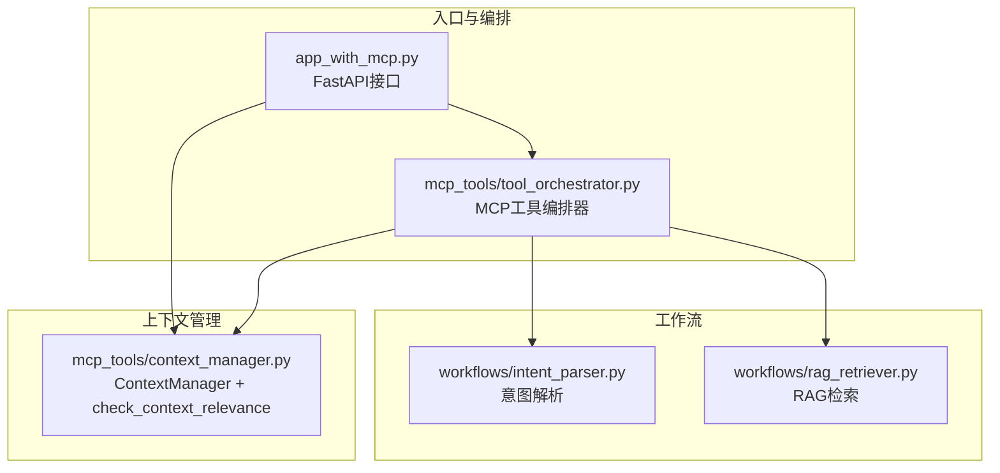
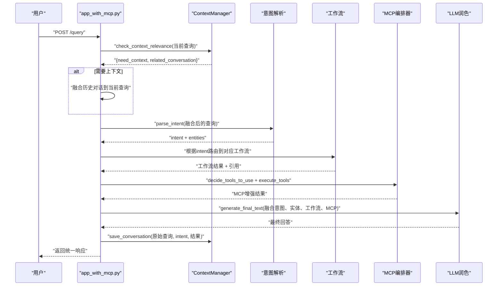
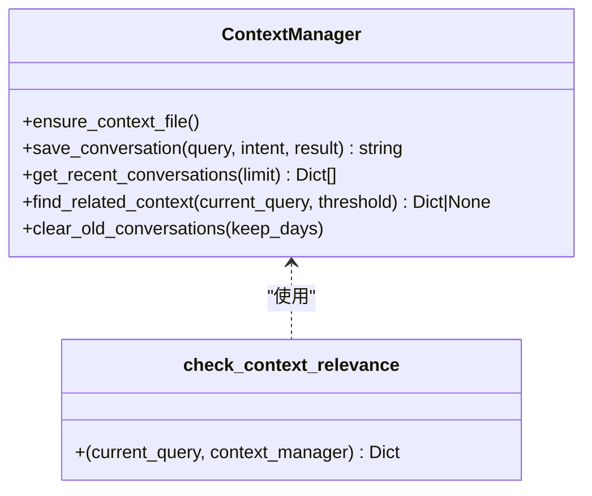
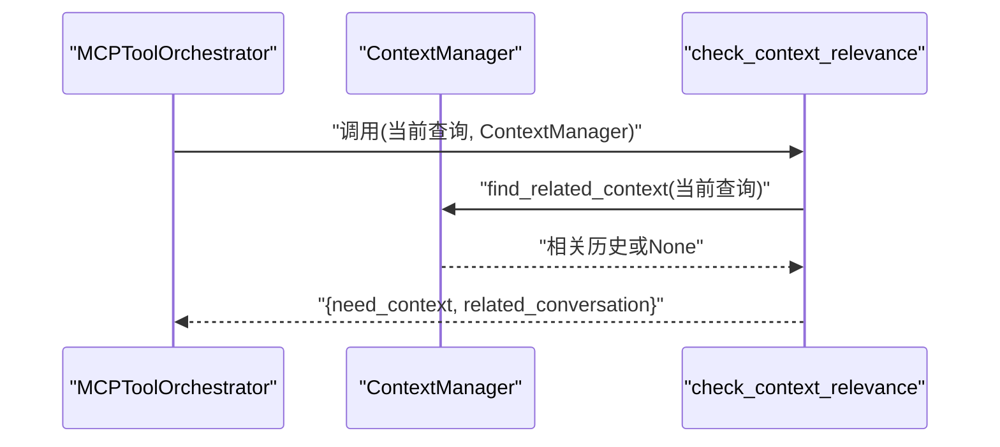
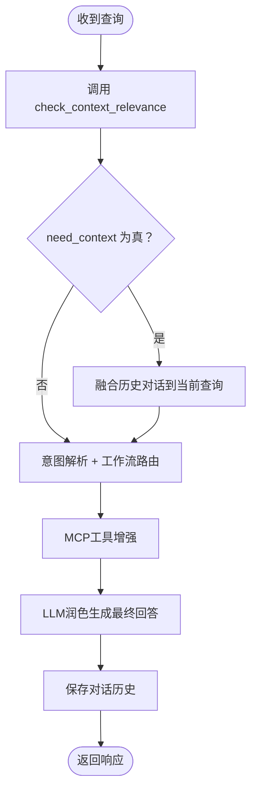

# 对话上下文管理

<cite>
**本文引用的文件**
- [mcp_tools/context_manager.py](file://mcp_tools/context_manager.py)
- [mcp_tools/tool_orchestrator.py](file://mcp_tools/tool_orchestrator.py)
- [app_with_mcp.py](file://app_with_mcp.py)
- [workflows/intent_parser.py](file://workflows/intent_parser.py)
- [workflows/rag_retriever.py](file://workflows/rag_retriever.py)
- [test_mcp.py](file://test_mcp.py)
</cite>

## 目录
1. [简介](#简介)
2. [项目结构](#项目结构)
3. [核心组件](#核心组件)
4. [架构总览](#架构总览)
5. [详细组件分析](#详细组件分析)
6. [依赖关系分析](#依赖关系分析)
7. [性能考量](#性能考量)
8. [故障排查指南](#故障排查指南)
9. [结论](#结论)
10. [附录](#附录)

## 简介
本文件围绕对话上下文管理（ContextManager）展开，重点解释其在支持多轮对话中的关键作用，包括：
- check_context_relevance 如何判断当前查询是否与历史对话相关
- save_conversation 如何存储对话历史以供后续引用
- 内部实现机制：如何利用轻量级本地存储管理会话状态
- 结合 app_with_mcp.py 的实际流程，说明当用户提出指代性问题（如“那个政策的流程是什么？”）时，系统如何通过上下文管理器检索之前的对话内容，并将其融合到当前查询中，从而实现连贯的对话体验。

## 项目结构
本项目采用模块化设计，对话上下文管理位于 mcp_tools 子目录，与意图解析、RAG 检索、MCP 工具编排器共同构成完整的智能体服务链路。



**图表来源**
- [app_with_mcp.py](file://app_with_mcp.py#L47-L188)
- [mcp_tools/tool_orchestrator.py](file://mcp_tools/tool_orchestrator.py#L23-L228)
- [workflows/intent_parser.py](file://workflows/intent_parser.py#L16-L125)
- [workflows/rag_retriever.py](file://workflows/rag_retriever.py#L215-L327)
- [mcp_tools/context_manager.py](file://mcp_tools/context_manager.py#L11-L152)

**章节来源**
- [app_with_mcp.py](file://app_with_mcp.py#L47-L188)
- [mcp_tools/tool_orchestrator.py](file://mcp_tools/tool_orchestrator.py#L23-L228)
- [mcp_tools/context_manager.py](file://mcp_tools/context_manager.py#L11-L152)

## 核心组件
- ContextManager：提供本地轻量级对话历史存储、最近对话读取、相关上下文查找、对话清理等能力。
- check_context_relevance：对当前查询进行上下文相关性判断，若命中上下文关键词，则尝试从历史中检索最相关的对话并返回。
- MCPToolOrchestrator：在启用 MCP 的情况下，负责工具决策与执行，其中 context7 工具即调用上下文相关性检查与历史检索。
- app_with_mcp：在请求处理流程中，先进行上下文相关性检查，再进行意图解析与工作流路由，最后保存对话历史。

**章节来源**
- [mcp_tools/context_manager.py](file://mcp_tools/context_manager.py#L11-L152)
- [mcp_tools/tool_orchestrator.py](file://mcp_tools/tool_orchestrator.py#L23-L228)
- [app_with_mcp.py](file://app_with_mcp.py#L47-L188)

## 架构总览
下图展示了从用户查询到上下文融合再到最终回答的完整流程，突出 ContextManager 在多轮对话中的关键位置。



**图表来源**
- [app_with_mcp.py](file://app_with_mcp.py#L47-L188)
- [mcp_tools/context_manager.py](file://mcp_tools/context_manager.py#L119-L152)
- [mcp_tools/tool_orchestrator.py](file://mcp_tools/tool_orchestrator.py#L117-L155)
- [workflows/intent_parser.py](file://workflows/intent_parser.py#L16-L125)

## 详细组件分析

### ContextManager 类与上下文相关性判断
- 职责
  - 本地持久化：以 JSON Lines 形式存储对话历史，键包含 conversation_id、timestamp、query、intent、result。
  - 最近对话：按时间顺序读取最近 N 条记录，便于快速检索。
  - 相关上下文：基于 Jaccard 相似度在最近对话中寻找与当前查询语义最接近的历史记录。
  - 清理策略：预留清理接口，当前版本为占位实现。
- 关键方法
  - save_conversation：生成短哈希作为 conversation_id，写入 JSON Lines 文件。
  - get_recent_conversations：读取最近 N 条记录。
  - find_related_context：计算当前查询与历史查询的关键词 Jaccard 相似度，返回最佳匹配。
  - clear_old_conversations：待实现。
- 上下文相关性判断
  - check_context_relevance：检测查询中是否包含“刚才”“上面”“那个”“这个政策”“刚说的”“继续”等关键词；若命中，则调用 find_related_context 获取相关历史，并返回 need_context 与 related_conversation。



**图表来源**
- [mcp_tools/context_manager.py](file://mcp_tools/context_manager.py#L11-L152)

**章节来源**
- [mcp_tools/context_manager.py](file://mcp_tools/context_manager.py#L11-L152)

### MCP 工具编排器中的上下文调用
- MCPToolOrchestrator 在工具决策阶段会根据意图、实体与工作流结果判断是否需要 context7 工具。
- 执行阶段通过 _execute_context7 调用 check_context_relevance，将当前查询与上下文管理器交互。
- 编排器还提供 save_conversation 方法，委托给 ContextManager 保存对话历史。



**图表来源**
- [mcp_tools/tool_orchestrator.py](file://mcp_tools/tool_orchestrator.py#L117-L155)
- [mcp_tools/context_manager.py](file://mcp_tools/context_manager.py#L79-L112)

**章节来源**
- [mcp_tools/tool_orchestrator.py](file://mcp_tools/tool_orchestrator.py#L23-L228)

### 应用层的上下文融合与对话保存
- app_with_mcp 在启用 MCP 的前提下，先调用 check_context_relevance 判断是否需要上下文。
- 若 need_context 为真且存在 related_conversation，则将历史 query 与当前查询进行融合，形成新的 raw_text，再进入意图解析与工作流。
- 最后调用 mcp_orchestrator.save_conversation 将本次对话保存至本地历史文件。



**图表来源**
- [app_with_mcp.py](file://app_with_mcp.py#L47-L188)
- [mcp_tools/context_manager.py](file://mcp_tools/context_manager.py#L119-L152)

**章节来源**
- [app_with_mcp.py](file://app_with_mcp.py#L47-L188)

### 指代性问题的处理示例
当用户提出“那个政策的流程是什么？”这类指代性问题时，系统通过以下步骤实现连贯对话：
- 关键词检测：check_context_relevance 检测到“那个”等上下文关键词，判定需要上下文。
- 历史检索：find_related_context 在最近对话中基于 Jaccard 相似度找到最相关的历史查询。
- 查询融合：app_with_mcp 将历史 query 与当前问题组合成新的 raw_text，再进行意图解析与工作流处理。
- 结果生成：LLM 基于融合后的输入生成针对“流程”的具体答案，并在需要时附加图表或地图等可视化增强。

该流程确保了“指代性问题”也能被正确理解并给出准确回答，显著提升了多轮对话的连贯性与用户体验。

**章节来源**
- [mcp_tools/context_manager.py](file://mcp_tools/context_manager.py#L119-L152)
- [app_with_mcp.py](file://app_with_mcp.py#L66-L76)

## 依赖关系分析
- ContextManager 依赖本地文件系统进行对话历史持久化，使用 JSON Lines 格式，便于增量追加与逐行解析。
- MCPToolOrchestrator 依赖 ContextManager 提供的上下文相关性检查与对话保存能力。
- app_with_mcp 依赖 MCPToolOrchestrator 的工具编排能力，同时在流程中直接调用 ContextManager 的相关方法。
- 意图解析与 RAG 检索为对话提供语义理解与知识支撑，与上下文管理相互配合，共同提升回答质量。

```mermaid
graph LR
CM["ContextManager"] <- --> TO["MCPToolOrchestrator"]
TO --> APP["app_with_mcp.py"]
INT["意图解析"] --> APP
RAG["RAG检索"] --> APP
APP --> CM
```

**图表来源**
- [mcp_tools/context_manager.py](file://mcp_tools/context_manager.py#L11-L152)
- [mcp_tools/tool_orchestrator.py](file://mcp_tools/tool_orchestrator.py#L23-L228)
- [app_with_mcp.py](file://app_with_mcp.py#L47-L188)
- [workflows/intent_parser.py](file://workflows/intent_parser.py#L16-L125)
- [workflows/rag_retriever.py](file://workflows/rag_retriever.py#L215-L327)

**章节来源**
- [mcp_tools/context_manager.py](file://mcp_tools/context_manager.py#L11-L152)
- [mcp_tools/tool_orchestrator.py](file://mcp_tools/tool_orchestrator.py#L23-L228)
- [app_with_mcp.py](file://app_with_mcp.py#L47-L188)

## 性能考量
- 存储与读取
  - 采用 JSON Lines 追加写入，避免频繁重写文件，写入开销低。
  - 读取最近 N 条记录时按行解析，时间复杂度与最近记录数线性相关。
- 相似度计算
  - 当前使用 Jaccard 相似度，计算成本较低，适合小规模历史记录。
  - 若未来历史规模扩大，可考虑引入向量相似度或倒排索引优化检索效率。
- 并发与一致性
  - 单进程写入 JSON Lines，无需锁；多进程并发写入需额外同步策略。
- 大模型辅助
  - 上下文相关性判断目前基于关键词规则，后续可接入大模型进行更精准的语义判断，提高准确性但增加延迟。

[本节为通用指导，不直接分析具体文件]

## 故障排查指南
- 上下文文件未创建或权限不足
  - 现象：首次运行无历史记录或保存失败。
  - 排查：确认 CONTEXT_FILE 所在目录是否存在且具备读写权限；ensure_context_file 会在初始化时自动创建空文件。
  - 参考路径：[mcp_tools/context_manager.py](file://mcp_tools/context_manager.py#L17-L23)
- 历史记录为空
  - 现象：find_related_context 返回 None。
  - 排查：确认已保存过至少一条对话记录；get_recent_conversations 仅返回最近 N 条。
  - 参考路径：[mcp_tools/context_manager.py](file://mcp_tools/context_manager.py#L53-L78)
- 上下文融合未生效
  - 现象：用户提问“那个政策的流程是什么？”未融合历史。
  - 排查：确认查询中包含“那个”“刚才”等关键词；检查 app_with_mcp 是否启用了 MCP 并正确调用 check_context_relevance。
  - 参考路径：[mcp_tools/context_manager.py](file://mcp_tools/context_manager.py#L119-L152)、[app_with_mcp.py](file://app_with_mcp.py#L66-L76)
- 对话保存失败
  - 现象：保存对话历史时报错。
  - 排查：检查 write 路径权限与磁盘空间；确认 JSON 序列化无异常。
  - 参考路径：[mcp_tools/context_manager.py](file://mcp_tools/context_manager.py#L24-L51)
- 工具决策未触发 context7
  - 现象：意图解析与工作流正常，但未进行上下文相关性检查。
  - 排查：确认 MCPToolOrchestrator.decide_tools_to_use 的规则或降级逻辑是否命中；或检查 app_with_mcp 是否显式禁用了 MCP。
  - 参考路径：[mcp_tools/tool_orchestrator.py](file://mcp_tools/tool_orchestrator.py#L29-L116)、[app_with_mcp.py](file://app_with_mcp.py#L113-L126)

**章节来源**
- [mcp_tools/context_manager.py](file://mcp_tools/context_manager.py#L17-L51)
- [mcp_tools/context_manager.py](file://mcp_tools/context_manager.py#L53-L112)
- [mcp_tools/tool_orchestrator.py](file://mcp_tools/tool_orchestrator.py#L29-L116)
- [app_with_mcp.py](file://app_with_mcp.py#L66-L76)

## 结论
ContextManager 通过轻量级本地存储与关键词相似度匹配，为多轮对话提供了低成本、易扩展的上下文管理能力。结合 MCP 工具编排器与 app_with_mcp 的流程设计，系统能够有效识别并融合指代性问题，显著提升对话连贯性与用户体验。未来可在相似度计算、清理策略与持久化介质上进一步优化，以适应更大规模与更高并发的场景。

[本节为总结性内容，不直接分析具体文件]

## 附录
- 测试用例参考
  - 使用 test_mcp.py 可验证上下文融合效果，例如先问“济南市电视机补贴政策是什么？”，再问“那个政策的申领流程是怎样的？”观察是否自动融合历史。
  - 参考路径：[test_mcp.py](file://test_mcp.py#L85-L89)

**章节来源**
- [test_mcp.py](file://test_mcp.py#L85-L89)