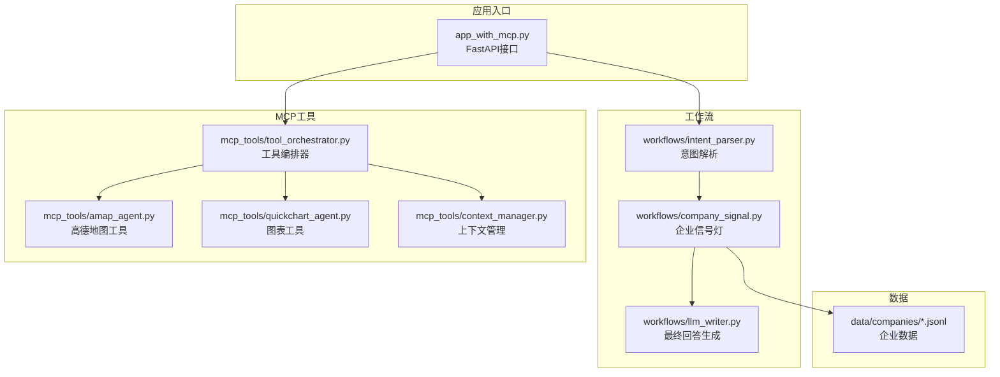
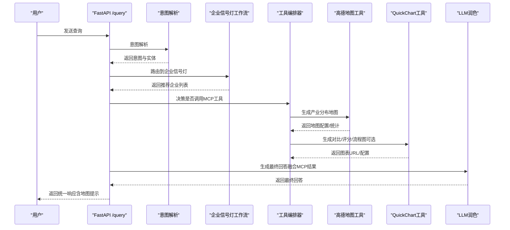
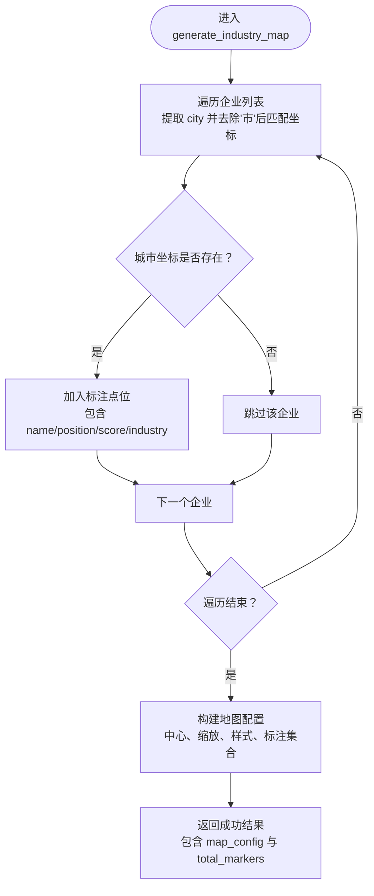
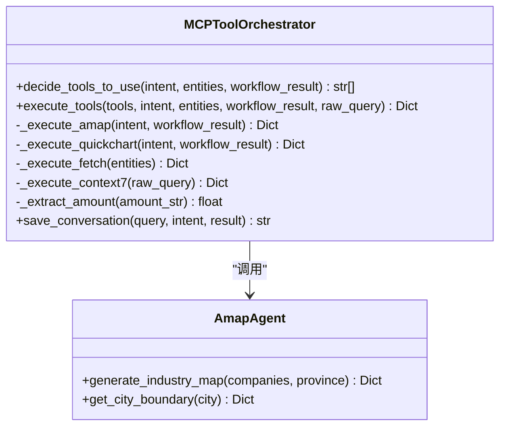
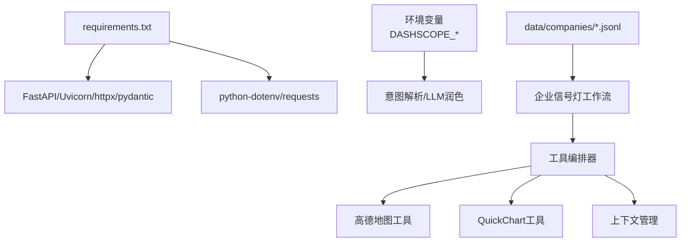

# 高德地图集成

<cite>
**本文引用的文件**
- [mcp_tools/amap_agent.py](file://mcp_tools/amap_agent.py)
- [mcp_tools/tool_orchestrator.py](file://mcp_tools/tool_orchestrator.py)
- [app_with_mcp.py](file://app_with_mcp.py)
- [workflows/company_signal.py](file://workflows/company_signal.py)
- [workflows/llm_writer.py](file://workflows/llm_writer.py)
- [workflows/intent_parser.py](file://workflows/intent_parser.py)
- [mcp_tools/quickchart_agent.py](file://mcp_tools/quickchart_agent.py)
- [mcp_tools/context_manager.py](file://mcp_tools/context_manager.py)
- [requirements.txt](file://requirements.txt)
- [data/companies/companies_appliance.jsonl](file://data/companies/companies_appliance.jsonl)
- [data/companies/companies_digital.jsonl](file://data/companies/companies_digital.jsonl)
</cite>

## 目录
1. [简介](#简介)
2. [项目结构](#项目结构)
3. [核心组件](#核心组件)
4. [架构总览](#架构总览)
5. [详细组件分析](#详细组件分析)
6. [依赖关系分析](#依赖关系分析)
7. [性能与可用性考量](#性能与可用性考量)
8. [故障排查指南](#故障排查指南)
9. [结论](#结论)
10. [附录](#附录)

## 简介
本文件面向“高德地图（Amap）MCP工具”的集成与使用，聚焦于“企业投资信号灯”场景下的产业分布地图生成能力。文档阐明：
- generate_industry_map 如何将企业投资分析结果中的地理位置信息可视化；
- 在工作流返回的企业列表非空时，系统如何自动触发地图生成，并在最终回答中添加地图提示；
- API调用参数与返回结构（如企业列表、坐标信息、地图配置等）；
- 与 QuickChart、Context7 的协同机制，以及与意图解析、企业信号灯工作流的衔接。

## 项目结构
围绕“MCP工具链”的关键目录与文件如下：
- mcp_tools：MCP工具编排与实现（amap、quickchart、context_manager、tool_orchestrator）
- workflows：业务工作流（意图解析、企业信号灯、LLM润色等）
- app_with_mcp.py：FastAPI入口，统一查询接口，集成MCP增强
- data/companies：企业数据（JSONL），用于企业信号灯工作流

图表来源
- [app_with_mcp.py](file://app_with_mcp.py#L1-L222)
- [workflows/intent_parser.py](file://workflows/intent_parser.py#L1-L175)
- [workflows/company_signal.py](file://workflows/company_signal.py#L1-L150)
- [workflows/llm_writer.py](file://workflows/llm_writer.py#L1-L145)
- [mcp_tools/tool_orchestrator.py](file://mcp_tools/tool_orchestrator.py#L1-L228)
- [mcp_tools/amap_agent.py](file://mcp_tools/amap_agent.py#L1-L92)
- [mcp_tools/quickchart_agent.py](file://mcp_tools/quickchart_agent.py#L1-L128)
- [mcp_tools/context_manager.py](file://mcp_tools/context_manager.py#L1-L152)
- [data/companies/companies_appliance.jsonl](file://data/companies/companies_appliance.jsonl#L1-L70)

章节来源
- [app_with_mcp.py](file://app_with_mcp.py#L1-L222)
- [mcp_tools/tool_orchestrator.py](file://mcp_tools/tool_orchestrator.py#L1-L228)

## 核心组件
- 高德地图工具（amap_agent）
  - generate_industry_map：接收企业列表，构建地图配置与标注点位，返回地图配置与统计信息
  - get_city_boundary：占位函数，用于城市边界数据（当前返回模拟数据）
- 工具编排器（tool_orchestrator）
  - decide_tools_to_use：基于意图、实体与工作流结果，决定是否调用 amap、quickchart、fetch、context7
  - execute_tools：按需执行工具，收集结果
  - _execute_amap：针对“企业投资信号灯”意图，将推荐企业转换为地图输入并调用 generate_industry_map
- 应用入口（app_with_mcp）
  - /query 接口：统一处理查询，路由到工作流，执行MCP工具增强，最终生成回答
  - 自动在回答中追加地图提示（若 amap 成功）

章节来源
- [mcp_tools/amap_agent.py](file://mcp_tools/amap_agent.py#L1-L92)
- [mcp_tools/tool_orchestrator.py](file://mcp_tools/tool_orchestrator.py#L1-L228)
- [app_with_mcp.py](file://app_with_mcp.py#L1-L222)

## 架构总览
整体流程：用户查询 -> 意图解析 -> 企业信号灯工作流 -> LLM润色 -> MCP工具增强（amap/quickchart/context7）-> 最终回答

图表来源
- [app_with_mcp.py](file://app_with_mcp.py#L1-L222)
- [workflows/intent_parser.py](file://workflows/intent_parser.py#L1-L175)
- [workflows/company_signal.py](file://workflows/company_signal.py#L1-L150)
- [mcp_tools/tool_orchestrator.py](file://mcp_tools/tool_orchestrator.py#L1-L228)
- [mcp_tools/amap_agent.py](file://mcp_tools/amap_agent.py#L1-L92)
- [mcp_tools/quickchart_agent.py](file://mcp_tools/quickchart_agent.py#L1-L128)
- [workflows/llm_writer.py](file://workflows/llm_writer.py#L1-L145)

## 详细组件分析

### 高德地图工具（amap_agent）
- generate_industry_map
  - 输入：企业列表（包含 name、city、industry、score 等字段）
  - 处理：根据城市映射表将地市转换为经纬度，构建标注点位；设置地图中心、缩放级别、样式
  - 输出：包含 success、map_config、total_markers 的字典；异常时返回 success=false 和错误信息
- get_city_boundary
  - 输入：城市名称
  - 输出：模拟的城市边界数据（当前占位，后续可对接高德API）

图表来源
- [mcp_tools/amap_agent.py](file://mcp_tools/amap_agent.py#L1-L92)

章节来源
- [mcp_tools/amap_agent.py](file://mcp_tools/amap_agent.py#L1-L92)

### 工具编排器（tool_orchestrator）
- decide_tools_to_use
  - 基于意图、实体与工作流结果，判断是否需要 amap/quickchart/fetch/context7
  - “企业投资信号灯”意图且存在推荐企业时，优先调用 quickchart 与 amap
- execute_tools
  - 按需执行各工具，聚合结果
- _execute_amap
  - 将推荐企业转换为地图输入（提取 location 中的“市”作为 city 字段）
  - 调用 generate_industry_map 并返回结果

图表来源
- [mcp_tools/tool_orchestrator.py](file://mcp_tools/tool_orchestrator.py#L1-L228)
- [mcp_tools/amap_agent.py](file://mcp_tools/amap_agent.py#L1-L92)

章节来源
- [mcp_tools/tool_orchestrator.py](file://mcp_tools/tool_orchestrator.py#L1-L228)

### 应用入口（app_with_mcp）
- /query 接口
  - 步骤：上下文检查（可选）-> 意图解析 -> 工作流路由 -> MCP工具增强 -> LLM润色 -> 保存对话历史
  - 若 amap 成功，自动在最终回答中追加“产业分布地图”提示
- 响应结构
  - 包含 success、intent、raw_text、entities、result、final_answer、mcp_enhancements、conversation_id 等字段

章节来源
- [app_with_mcp.py](file://app_with_mcp.py#L1-L222)

### 企业信号灯工作流（company_signal）
- 输入：意图解析得到的行业与地点实体
- 输出：推荐企业列表、行业总结、投资信号灯、知识库引用
- 数据来源：data/companies 下的 JSONL 文件（按行业分类）

章节来源
- [workflows/company_signal.py](file://workflows/company_signal.py#L1-L150)
- [data/companies/companies_appliance.jsonl](file://data/companies/companies_appliance.jsonl#L1-L70)
- [data/companies/companies_digital.jsonl](file://data/companies/companies_digital.jsonl#L1-L162)

### LLM润色（llm_writer）
- 根据不同意图，将结构化结果（如政策解析、个人福利、区域对比、企业投资信号灯）转化为自然语言回答
- 可选追加知识库引用

章节来源
- [workflows/llm_writer.py](file://workflows/llm_writer.py#L1-L145)

### 意图解析（intent_parser）
- 识别用户查询的意图（policy_parse、personal_welfare、regional_compare、investment_signal）
- 提取实体（地点、产品、公司、行业、时间、价格、能效等级等）

章节来源
- [workflows/intent_parser.py](file://workflows/intent_parser.py#L1-L175)

### QuickChart 工具（quickchart_agent）
- 生成对比图、企业评分柱状图、流程图等
- 与 amap 协同：在“企业投资信号灯”场景下，先生成评分柱状图，再生成产业分布地图

章节来源
- [mcp_tools/quickchart_agent.py](file://mcp_tools/quickchart_agent.py#L1-L128)

### 上下文管理（context_manager）
- 保存对话历史、查找相关上下文、提供上下文融合能力
- 与 app_with_mcp 的上下文检查配合使用

章节来源
- [mcp_tools/context_manager.py](file://mcp_tools/context_manager.py#L1-L152)

## 依赖关系分析
- 运行时依赖
  - FastAPI、Uvicorn、httpx、pydantic、python-dotenv、requests
- 环境变量
  - DASHSCOPE_API_BASE_URL、DASHSCOPE_API_KEY、DASHSCOPE_CHAT_MODEL
- 数据依赖
  - data/companies/*.jsonl：企业数据（JSONL）

图表来源
- [requirements.txt](file://requirements.txt#L1-L7)
- [workflows/intent_parser.py](file://workflows/intent_parser.py#L1-L175)
- [workflows/llm_writer.py](file://workflows/llm_writer.py#L1-L145)
- [workflows/company_signal.py](file://workflows/company_signal.py#L1-L150)
- [mcp_tools/tool_orchestrator.py](file://mcp_tools/tool_orchestrator.py#L1-L228)
- [mcp_tools/amap_agent.py](file://mcp_tools/amap_agent.py#L1-L92)
- [mcp_tools/quickchart_agent.py](file://mcp_tools/quickchart_agent.py#L1-L128)
- [mcp_tools/context_manager.py](file://mcp_tools/context_manager.py#L1-L152)

章节来源
- [requirements.txt](file://requirements.txt#L1-L7)

## 性能与可用性考量
- 异步调用：amap_agent、quickchart_agent、intent_parser、llm_writer 均采用异步HTTP客户端，降低I/O阻塞
- 缓存与重试：当前实现未内置缓存/重试策略，建议在生产环境增加指数退避与超时配置
- 地图数据规模：generate_industry_map 会遍历企业列表并匹配城市坐标，建议对城市坐标表进行索引优化
- 工具编排：decide_tools_to_use 支持LLM决策与规则降级，保证稳定性

[本节为通用指导，无需特定文件引用]

## 故障排查指南
- amap 返回失败
  - 检查 generate_industry_map 的异常捕获与返回结构
  - 确认企业列表中的 city 字段是否包含“市”，是否能被坐标映射表正确匹配
- MCP工具未触发
  - 检查 decide_tools_to_use 的规则与LLM降级逻辑
  - 确认工作流返回的 recommended_companies 是否非空
- 回答中未出现地图提示
  - 检查 app_with_mcp 对 mcp_enhancements 的处理逻辑
  - 确认 amap 的 success 字段为真

章节来源
- [mcp_tools/amap_agent.py](file://mcp_tools/amap_agent.py#L1-L92)
- [mcp_tools/tool_orchestrator.py](file://mcp_tools/tool_orchestrator.py#L1-L228)
- [app_with_mcp.py](file://app_with_mcp.py#L1-L222)

## 结论
- 本系统通过“企业投资信号灯”工作流产出推荐企业列表，并在满足条件时自动触发高德地图工具生成产业分布地图
- generate_industry_map 将企业地理位置信息可视化，结合 QuickChart 的评分图，形成“图表+地图”的综合可视化增强
- 应用入口在最终回答中自动追加地图提示，提升用户体验与空间决策支持

[本节为总结性内容，无需特定文件引用]

## 附录

### API定义与调用参数
- generate_industry_map
  - 参数
    - companies：企业列表，元素包含 name、city、industry、score 等
    - province：省份名称（默认“山东省”）
  - 返回
    - success：布尔
    - map_config：地图配置（包含 province、center、zoom、markers、style 等）
    - total_markers：标注总数
    - error：异常信息（当 success=false 时）
- get_city_boundary
  - 参数
    - city：城市名称
  - 返回
    - success：布尔
    - city：城市名称
    - boundary：城市边界数据（当前为模拟数据）

章节来源
- [mcp_tools/amap_agent.py](file://mcp_tools/amap_agent.py#L1-L92)

### 企业数据字段说明（来自 JSONL）
- 示例字段：company_id、name、industry、province、city、main_products、registered_capital_wan、established_date、scope_raw、age_years、score、patents_count、rd_investment_ratio、innovation_score、recruitment_intent_score、news_sentiment_score、expansion_willingness、existing_channels、source_urls、last_updated
- 用途：企业信号灯工作流评分与筛选的基础数据

章节来源
- [data/companies/companies_appliance.jsonl](file://data/companies/companies_appliance.jsonl#L1-L70)
- [data/companies/companies_digital.jsonl](file://data/companies/companies_digital.jsonl#L1-L162)

### 场景联动要点
- 当工作流返回的 recommended_companies 非空时，工具编排器会自动调用 amap 生成产业分布地图
- 应用入口会在最终回答中追加“产业分布地图”提示，提示标注数量
- QuickChart 与 amap 可同时启用，分别生成评分图与分布图，共同支撑“企业投资信号灯”场景

章节来源
- [mcp_tools/tool_orchestrator.py](file://mcp_tools/tool_orchestrator.py#L1-L228)
- [app_with_mcp.py](file://app_with_mcp.py#L1-L222)