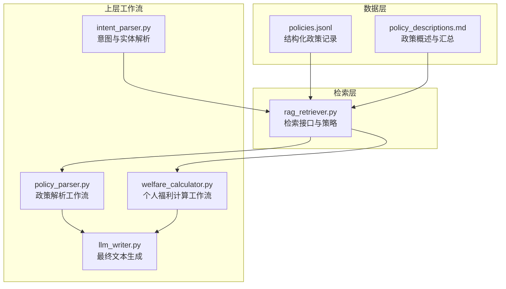
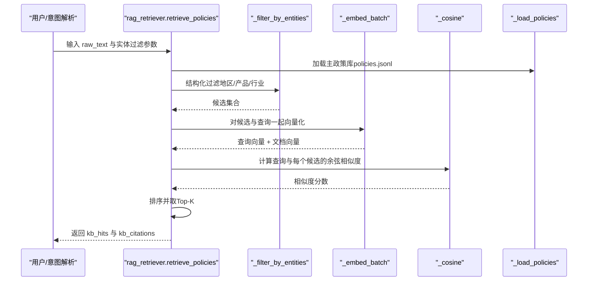
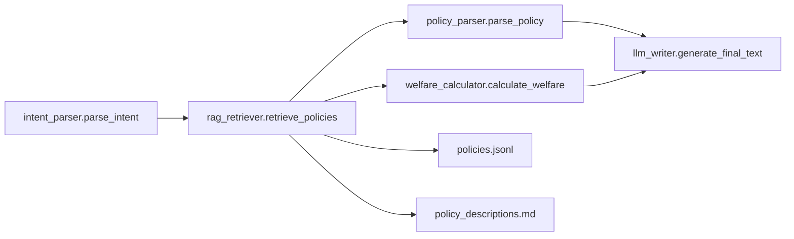

# RAG检索系统

<cite>
**本文引用的文件**
- [rag_retriever.py](file://workflows/rag_retriever.py)
- [policy_descriptions.md](file://data/policies/policy_descriptions.md)
- [policies.jsonl](file://data/policies/policies.jsonl)
- [intent_parser.py](file://workflows/intent_parser.py)
- [policy_parser.py](file://workflows/policy_parser.py)
- [welfare_calculator.py](file://workflows/welfare_calculator.py)
- [llm_writer.py](file://workflows/llm_writer.py)
- [requirements.txt](file://requirements.txt)
</cite>

## 目录
1. [简介](#简介)
2. [项目结构](#项目结构)
3. [核心组件](#核心组件)
4. [架构总览](#架构总览)
5. [详细组件分析](#详细组件分析)
6. [依赖关系分析](#依赖关系分析)
7. [性能考量](#性能考量)
8. [故障排查指南](#故障排查指南)
9. [结论](#结论)
10. [附录](#附录)

## 简介
本文件聚焦RAG（检索增强生成）系统的检索模块，全面解析 workflows/rag_retriever.py 的实现细节，阐明其检索策略、索引构建方式、检索流程以及输出格式，并说明该模块如何为上层工作流（政策解析、个人福利计算）提供准确、可验证的信息支持。

## 项目结构
RAG检索系统位于 workflows 目录，围绕 policies.jsonl 结构化政策数据与 policy_descriptions.md 叙述性描述文件构建统一检索能力。检索结果被上层工作流消费，用于政策解析与福利计算。

图表来源
- [rag_retriever.py](file://workflows/rag_retriever.py#L1-L327)
- [policy_descriptions.md](file://data/policies/policy_descriptions.md#L1-L23)
- [policies.jsonl](file://data/policies/policies.jsonl#L1-L9)
- [intent_parser.py](file://workflows/intent_parser.py#L1-L175)
- [policy_parser.py](file://workflows/policy_parser.py#L1-L83)
- [welfare_calculator.py](file://workflows/welfare_calculator.py#L1-L123)
- [llm_writer.py](file://workflows/llm_writer.py#L1-L39)

章节来源
- [rag_retriever.py](file://workflows/rag_retriever.py#L1-L327)
- [policy_descriptions.md](file://data/policies/policy_descriptions.md#L1-L23)
- [policies.jsonl](file://data/policies/policies.jsonl#L1-L9)
- [intent_parser.py](file://workflows/intent_parser.py#L1-L175)
- [policy_parser.py](file://workflows/policy_parser.py#L1-L83)
- [welfare_calculator.py](file://workflows/welfare_calculator.py#L1-L123)
- [llm_writer.py](file://workflows/llm_writer.py#L1-L39)

## 核心组件
- 检索接口：retrieve_policies(raw_text, entity_location, entity_product, entity_industry, entity_time, top_k)
- 结构化过滤：_filter_by_entities(items, entity_location, entity_product, entity_industry)
- 向量召回：_embed_batch(texts) + 余弦相似度
- 文本拼接：_doc_text(obj)
- 福利派生：_derive_benefit(obj)
- 地域推导：_derive_region(campaign_id)
- 主政策加载：_load_policies()
- 补充政策加载：_load_supplement_policies(industry)
- 输出组装：kb_hits（命中的政策列表）、kb_citations（来源链接）

章节来源
- [rag_retriever.py](file://workflows/rag_retriever.py#L155-L327)

## 架构总览
检索系统采用“结构化过滤 + 向量相似度”的两阶段召回策略，结合补充政策的文本提示，最终输出扁平化的命中结果与引用链接，供上层工作流使用。

图表来源
- [rag_retriever.py](file://workflows/rag_retriever.py#L155-L327)

## 详细组件分析

### 检索接口与流程
- 输入：自然语言查询 raw_text，以及可选实体过滤参数（地区、产品、行业、时间）。
- 处理步骤：
  1) 加载主政策库（policies.jsonl）。
  2) 结构化过滤：按 campaign_id 推导地域，按行业前缀与产品清单过滤。
  3) 向量召回：对查询与候选文本批量向量化，计算余弦相似度。
  4) 排序与Top-K：按相似度降序取前k条。
  5) 补充政策：当命中不足时，按行业加载补充 Markdown 文本（当前简化处理，未做向量检索）。
  6) 输出：kb_hits（命中的政策列表，包含标题、地区、有效期、福利类型、金额、条件、流程、所需材料、申领平台、相似度分数等）、kb_citations（来源链接，以“|”分隔）。

章节来源
- [rag_retriever.py](file://workflows/rag_retriever.py#L155-L327)

### 结构化过滤策略
- 地域过滤：从 campaign_id 推导省份/城市；同时考虑申领平台名称是否包含地名。
- 产品过滤：从 common_rules.subsidy_products 列表中匹配用户输入的产品关键词。
- 行业过滤：依据 campaign_id 前缀映射到 appling/digital/car/retail_catering 四类行业。

章节来源
- [rag_retriever.py](file://workflows/rag_retriever.py#L155-L213)

### 向量检索与相似度
- 文本拼接：将政策名称与 common_rules 序列化为一段文本，作为向量输入。
- 向量化：调用 DashScope Embeddings 接口，批量获取向量。
- 相似度：余弦相似度计算，作为最终排序依据。
- 注意：若环境变量缺失，将返回零向量占位，保证流程稳定。

章节来源
- [rag_retriever.py](file://workflows/rag_retriever.py#L114-L151)
- [rag_retriever.py](file://workflows/rag_retriever.py#L133-L151)

### 索引构建与数据来源
- 主索引（结构化政策）：逐记录索引，来源于 policies.jsonl。
- 叙述索引（政策描述）：来源于 policy_descriptions.md，仓库文档建议采用章节感知分块（H2/H3），chunk 800–1200 tokens，overlap 100–200，并结合 BM25 与 Cross-Encoder 重排。当前实现未直接加载该文件，但保留了补充政策加载逻辑，便于后续扩展。

章节来源
- [policy_descriptions.md](file://data/policies/policy_descriptions.md#L1-L23)
- [policies.jsonl](file://data/policies/policies.jsonl#L1-L9)
- [rag_retriever.py](file://workflows/rag_retriever.py#L1-L24)

### 输出格式与用途
- 输出字段：
  - kb_hits：命中的政策列表，包含 doc_id、title、summary、region_province、region_city、effective_start、effective_end、benefit_type、benefit_amount、conditions、procedures、required_materials、claiming_platform、score 等。
  - kb_citations：来源链接，以“|”分隔。
- 上层工作流使用：
  - 政策解析：将 kb_hits 中的第一条作为主要结果，提取标题、地区、有效期、条件、流程、所需材料、申领平台等。
  - 个人福利计算：在具备购买价格等信息时，结合 kb_hits 的规则计算可领金额，并输出明细与约束。

章节来源
- [rag_retriever.py](file://workflows/rag_retriever.py#L215-L327)
- [policy_parser.py](file://workflows/policy_parser.py#L1-L83)
- [welfare_calculator.py](file://workflows/welfare_calculator.py#L1-L123)

### 与上层工作流的衔接
- 意图解析：intent_parser.parse_intent 将用户查询解析为意图与实体，作为检索接口的输入参数。
- 政策解析：policy_parser.parse_policy 调用检索接口，组装最终展示字段。
- 福利计算：welfare_calculator.calculate_welfare 调用检索接口，结合价格等实体计算补贴金额。
- 最终生成：llm_writer.generate_final_text 基于工作流结果与引用链接生成面向用户的最终文本。

章节来源
- [intent_parser.py](file://workflows/intent_parser.py#L1-L175)
- [policy_parser.py](file://workflows/policy_parser.py#L1-L83)
- [welfare_calculator.py](file://workflows/welfare_calculator.py#L1-L123)
- [llm_writer.py](file://workflows/llm_writer.py#L1-L39)

## 依赖关系分析

图表来源
- [intent_parser.py](file://workflows/intent_parser.py#L1-L175)
- [rag_retriever.py](file://workflows/rag_retriever.py#L1-L327)
- [policy_parser.py](file://workflows/policy_parser.py#L1-L83)
- [welfare_calculator.py](file://workflows/welfare_calculator.py#L1-L123)
- [llm_writer.py](file://workflows/llm_writer.py#L1-L39)
- [policies.jsonl](file://data/policies/policies.jsonl#L1-L9)
- [policy_descriptions.md](file://data/policies/policy_descriptions.md#L1-L23)

章节来源
- [requirements.txt](file://requirements.txt#L1-L7)
- [intent_parser.py](file://workflows/intent_parser.py#L1-L175)
- [rag_retriever.py](file://workflows/rag_retriever.py#L1-L327)
- [policy_parser.py](file://workflows/policy_parser.py#L1-L83)
- [welfare_calculator.py](file://workflows/welfare_calculator.py#L1-L123)
- [llm_writer.py](file://workflows/llm_writer.py#L1-L39)

## 性能考量
- 向量召回成本：批量向量化与余弦相似度计算的时间复杂度与候选数量线性相关。建议在高并发场景下：
  - 控制 top_k 与候选规模，避免一次性向量化过多文档。
  - 在 DashScope API 不可用时，使用零向量占位，保证检索流程可用。
- 结构化过滤前置：通过 campaign_id 前缀与 common_rules 字段快速缩小候选范围，显著降低向量计算量。
- 补充政策：当前对补充 Markdown 文本采用简化处理（未向量化），若命中不足再加载，可减少不必要的向量计算。

章节来源
- [rag_retriever.py](file://workflows/rag_retriever.py#L155-L327)

## 故障排查指南
- DashScope API 未配置或不可用
  - 现象：向量接口返回零向量占位，检索仍可运行。
  - 处理：检查 .env 中 DASHSCOPE_API_BASE_URL、DASHSCOPE_API_KEY、DASHSCOPE_EMBED_MODEL 是否正确设置。
- policies.jsonl 文件缺失或格式异常
  - 现象：主政策库为空，检索命中为空。
  - 处理：确认文件路径与编码，逐条校验 JSONL 行格式。
- 补充政策加载失败
  - 现象：补充 Markdown 目录不存在或读取异常。
  - 处理：确认行业目录是否存在，文件编码为 UTF-8。
- 输出为空
  - 现象：kb_hits 为空，kb_citations 为空。
  - 处理：检查实体过滤参数是否过于严格；适当放宽地区/产品/行业过滤条件。

章节来源
- [rag_retriever.py](file://workflows/rag_retriever.py#L1-L327)

## 结论
该 RAG 检索模块以“结构化过滤 + 向量相似度”为核心策略，结合补充政策文本提示，实现了对政策知识库的高效召回。其输出格式清晰、可验证性强，能够稳定支撑政策解析与个人福利计算等上层工作流，满足实际业务需求。后续可在叙述索引与重排策略上进一步完善，以提升召回质量与相关性。

## 附录

### 索引构建与检索策略对照
- 主索引（结构化政策）：逐记录索引，先结构化过滤（地区、产品、行业），再向量召回并排序。
- 叙述索引（政策描述）：仓库文档建议章节感知分块 + BM25 + Cross-Encoder 重排；当前实现未直接加载该文件，保留补充政策加载逻辑以便扩展。

章节来源
- [policy_descriptions.md](file://data/policies/policy_descriptions.md#L1-L23)
- [policies.jsonl](file://data/policies/policies.jsonl#L1-L9)
- [rag_retriever.py](file://workflows/rag_retriever.py#L1-L24)