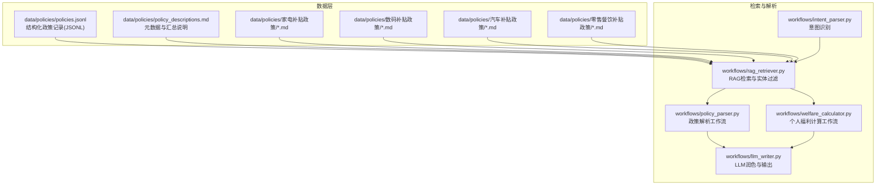
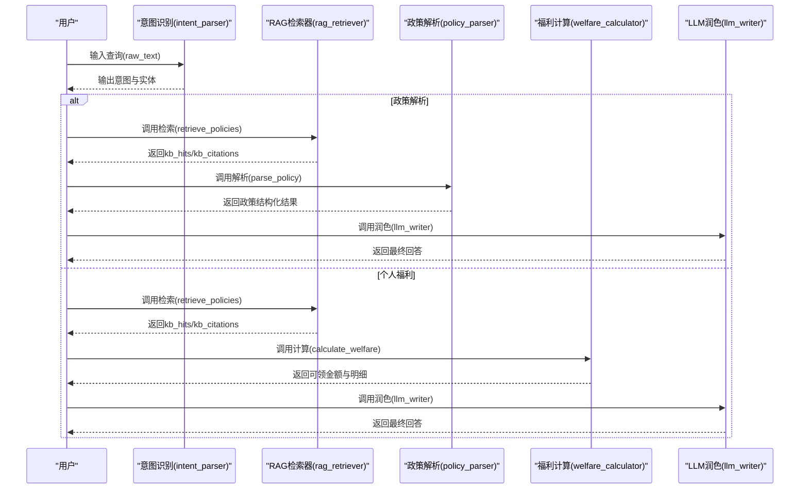
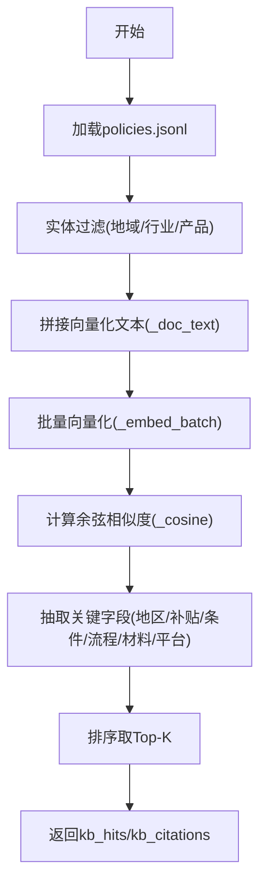
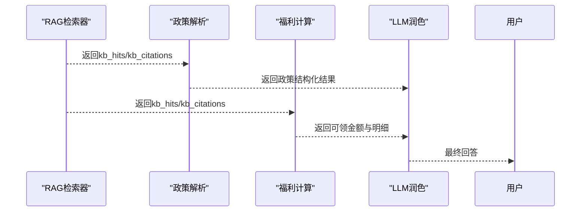
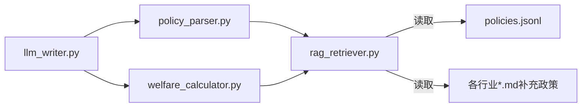

# 政策知识库

<cite>
**本文引用的文件**
- [policy_descriptions.md](file://data/policies/policy_descriptions.md)
- [rag_retriever.py](file://workflows/rag_retriever.py)
- [policy_parser.py](file://workflows/policy_parser.py)
- [welfare_calculator.py](file://workflows/welfare_calculator.py)
- [llm_writer.py](file://workflows/llm_writer.py)
- [intent_parser.py](file://workflows/intent_parser.py)
- [重构完成说明.md](file://重构完成说明.md)
- [泉策通开发文档.md](file://泉策通开发文档.md)
</cite>

## 目录
1. [简介](#简介)
2. [项目结构](#项目结构)
3. [核心组件](#核心组件)
4. [架构总览](#架构总览)
5. [详细组件分析](#详细组件分析)
6. [依赖分析](#依赖分析)
7. [性能考虑](#性能考虑)
8. [故障排查指南](#故障排查指南)
9. [结论](#结论)
10. [附录](#附录)

## 简介
本文件面向政策知识库的数据结构与管理机制进行全面文档化，重点围绕 data/policies/ 目录下的结构化与非结构化数据协同关系展开，涵盖：
- policy_descriptions.md 作为元数据说明文件的作用与规范
- policies.jsonl 的 JSONL 格式设计与字段语义
- 多轮次与分级补贴的结构化表达示例
- RAG 检索系统如何基于该数据生成准确回答
- 新增或更新政策时的数据维护流程建议

## 项目结构
政策知识库采用“结构化 JSONL + 非结构化 Markdown”的双轨协同模式：
- 结构化数据：policies.jsonl（每行一条 campaign 的 JSON 对象）
- 非结构化数据：各行业政策目录下的 .md 公告文件
- 元数据与汇总：policy_descriptions.md

图表来源
- [rag_retriever.py](file://workflows/rag_retriever.py#L1-L327)
- [policy_parser.py](file://workflows/policy_parser.py#L1-L83)
- [welfare_calculator.py](file://workflows/welfare_calculator.py#L1-L123)
- [llm_writer.py](file://workflows/llm_writer.py#L38-L123)
- [intent_parser.py](file://workflows/intent_parser.py#L100-L135)
- [重构完成说明.md](file://重构完成说明.md#L28-L47)
- [泉策通开发文档.md](file://泉策通开发文档.md#L35-L83)

章节来源
- [重构完成说明.md](file://重构完成说明.md#L28-L47)
- [泉策通开发文档.md](file://泉策通开发文档.md#L35-L83)

## 核心组件
- 结构化政策库（JSONL）：承载每个 campaign 的完整结构化信息，便于精确过滤与向量化召回
- 非结构化政策库（Markdown）：承载官方公告原文，作为补充与溯源依据
- 元数据说明（policy_descriptions.md）：提供 campaign_id 命名规范、补贴计算规则指引、数据状态说明等
- RAG 检索器：统一加载结构化与补充政策，执行实体过滤与向量召回，输出扁平化命中结果
- 政策解析与福利计算：基于 RAG 命中结果，抽取关键字段并生成用户可读回答或计算可领金额

章节来源
- [policy_descriptions.md](file://data/policies/policy_descriptions.md#L1-L23)
- [rag_retriever.py](file://workflows/rag_retriever.py#L1-L327)
- [policy_parser.py](file://workflows/policy_parser.py#L1-L83)
- [welfare_calculator.py](file://workflows/welfare_calculator.py#L1-L123)

## 架构总览
RAG 检索与工作流的整体交互如下：

图表来源
- [intent_parser.py](file://workflows/intent_parser.py#L100-L135)
- [rag_retriever.py](file://workflows/rag_retriever.py#L215-L327)
- [policy_parser.py](file://workflows/policy_parser.py#L1-L83)
- [welfare_calculator.py](file://workflows/welfare_calculator.py#L1-L123)
- [llm_writer.py](file://workflows/llm_writer.py#L38-L123)

## 详细组件分析

### 元数据说明文件：policy_descriptions.md
- 文件定位：data/policies/policy_descriptions.md
- 主要作用：
  - 明确数据格式（JSONL）、来源（官方细则与公告）、当前状态（完成/进行中）
  - 给出 campaign_id 命名规范（如 JN_、SD_ 前缀代表地市/省级）
  - 提供补贴计算规则指引（如按比例+上限的表达方式）
  - 统一字段语义与 schema（如 rounds、common_rules 等）
  - 汇总各 campaign 的关键指标（类型、补贴率/标准、上限、产品数、平台）

章节来源
- [policy_descriptions.md](file://data/policies/policy_descriptions.md#L1-L23)

### JSONL 政策库：policies.jsonl 字段语义与使用场景
- 文件定位：data/policies/policies.jsonl
- 加载与解析：RAG 检索器逐行读取 JSONL，跳过空行与解析异常
- 关键字段（以实际代码使用为准）：
  - doc_id/campaign_id：唯一标识，用于定位与引用
  - title/name：政策名称
  - region_province：省份信息
  - benefit_amount：补贴金额/标准（由 common_rules.subsidy_standard.price_cap 或 brackets 推导）
  - conditions：筛选条件（如能效要求、限购数量、实名认证等）
  - source_url：来源链接（当前检索返回中可能为空）
  - subsidy_rules：计算规则（在实际计算中应从 common_rules.subsidy_standard.brackets 等结构提取）
  - rounds：多轮次活动的结构化表达（如汽车下半年3轮）
  - common_rules：通用规则容器，包含
    - subsidy_standard：补贴标准（如 price_cap、brackets、energy_efficiency_requirement、quantity_limit）
    - qualification_rules：资格规则（如 real_name_auth）
    - claiming_platform：申领平台
    - required_documents：所需材料清单
  - start_date/end_date：有效起止日期
  - audit_process：审核流程步骤（用于生成 procedures）
  - claiming_platform：申领平台（用于生成 claiming_platform）

字段使用场景举例（基于代码逻辑）：
- campaign_id 命名规范：通过前缀推导地域（JN_ 代表济南市，SD_ 代表山东省）
- 补贴金额提取：从 common_rules.subsidy_standard.price_cap 推导“上限X元”
- 零售餐饮满减：当 campaign_id 包含 RETAIL_CATERING 时，从 brackets 中取首个阈值与减免金额
- 产品过滤：common_rules.subsidy_products 用于匹配实体产品
- 材料与流程：required_documents 与 audit_process 用于生成“所需材料”和“办理流程”

章节来源
- [rag_retriever.py](file://workflows/rag_retriever.py#L26-L327)

### 多轮次与分级补贴的结构化表达
- 多轮次（rounds）：用于表达同一政策在不同时间段的多次活动，常见于汽车下半年3轮等场景
- 分级补贴（brackets）：用于表达阶梯式或满减式补贴，如“满100减20-75元”或“价档1900-8500元”
- 在 JSONL 中，这些信息通常位于 common_rules.subsidy_standard 下，检索器会将其转换为可读的 benefit_amount 与 conditions

章节来源
- [rag_retriever.py](file://workflows/rag_retriever.py#L86-L112)
- [policy_descriptions.md](file://data/policies/policy_descriptions.md#L1-L23)

### RAG 检索系统如何基于此数据生成准确回答
- 数据加载：统一加载 policies.jsonl 与各行业补充 Markdown 文档
- 实体过滤：按地域（city/province/platform）、行业（appliance/digital/car/retail_catering）、产品进行过滤
- 向量化召回：对候选记录拼接用于向量化的文本，计算与查询的余弦相似度
- 结果排序与输出：按相似度排序，取 top_k，同时抽取 benefit_type、benefit_amount、conditions、procedures、required_materials、claiming_platform 等字段，形成扁平化命中结果

图表来源
- [rag_retriever.py](file://workflows/rag_retriever.py#L215-L327)

章节来源
- [rag_retriever.py](file://workflows/rag_retriever.py#L215-L327)

### 政策解析与个人福利计算工作流
- 政策解析（policy_parser）：基于 RAG 命中结果，抽取标题、补贴类型、金额、地域、有效期、条件、流程、材料、平台等字段，形成扁平化输出
- 个人福利计算（welfare_calculator）：在具备购买价格等实体信息时，结合命中政策的计算规则，给出可领金额与明细；若缺少关键信息则提示错误

图表来源
- [policy_parser.py](file://workflows/policy_parser.py#L1-L83)
- [welfare_calculator.py](file://workflows/welfare_calculator.py#L1-L123)
- [llm_writer.py](file://workflows/llm_writer.py#L38-L123)

章节来源
- [policy_parser.py](file://workflows/policy_parser.py#L1-L83)
- [welfare_calculator.py](file://workflows/welfare_calculator.py#L1-L123)
- [llm_writer.py](file://workflows/llm_writer.py#L38-L123)

## 依赖分析
- 模块耦合关系：
  - rag_retriever 依赖 data/policies/policies.jsonl 与各行业补充目录
  - policy_parser 与 welfare_calculator 均依赖 rag_retriever 的检索结果
  - llm_writer 依赖上游工作流输出，负责最终文本润色
- 外部依赖：
  - DashScope Embedding API（环境变量配置）
  - Markdown 补充政策目录（按行业划分）

图表来源
- [rag_retriever.py](file://workflows/rag_retriever.py#L1-L327)
- [policy_parser.py](file://workflows/policy_parser.py#L1-L83)
- [welfare_calculator.py](file://workflows/welfare_calculator.py#L1-L123)
- [llm_writer.py](file://workflows/llm_writer.py#L38-L123)

章节来源
- [rag_retriever.py](file://workflows/rag_retriever.py#L1-L327)
- [重构完成说明.md](file://重构完成说明.md#L28-L47)

## 性能考虑
- JSONL 加载：逐行解析，异常行跳过，避免整体失败
- 向量化批处理：批量请求 Embedding API，减少网络往返
- 实体过滤前置：先结构化过滤，缩小候选集，降低向量计算开销
- Top-K 控制：限制返回命中数量，兼顾准确性与性能
- 补充政策：当前为文本提示，未做向量检索，避免额外延迟

章节来源
- [rag_retriever.py](file://workflows/rag_retriever.py#L26-L327)

## 故障排查指南
- 缺失主政策文件：若 policies.jsonl 不存在，RAG 检索器会打印警告并返回空列表
- JSONL 解析失败：逐行解析异常会被跳过，不影响其他记录
- 环境变量缺失：Embedding API 未配置时，返回零向量占位，不影响流程继续
- 未命中政策：policy_parser 与 welfare_calculator 在无命中时返回空或错误提示
- 补充政策缺失：对应行业目录不存在时，返回空列表

章节来源
- [rag_retriever.py](file://workflows/rag_retriever.py#L26-L44)
- [rag_retriever.py](file://workflows/rag_retriever.py#L133-L153)
- [policy_parser.py](file://workflows/policy_parser.py#L38-L53)
- [welfare_calculator.py](file://workflows/welfare_calculator.py#L36-L46)

## 结论
本政策知识库通过“结构化 JSONL + 非结构化 Markdown + 元数据说明”的协同模式，实现了高可读性与高可用性的政策检索与问答体系。RAG 检索器在统一加载与实体过滤的基础上，结合向量相似度与结构化字段，输出扁平化命中结果，支撑政策解析与个人福利计算两大核心工作流。建议在新增或更新政策时，严格遵循 campaign_id 命名规范与 common_rules 结构，确保与源文件保持一致，保障检索与计算的准确性。

## 附录

### 新增/更新政策的数据维护流程建议
- 新增 campaign：
  - 在 JSONL 中添加一条记录，确保 campaign_id 唯一且符合命名规范（JN_/SD_ 前缀）
  - 在 common_rules 中完善 subsidy_standard、qualification_rules、claiming_platform、required_documents 等字段
  - 如涉及多轮次，使用 rounds 字段表达；如涉及阶梯/满减，使用 brackets
  - 在 policy_descriptions.md 中同步更新元数据与汇总表
- 更新政策：
  - 修改 JSONL 中对应 campaign 的字段；如修改有效期、补贴上限、产品范围等
  - 同步更新 policy_descriptions.md 中的汇总信息
  - 如补充公告原文，更新对应行业目录下的 .md 文件
- 质量检查：
  - 确认 JSONL 解析无异常
  - 通过 RAG 检索验证实体过滤与相似度召回效果
  - 在个人福利计算工作流中验证可领金额与明细是否正确

章节来源
- [policy_descriptions.md](file://data/policies/policy_descriptions.md#L1-L23)
- [rag_retriever.py](file://workflows/rag_retriever.py#L215-L327)
- [重构完成说明.md](file://重构完成说明.md#L28-L47)
- [泉策通开发文档.md](file://泉策通开发文档.md#L35-L83)