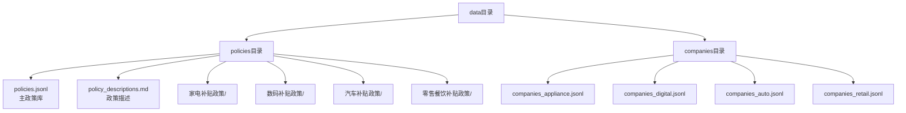

# 数据管理

<cite>
**本文档引用的文件**  
- [policy_descriptions.md](file://data/policies/policy_descriptions.md)
- [policies.jsonl](file://data/policies/policies.jsonl)
- [companies_appliance.jsonl](file://data/companies/companies_appliance.jsonl)
- [companies_auto.jsonl](file://data/companies/companies_auto.jsonl)
- [companies_digital.jsonl](file://data/companies/companies_digital.jsonl)
- [companies_retail.jsonl](file://data/companies/companies_retail.jsonl)
- [rag_retriever.py](file://workflows/rag_retriever.py)
- [company_signal.py](file://workflows/company_signal.py)
- [泉策通开发文档.md](file://泉策通开发文档.md)
- [快速开始.md](file://快速开始.md)
- [新架构说明.md](file://新架构说明.md)
</cite>

## 目录
1. [引言](#引言)
2. [数据组织结构](#数据组织结构)
3. [政策知识库](#政策知识库)
4. [企业知识库](#企业知识库)
5. [RAG检索系统集成](#rag检索系统集成)
6. [数据更新与维护建议](#数据更新与维护建议)
7. [结论](#结论)

## 引言
本系统旨在为政策咨询和企业投资决策提供智能化支持。其核心依赖于结构化的数据模型和知识库体系，通过RAG（检索增强生成）技术实现精准的信息检索与响应。本文档全面说明系统的数据模型与知识库结构，重点阐述`data/`目录下的数据组织方式，包括政策知识库和企业知识库的构成、字段含义及其在系统中的应用。

**文档来源**
- [快速开始.md](file://快速开始.md#L78-L93)
- [新架构说明.md](file://新架构说明.md#L20-L38)

## 数据组织结构
系统的所有数据均集中存放在`data/`目录下，该目录采用清晰的分层结构进行管理，分为`policies/`（政策数据）和`companies/`（企业数据）两个主要子目录。

- **`data/policies/`**: 存放所有与政府补贴政策相关的数据。
  - `policies.jsonl`: 主政策库，包含所有补贴政策的结构化记录。
  - `policy_descriptions.md`: 非结构化叙述文件，提供对政策数据的概览和总结。
  - `家电补贴政策/`, `数码补贴政策/`, `汽车补贴政策/`, `零售餐饮补贴政策/`: 四个子目录，存放与各行业相关的原始政策文档（Markdown格式），作为补充知识库。

- **`data/companies/`**: 存放所有企业相关的数据。
  - `companies_appliance.jsonl`: 家电行业企业知识库。
  - `companies_digital.jsonl`: 数码产品行业企业知识库。
  - `companies_auto.jsonl`: 汽车行业企业知识库。
  - `companies_retail.jsonl`: 零售餐饮行业企业知识库。

这种组织方式实现了数据的逻辑分离，便于管理和维护。

**图示来源**
- [快速开始.md](file://快速开始.md#L82-L93)
- [新架构说明.md](file://新架构说明.md#L22-L38)

## 政策知识库
政策知识库由非结构化和结构化两部分组成，二者相辅相成，共同支撑系统的政策解析能力。

### 非结构化叙述：`policy_descriptions.md`
`policy_descriptions.md`是一个Markdown文件，它以人类可读的方式对政策数据进行总结和概述。其主要作用包括：
- **提供上下文**：解释`policies.jsonl`中数据的来源、背景和整体情况。
- **数据概览**：通过表格形式总结所有补贴活动（campaigns）的关键信息，如活动ID、类型、补贴标准、上限、产品范围和申领平台等。
- **统一说明**：定义数据集的通用规则，例如`campaign_id`的命名规范、字段的统一schema以及缺失值的处理方式（用`null`表示）。

该文件是理解整个政策体系的入口，为开发人员和数据维护人员提供了宏观视角。

**文档来源**
- [policy_descriptions.md](file://data/policies/policy_descriptions.md#L1-L23)
- [泉策通开发文档.md](file://泉策通开发文档.md#L36)

### 结构化记录：`policies.jsonl`
`policies.jsonl`是系统的核心数据源，采用JSONL（JSON Lines）格式。JSONL格式的特点是每行是一个独立的JSON对象，这使得文件可以被高效地流式读取和处理，非常适合用于RAG检索。

#### JSONL文件结构
文件中的每一条记录（即每一行）代表一个独立的补贴活动（campaign），其核心字段及其业务含义如下：

| 字段名 | 业务含义 |
| :--- | :--- |
| `doc_id` | 文档ID，与`campaign_id`相同，是政策的唯一标识符。 |
| `title` | 政策的标题，用于展示。 |
| `region_province` | 适用的省份，如“山东省”。 |
| `region_city` | 适用的城市，如“济南市”。 |
| `benefit_amount` | 补贴金额或标准，通常以“上限X元”或“满Y减Z元”的形式表示。 |
| `conditions` | 申领条件，如能效要求、实名认证、限购数量等。 |
| `source_url` | 政策原文的官方链接，用于溯源和引用。 |
| `campaign_id` | 活动ID，采用统一命名规范（如`JN_APPLIANCE_2025`代表“济南市2025年家电补贴”）。 |
| `common_rules` | 包含补贴规则的嵌套对象，如`subsidy_standard`（补贴标准）、`subsidy_products`（补贴产品）等。 |
| `start_date` / `end_date` | 政策的有效起止时间。 |

**文档来源**
- [policy_descriptions.md](file://data/policies/policy_descriptions.md#L14-L23)
- [rag_retriever.py](file://workflows/rag_retriever.py#L290-L305)
- [泉策通开发文档.md](file://泉策通开发文档.md#L52)

## 企业知识库
企业知识库按行业拆分为四个独立的JSONL文件，分别对应家电、数码、汽车和零售餐饮四大行业。这种按行业拆分的方式有助于实现更精准的检索和分析。

### 文件结构与关键字段
每个企业知识库文件的结构相似，每条记录代表一家企业。以下是关键字段及其业务含义：

| 字段名 | 业务含义 |
| :--- | :--- |
| `company_id` | 企业的唯一标识符。 |
| `name` | 企业名称。 |
| `industry` | 所属行业，如“家电”、“汽车”等。 |
| `main_products` | 主要产品列表，以数组形式存储。 |
| `expansion_willingness` | 扩展意愿，分为`low`（低）、`medium`（中）、`high`（高）三个等级，反映企业扩张的积极程度。 |
| `innovation_score` | 创新评分，一个数值，用于量化企业的创新能力。 |
| `province` / `city` | 企业所在的省份和城市，用于地域过滤。 |
| `existing_channels` | 现有销售渠道列表，以数组形式存储。 |
| `last_updated` | 数据最后更新时间，确保数据的时效性。 |

这些字段被用于“企业投资信号灯”工作流中，通过综合评分模型（如`_score_company`函数）对企业进行评估和推荐。

**文档来源**
- [company_signal.py](file://workflows/company_signal.py#L104-L107)
- [泉策通开发文档.md](file://泉策通开发文档.md#L104-L107)

## RAG检索系统集成
系统通过RAG（检索增强生成）技术将知识库与大语言模型（LLM）连接起来，确保输出结果的准确性和可追溯性。

### 检索策略
系统采用双索引策略进行检索：
1.  **政策索引**：直接对`policies.jsonl`文件进行索引。检索时，首先根据用户查询中的实体（如地点、产品、行业）进行结构化过滤，然后对过滤后的结果进行向量化召回和重排序。
2.  **企业索引**：对各个`companies_*.jsonl`文件进行索引。检索逻辑与政策索引类似，先进行结构化过滤（如按省市、行业），再进行向量化处理。

### 数据使用流程
当用户发起查询时，`rag_retriever.py`模块会：
1.  加载`policies.jsonl`或相应的企业JSONL文件。
2.  根据用户查询中的实体信息（如`entity_location`, `entity_product`）过滤数据。
3.  将过滤后的政策或企业信息转换为向量，并与用户查询的向量进行相似度计算。
4.  返回最相关的Top-K条记录，并将其序列化为`kb_hits_json`字段，供后续的LLM生成最终回答。

这种方式确保了系统能够从海量数据中快速、准确地找到相关信息。

**文档来源**
- [rag_retriever.py](file://workflows/rag_retriever.py#L26-L212)
- [泉策通开发文档.md](file://泉策通开发文档.md#L47-L50)

## 数据更新与维护建议
为确保系统知识库的准确性和时效性，建议遵循以下数据更新与维护流程：

1.  **数据采集**：定期从政府官方网站（如济南政府网）采集最新的政策文件，并将其存入`data/policies/`下的相应子目录（如`家电补贴政策/`）。
2.  **结构化处理**：将新采集的政策文件的核心信息（如补贴标准、申领条件、有效时间等）提取出来，以JSON格式添加到`policies.jsonl`文件中。确保`campaign_id`的命名符合规范。
3.  **更新描述文件**：同步更新`policy_descriptions.md`文件中的数据概览表格和相关说明，保持与`policies.jsonl`的一致性。
4.  **企业数据维护**：对于企业知识库，建议建立一个数据导入流程，将从企查查等第三方平台获取的企业数据，按照预定义的字段（如`innovation_score`, `expansion_willingness`）进行清洗和标注后，分别存入对应的`companies_*.jsonl`文件。
5.  **版本控制**：对`data/`目录下的所有文件进行版本控制（如使用Git），以便追踪变更历史和回滚错误。

**文档来源**
- [新架构说明.md](file://新架构说明.md#L35-L38)
- [泉策通开发文档.md](file://泉策通开发文档.md#L44)

## 结论
本系统的数据模型设计清晰、结构合理。通过将政策知识库分为非结构化的`policy_descriptions.md`和结构化的`policies.jsonl`，以及将企业知识库按行业拆分为多个JSONL文件，系统实现了高效的数据管理和精准的RAG检索。这种设计不仅支持了“政策解析”、“福利计算”等功能，还为“企业投资信号灯”等高级分析功能提供了坚实的数据基础。遵循建议的数据更新与维护流程，可以确保系统长期稳定、准确地运行。