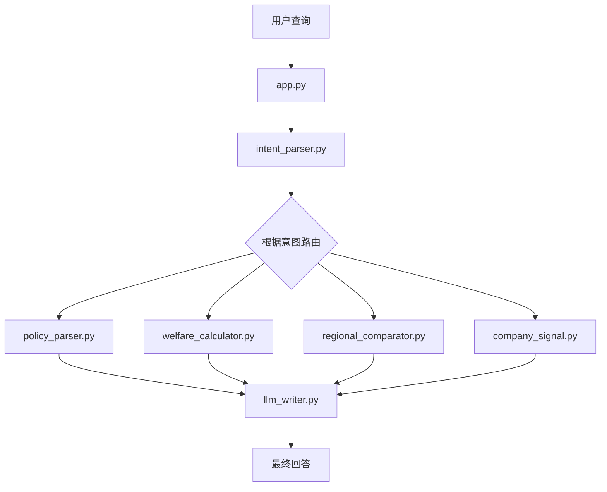
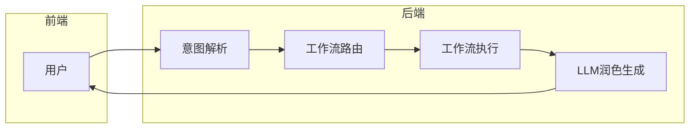
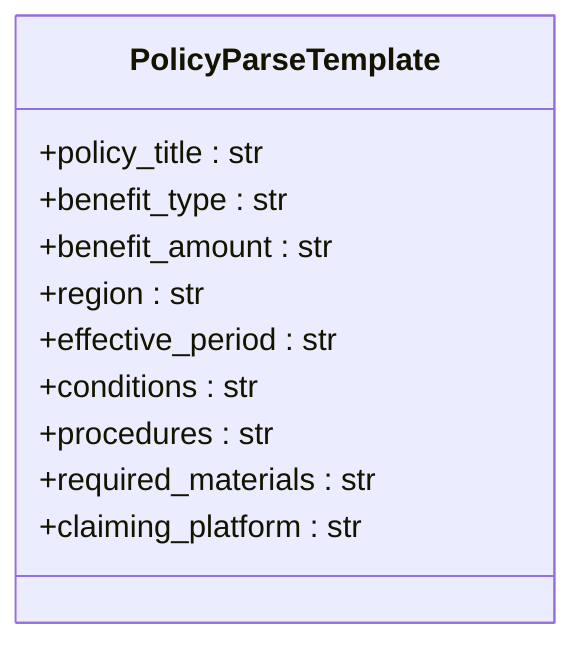
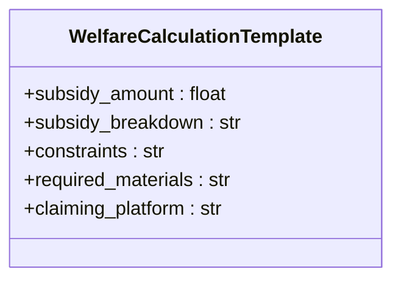
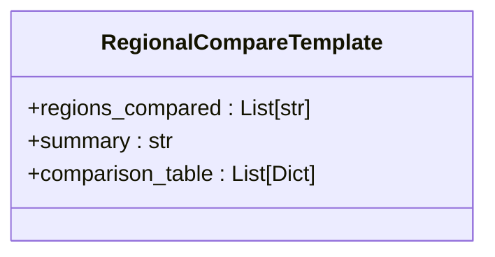
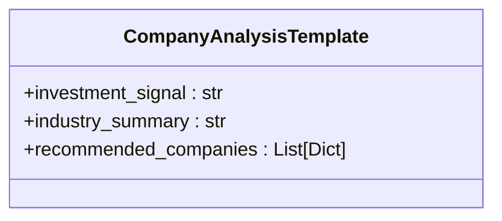
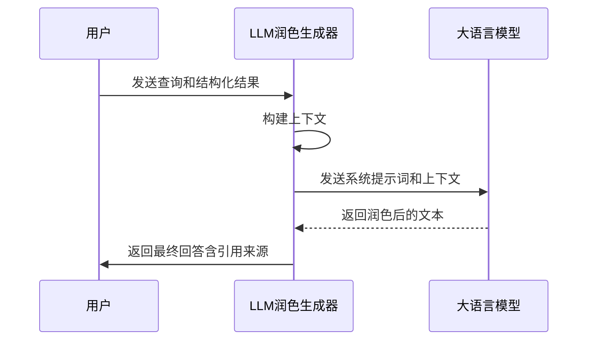
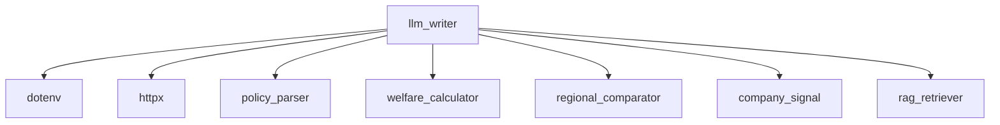

# LLM润色生成器

<cite>
**本文档引用文件**  
- [llm_writer.py](file://workflows/llm_writer.py#L1-L145)
- [app.py](file://app.py#L1-L155)
- [policy_parser.py](file://workflows/policy_parser.py#L1-L83)
- [welfare_calculator.py](file://workflows/welfare_calculator.py#L1-L123)
- [regional_comparator.py](file://workflows/regional_comparator.py#L1-L91)
- [company_signal.py](file://workflows/company_signal.py#L1-L150)
- [rag_retriever.py](file://workflows/rag_retriever.py#L1-L327)
</cite>

## 目录
1. [简介](#简介)
2. [项目结构](#项目结构)
3. [核心组件](#核心组件)
4. [架构概述](#架构概述)
5. [详细组件分析](#详细组件分析)
6. [依赖分析](#依赖分析)
7. [性能考虑](#性能考虑)
8. [故障排除指南](#故障排除指南)
9. [结论](#结论)

## 简介
`llm_writer.py` 模块是“泉策通”智能体系统响应生成的最终环节，负责将各工作流的结构化结果转化为自然、流畅的中文回答。该模块通过 `generate_final_text` 函数，根据不同的 `intent` 类型选择相应的上下文模板，将 `workflow_result` 中的字段填充到预设的 Markdown 格式中，构建清晰的结构化上下文。随后，利用大语言模型（通过 DashScope API）对上下文进行润色，生成符合要求（友好、重点突出、不编造、200-300字）的最终文本。在 API 调用失败时，系统会降级为直接返回结构化内容。此外，模块会将知识库引用来源 `kb_citations` 附加到回答末尾，确保信息的可追溯性，完成整个查询响应闭环。

## 项目结构
系统采用模块化设计，`llm_writer.py` 位于 `workflows` 目录下，是整个查询响应流程的最终环节。它接收来自不同工作流（如政策解析、福利计算、区域对比、企业分析）的结构化结果，并将其转化为用户友好的自然语言回答。

**图示来源**  
- [app.py](file://app.py#L1-L155)
- [llm_writer.py](file://workflows/llm_writer.py#L1-L145)

**本节来源**  
- [app.py](file://app.py#L1-L155)
- [workflows](file://workflows)

## 核心组件
`llm_writer.py` 的核心是 `generate_final_text` 异步函数。该函数接收 `intent`、`raw_text`、`entities`、`workflow_result` 和 `kb_citations` 五个参数，根据 `intent` 的类型，从 `workflow_result` 中提取相应的字段，填充到预设的 Markdown 模板中，构建结构化上下文。然后，该上下文与系统提示词（`system_prompt`）和用户原始查询一起，通过 DashScope API 发送给大语言模型进行润色。最终，生成的文本会附加引用来源并返回给用户。

**本节来源**  
- [llm_writer.py](file://workflows/llm_writer.py#L15-L145)

## 架构概述
整个系统的架构遵循“意图识别 -> 工作流路由 -> 结构化结果生成 -> 自然语言润色”的流程。`llm_writer.py` 模块位于流程的末端，其输入是来自不同工作流的结构化数据，输出是经过大语言模型润色后的自然语言回答。

**图示来源**  
- [app.py](file://app.py#L37-L110)
- [llm_writer.py](file://workflows/llm_writer.py#L15-L145)

## 详细组件分析

### generate_final_text 函数分析
`generate_final_text` 函数是 `llm_writer.py` 模块的核心，它根据不同的 `intent` 类型，使用不同的模板来构建上下文。

#### 政策解析模板
当 `intent` 为 `policy_parse` 时，函数会构建一个包含政策名称、福利类型、补贴金额、适用地区、有效期、申请条件、办理流程、所需材料和申领平台的上下文。

**图示来源**  
- [llm_writer.py](file://workflows/llm_writer.py#L31-L47)
- [policy_parser.py](file://workflows/policy_parser.py#L11-L22)

#### 福利计算模板
当 `intent` 为 `personal_welfare` 时，函数会构建一个包含可获得补贴金额、补贴明细、限制条件、所需材料和申领平台的上下文。

**图示来源**  
- [llm_writer.py](file://workflows/llm_writer.py#L48-L59)
- [welfare_calculator.py](file://workflows/welfare_calculator.py#L12-L20)

#### 区域对比模板
当 `intent` 为 `regional_compare` 时，函数会构建一个包含对比地区、对比总结和详细对比表格的上下文。

**图示来源**  
- [llm_writer.py](file://workflows/llm_writer.py#L60-L72)
- [regional_comparator.py](file://workflows/regional_comparator.py#L11-L16)

#### 企业分析模板
当 `intent` 为 `investment_signal` 时，函数会构建一个包含投资信号、行业概况和推荐企业的上下文。

**图示来源**  
- [llm_writer.py](file://workflows/llm_writer.py#L73-L88)
- [company_signal.py](file://workflows/company_signal.py#L67-L72)

### LLM润色流程
构建好上下文后，`generate_final_text` 函数会调用 DashScope API 对上下文进行润色。

**图示来源**  
- [llm_writer.py](file://workflows/llm_writer.py#L91-L136)

**本节来源**  
- [llm_writer.py](file://workflows/llm_writer.py#L15-L145)

## 依赖分析
`llm_writer.py` 模块依赖于多个外部库和内部模块。

**图示来源**  
- [llm_writer.py](file://workflows/llm_writer.py#L1-L13)
- [app.py](file://app.py#L9-L14)

**本节来源**  
- [llm_writer.py](file://workflows/llm_writer.py#L1-L145)
- [requirements.txt](file://requirements.txt#L1-L7)

## 性能考虑
`llm_writer.py` 模块的性能主要受 DashScope API 调用的影响。为了保证响应速度，模块设置了 30 秒的超时时间。在 API 调用失败时，模块会降级为直接返回结构化内容，避免用户长时间等待。

## 故障排除指南
如果 `llm_writer.py` 模块无法正常工作，可以检查以下几点：
1. 确认环境变量 `DASHSCOPE_API_BASE_URL` 和 `DASHSCOPE_API_KEY` 是否正确配置。
2. 检查网络连接是否正常，确保可以访问 DashScope API。
3. 查看日志输出，确认是否有 API 调用失败的记录。

**本节来源**  
- [llm_writer.py](file://workflows/llm_writer.py#L138-L144)

## 结论
`llm_writer.py` 模块作为“泉策通”智能体系统响应生成的最后环节，成功地将各工作流的结构化结果转化为自然、流畅的中文回答。通过使用不同的模板和大语言模型润色，该模块能够生成符合要求的高质量回答，并在 API 调用失败时提供降级策略，确保系统的稳定性和可靠性。同时，通过附加引用来源，该模块保证了信息的可追溯性，为用户提供了透明、可信的服务。