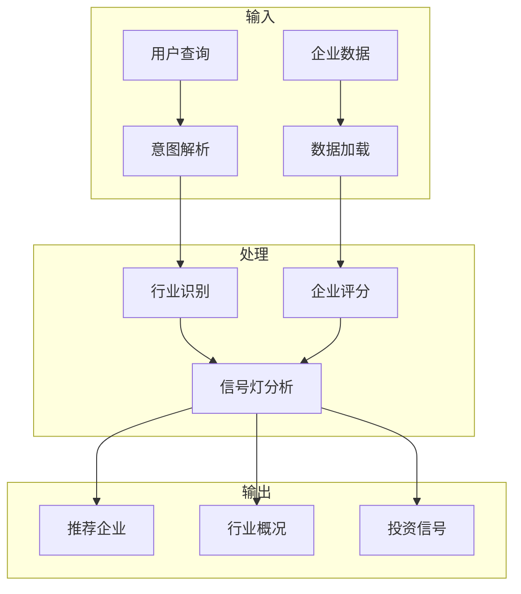
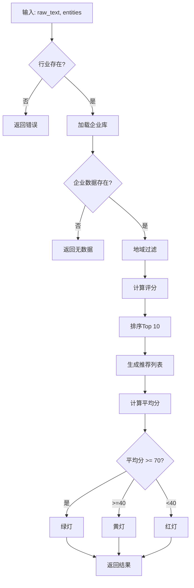
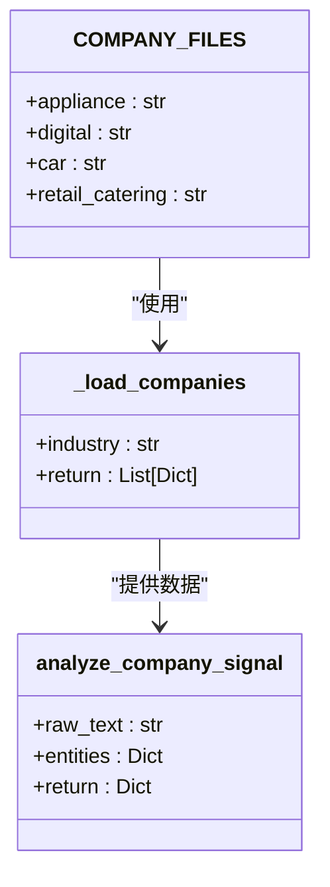
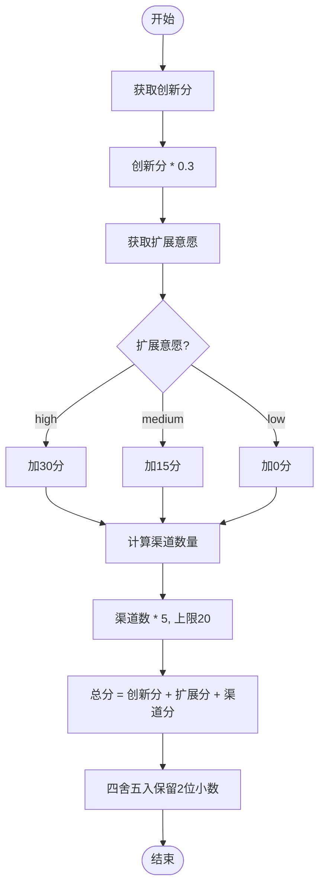
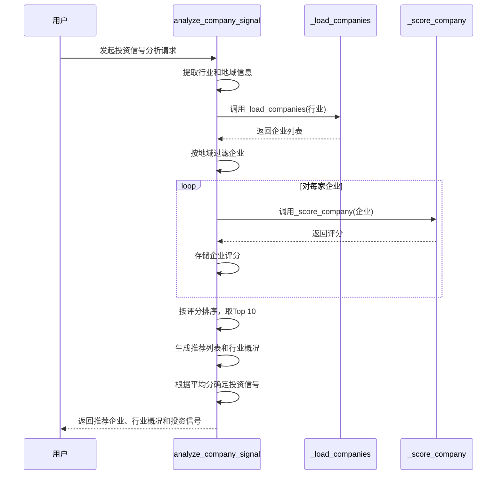

# 企业投资信号灯工作流

<cite>
**本文档引用的文件**   
- [company_signal.py](file://workflows/company_signal.py)
- [companies_appliance.jsonl](file://data/companies/companies_appliance.jsonl)
- [companies_digital.jsonl](file://data/companies/companies_digital.jsonl)
- [companies_auto.jsonl](file://data/companies/companies_auto.jsonl)
- [companies_retail.jsonl](file://data/companies/companies_retail.jsonl)
</cite>

## 目录
1. [项目结构](#项目结构)
2. [核心组件](#核心组件)
3. [架构概述](#架构概述)
4. [详细组件分析](#详细组件分析)
5. [可扩展性讨论](#可扩展性讨论)

## 项目结构
该模块位于`workflows`目录下，是企业投资决策支持系统的核心分析组件。它通过读取`data/companies/`目录下的JSONL格式企业数据文件，对特定行业的企业进行评分和推荐。系统支持家电、数码、汽车和零售餐饮四个行业，每个行业有独立的数据文件。模块通过`analyze_company_signal`主函数处理`investment_signal`意图，输出投资建议。

**图表来源**
- [company_signal.py](file://workflows/company_signal.py#L62-L149)
- [companies_appliance.jsonl](file://data/companies/companies_appliance.jsonl)

**章节来源**
- [company_signal.py](file://workflows/company_signal.py#L1-L150)

## 核心组件
`company_signal.py`模块实现了企业投资信号灯工作流，主要包含三个核心函数：`_load_companies`用于加载企业数据，`_score_company`用于计算企业评分，`analyze_company_signal`作为主函数协调整个分析流程。这些函数共同构成了一个完整的投资决策支持系统，能够根据企业数据生成推荐列表和投资建议。

**章节来源**
- [company_signal.py](file://workflows/company_signal.py#L15-L149)

## 架构概述
该模块采用分层架构设计，从数据加载到评分计算再到结果生成，形成了清晰的处理流水线。首先通过`_load_companies`函数从JSONL文件中加载企业数据，然后使用`_score_company`函数对每家企业进行多维度评分，最后在`analyze_company_signal`函数中完成数据过滤、排序和结果格式化。这种设计使得系统具有良好的可维护性和可扩展性。

**图表来源**
- [company_signal.py](file://workflows/company_signal.py#L62-L149)

**章节来源**
- [company_signal.py](file://workflows/company_signal.py#L62-L149)

## 详细组件分析
### 数据源配置与加载
模块通过`COMPANY_FILES`字典配置了四个行业的数据源路径，分别对应家电、数码、汽车和零售餐饮行业。`_load_companies`函数根据指定的行业名称加载相应的JSONL文件，支持地域过滤功能。该函数实现了健壮的错误处理机制，在文件不存在或解析失败时能够优雅地处理异常情况。

**图表来源**
- [company_signal.py](file://workflows/company_signal.py#L7-L37)

**章节来源**
- [company_signal.py](file://workflows/company_signal.py#L7-L37)
- [companies_appliance.jsonl](file://data/companies/companies_appliance.jsonl)

### 评分函数算法解析
`_score_company`函数实现了多维度的企业评分算法，主要包含三个评分维度：创新分、扩展意愿和渠道数量。创新分直接从企业数据中的`innovation_score`字段获取，并乘以0.3的权重；扩展意愿根据"high"、"medium"、"low"三个等级分别加30、15分；渠道数量按每个渠道5分计算，上限20分。最终得分为各维度得分的总和，保留两位小数。

**图表来源**
- [company_signal.py](file://workflows/company_signal.py#L40-L59)

**章节来源**
- [company_signal.py](file://workflows/company_signal.py#L40-L59)

### 主函数执行流程
`analyze_company_signal`函数是整个模块的入口点，负责协调各个组件完成投资信号分析。执行流程包括：首先从实体中提取行业和地域信息，然后加载相应行业的企业数据，接着根据地域进行过滤（若无匹配则使用全部数据），计算每家企业的得分并按得分降序排序，选取Top 10企业生成推荐列表，最后根据平均分输出绿/黄/红灯投资建议。

**图表来源**
- [company_signal.py](file://workflows/company_signal.py#L62-L149)

**章节来源**
- [company_signal.py](file://workflows/company_signal.py#L62-L149)

## 可扩展性讨论
该模块设计具有良好的可扩展性，未来可以接入更复杂的评估模型。当前的评分算法相对简单，主要基于三个维度的加权计算。通过修改`_score_company`函数，可以引入更多评估维度，如财务状况、市场占有率、技术专利数量等。此外，可以将评分算法抽象为独立的评估引擎，支持配置不同的评估模型，甚至集成机器学习模型进行智能评分。地域过滤逻辑也可以进一步优化，支持更复杂的地理空间查询。

**章节来源**
- [company_signal.py](file://workflows/company_signal.py#L40-L59)