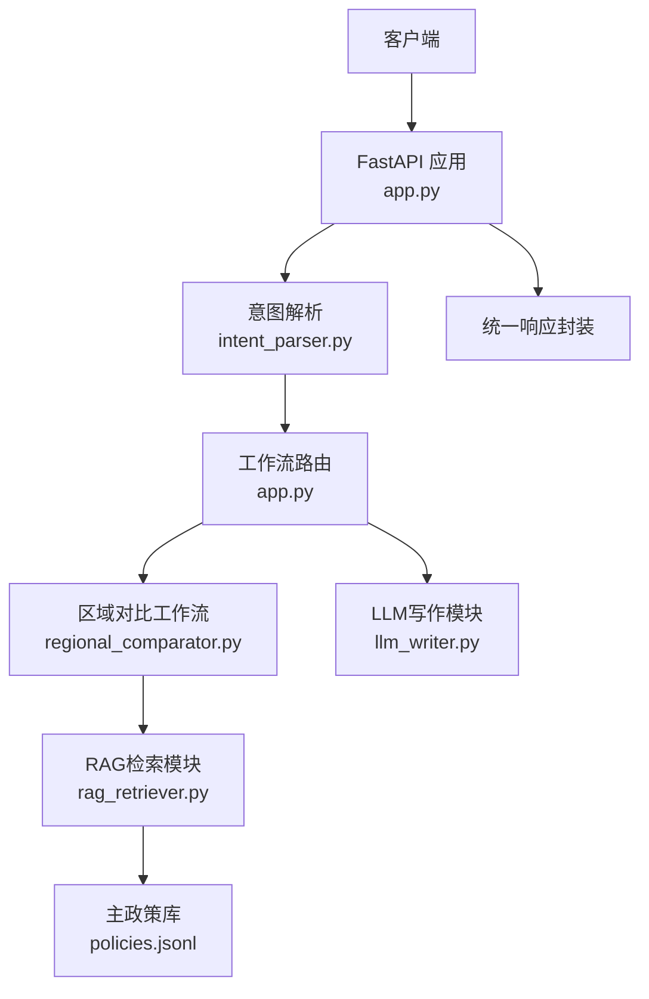
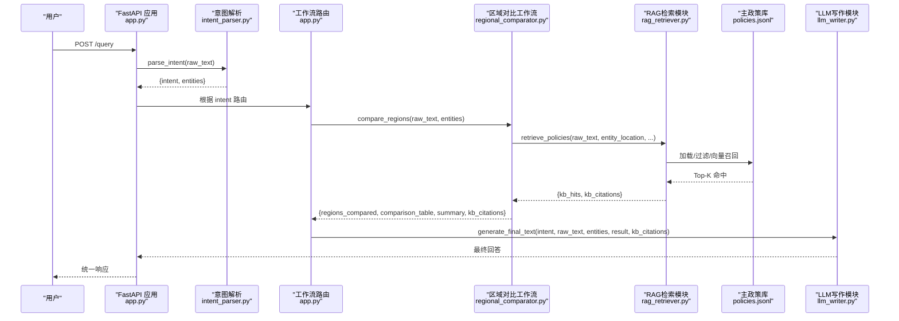
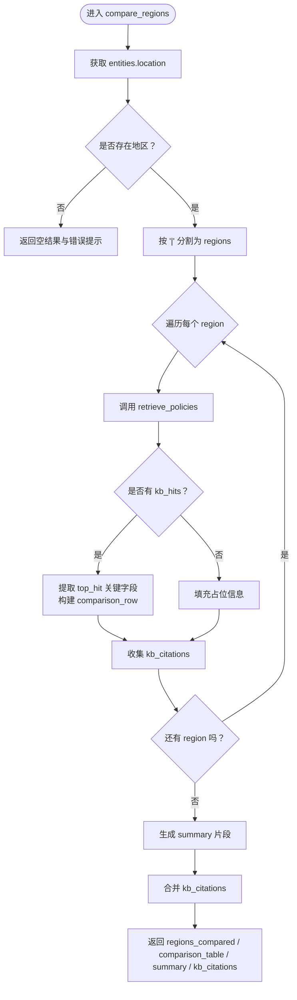
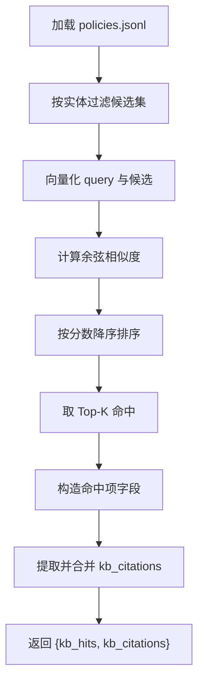
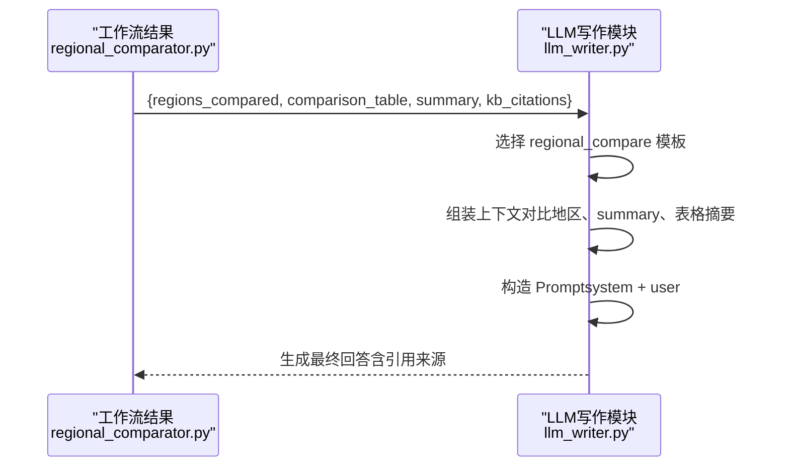
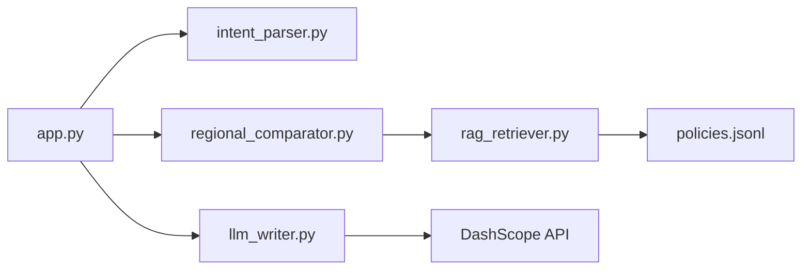

# 区域政策对比工作流

<cite>
**本文引用的文件**
- [app.py](file://app.py)
- [intent_parser.py](file://workflows/intent_parser.py)
- [regional_comparator.py](file://workflows/regional_comparator.py)
- [rag_retriever.py](file://workflows/rag_retriever.py)
- [llm_writer.py](file://workflows/llm_writer.py)
- [test_query.py](file://test_query.py)
- [policies.jsonl](file://data/policies/policies.jsonl)
- [policy_descriptions.md](file://data/policies/policy_descriptions.md)
</cite>

## 目录
1. [简介](#简介)
2. [项目结构](#项目结构)
3. [核心组件](#核心组件)
4. [架构总览](#架构总览)
5. [详细组件分析](#详细组件分析)
6. [依赖关系分析](#依赖关系分析)
7. [性能考量](#性能考量)
8. [故障排查指南](#故障排查指南)
9. [结论](#结论)
10. [附录](#附录)

## 简介
本文件围绕 workflows/regional_comparator.py 模块展开，系统性讲解“区域政策对比”意图的工作流设计与实现细节。该模块负责解析用户查询中的 entity_location 字段，支持通过“|”分隔符一次性指定多个对比地区；对每个地区独立调用检索模块 retrieve_policies 获取政策命中结果，并从命中的第一条政策中抽取关键对比项（如补贴金额、申领平台、有效期等），构建 comparison_table；同时汇总各地区的引用来源 kb_citations，并生成简洁 summary 对比总结；最后将结构化的对比数据传递给 llm_writer，由 LLM 将其润色为易于理解的对比报告。

## 项目结构
本项目采用“意图识别 + 工作流路由 + LLM润色”的分层架构：
- 入口服务：FastAPI 应用提供统一查询接口，负责接收请求、路由到对应工作流并调用 LLM 润色生成最终答案。
- 意图解析：基于大模型识别用户意图与实体，输出扁平化 JSON。
- 工作流：针对不同意图执行相应业务逻辑（如区域对比、个人福利计算、政策解析、企业投资分析）。
- 检索模块：统一 RAG 检索，加载主政策库与补充政策，按地域/行业/产品等实体过滤，向量化召回并排序，返回 Top-K 命中与引用来源。
- LLM 写作：根据工作流结果与引用来源，生成友好专业的最终回答。

图表来源
- [app.py](file://app.py#L37-L128)
- [intent_parser.py](file://workflows/intent_parser.py#L16-L125)
- [regional_comparator.py](file://workflows/regional_comparator.py#L6-L91)
- [rag_retriever.py](file://workflows/rag_retriever.py#L215-L327)
- [llm_writer.py](file://workflows/llm_writer.py#L15-L145)

章节来源
- [app.py](file://app.py#L37-L128)
- [intent_parser.py](file://workflows/intent_parser.py#L16-L125)

## 核心组件
- 意图解析（intent_parser.py）
  - 使用大模型识别意图与实体，输出包含 intent、entity_location、entity_product、entity_industry、entity_time 等字段的 JSON。
  - 当识别为 regional_compare 时，后续路由到 compare_regions 工作流。
- 区域对比工作流（regional_comparator.py）
  - 解析 entities 中的 location 字段，支持“|”分隔的多地区。
  - 对每个地区调用 retrieve_policies 获取 Top-K 命中，取第一条作为对比项来源。
  - 构建 comparison_table，汇总 regions_compared、summary、kb_citations。
- RAG 检索模块（rag_retriever.py）
  - 加载主政策库 policies.jsonl，按 campaign_id 推导地域，按实体过滤候选集。
  - 向量化 query 与候选，计算余弦相似度，排序取 Top-K。
  - 提取福利类型、金额、条件、流程、材料、平台、有效期等字段，构造命中项。
  - 生成 kb_citations（URL 去重并“|”连接）。
- LLM 写作模块（llm_writer.py）
  - 根据 intent 选择模板，将结构化数据转为自然语言。
  - 在 regional_compare 模板中，输出对比地区、summary 与对比表格摘要。
  - 若存在 kb_citations，追加参考来源。

章节来源
- [regional_comparator.py](file://workflows/regional_comparator.py#L6-L91)
- [rag_retriever.py](file://workflows/rag_retriever.py#L215-L327)
- [llm_writer.py](file://workflows/llm_writer.py#L60-L90)

## 架构总览
下图展示了从用户查询到最终回答的关键调用链路与数据流转：

图表来源
- [app.py](file://app.py#L37-L128)
- [intent_parser.py](file://workflows/intent_parser.py#L16-L125)
- [regional_comparator.py](file://workflows/regional_comparator.py#L6-L91)
- [rag_retriever.py](file://workflows/rag_retriever.py#L215-L327)
- [llm_writer.py](file://workflows/llm_writer.py#L15-L145)

## 详细组件分析

### compare_regions 函数详解
- 输入与实体
  - 接收 raw_text 与 entities，其中 entities 来自意图解析，包含 location、product、industry、time 等。
- 多地区解析
  - 若 entities.get("location") 为空，直接返回空对比结果与错误提示。
  - 支持“|”分隔符，将 location 切分为 regions 列表；若无“|”，则视为单一地区。
- 检索与聚合
  - 对每个 region 调用 retrieve_policies，传入 raw_text 与实体信息，top_k=3。
  - 从 kb_hits 中取第一条作为 top_hit，提取标题、福利类型、金额、条件、申领平台、有效期（起止日期拼接）。
  - 若无命中，则填充占位信息。
  - 收集各地区返回的 kb_citations，去重后以“|”连接形成最终引用来源。
- 总结与输出
  - 生成 summary：遍历 comparison_table，拼接“地区：金额，申领平台：平台”片段，若无命中则返回“各地区暂无可对比政策”。
  - 返回 regions_compared、comparison_table、summary、kb_citations 四要素。

图表来源
- [regional_comparator.py](file://workflows/regional_comparator.py#L6-L91)

章节来源
- [regional_comparator.py](file://workflows/regional_comparator.py#L6-L91)

### RAG 检索模块（retrieve_policies）与实体过滤
- 主政策库加载
  - 读取 data/policies/policies.jsonl，逐行解析为候选政策对象。
- 实体过滤
  - 行业过滤：根据 campaign_id 前缀匹配 appliance/digital/car/retail_catering。
  - 地域过滤：从 campaign_id 推导省/市，或匹配 claiming_platform，再与 entity_location 做包含关系判断。
  - 产品过滤：若存在 entity_product，检查 common_rules.subsidy_products 是否包含目标产品。
- 向量召回与排序
  - 将 query 与候选文本向量化，计算余弦相似度，按分数降序取 Top-K。
- 命中项构造
  - 提取标题、省份/城市、起止日期、福利类型/金额、条件（能效、限购）、流程、材料、平台等字段。
- 引用来源
  - 从命中项提取 source_url，去重后“|”连接，作为 kb_citations 返回。

图表来源
- [rag_retriever.py](file://workflows/rag_retriever.py#L215-L327)

章节来源
- [rag_retriever.py](file://workflows/rag_retriever.py#L215-L327)
- [policies.jsonl](file://data/policies/policies.jsonl#L1-L9)
- [policy_descriptions.md](file://data/policies/policy_descriptions.md#L1-L23)

### LLM 写作模块（generate_final_text）与区域对比模板
- 模板选择
  - 根据 intent 选择模板：policy_parse、personal_welfare、regional_compare、investment_signal。
- 区域对比模板要点
  - 输出对比地区列表与 summary。
  - 输出对比表格摘要（逐条列出地区与补贴金额）。
- 引用来源
  - 若存在 kb_citations，追加“参考来源：...”在最终回答末尾。

图表来源
- [llm_writer.py](file://workflows/llm_writer.py#L60-L90)
- [llm_writer.py](file://workflows/llm_writer.py#L91-L145)

章节来源
- [llm_writer.py](file://workflows/llm_writer.py#L60-L90)
- [llm_writer.py](file://workflows/llm_writer.py#L91-L145)

### 示例：输入“济南|青岛”
- 意图解析
  - intent_parser 识别为 regional_compare，并提取 entity_location="济南|青岛"。
- 工作流路由
  - app.py 根据 intent 路由到 compare_regions。
- 区域对比工作流
  - compare_regions 将 location 拆分为 ["济南","青岛"]。
  - 对每个地区调用 retrieve_policies，得到各地区 Top-1 命中。
  - 构建 comparison_table，包含地区、政策标题、福利类型、金额、条件、平台、有效期等字段。
  - 汇总 kb_citations，生成 summary。
- LLM 写作
  - llm_writer 依据 regional_compare 模板，将 regions_compared、summary、comparison_table 摘要化为自然语言回答，并附加引用来源。

章节来源
- [intent_parser.py](file://workflows/intent_parser.py#L16-L125)
- [regional_comparator.py](file://workflows/regional_comparator.py#L6-L91)
- [rag_retriever.py](file://workflows/rag_retriever.py#L215-L327)
- [llm_writer.py](file://workflows/llm_writer.py#L60-L90)
- [test_query.py](file://test_query.py#L68-L80)

## 依赖关系分析
- 模块耦合
  - app.py 作为统一入口，依赖 intent_parser、regional_comparator、llm_writer。
  - regional_comparator 依赖 rag_retriever。
  - rag_retriever 依赖 data/policies/policies.jsonl。
  - llm_writer 依赖 DashScope API（通过环境变量配置）。
- 数据依赖
  - policies.jsonl 提供主政策库，包含 campaign_id、common_rules、claiming_platform、start_date/end_date 等字段，是 compare_regions 构建 comparison_table 的关键数据源。
- 外部接口
  - DashScope API 用于嵌入与对话，影响检索与写作的可用性与稳定性。

图表来源
- [app.py](file://app.py#L37-L128)
- [regional_comparator.py](file://workflows/regional_comparator.py#L6-L91)
- [rag_retriever.py](file://workflows/rag_retriever.py#L215-L327)
- [llm_writer.py](file://workflows/llm_writer.py#L15-L40)

章节来源
- [app.py](file://app.py#L37-L128)
- [regional_comparator.py](file://workflows/regional_comparator.py#L6-L91)
- [rag_retriever.py](file://workflows/rag_retriever.py#L215-L327)
- [llm_writer.py](file://workflows/llm_writer.py#L15-L40)

## 性能考量
- 检索性能
  - 向量化 batch_size 与 API 调用次数直接影响延迟；建议合理设置 top_k 与并发。
  - 若主库命中不足，会触发补充策略（当前实现为简化处理），可考虑增强补充召回逻辑。
- 数据规模
  - policies.jsonl 为 JSONL 格式，逐行解析；在数据量增大时，可考虑索引或缓存策略。
- 输出稳定性
  - llm_writer 依赖外部 API，需关注超时与降级策略（当前实现包含降级返回结构化内容）。

## 故障排查指南
- 缺少地区信息
  - 若 entities 中 location 为空，compare_regions 直接返回错误提示与空结果，请确认意图解析是否正确提取实体。
- 检索无命中
  - 若某地区无 kb_hits，compare_regions 会填充占位信息；可在 summary 中看到“未找到政策”提示。
- 引用来源为空
  - 若 kb_citations 为空，可能由于命中项未包含 source_url 或被过滤；可在最终回答末尾看不到参考来源。
- LLM 调用失败
  - llm_writer 会捕获异常并返回结构化降级内容；检查 DashScope API 配置与网络连通性。

章节来源
- [regional_comparator.py](file://workflows/regional_comparator.py#L18-L30)
- [llm_writer.py](file://workflows/llm_writer.py#L138-L145)

## 结论
regional_comparator.py 通过“多地区解析 + 独立检索 + 关键字段抽取 + 汇总总结”的方式，实现了对多地区政策的横向对比。其与 rag_retriever 的紧密协作保证了检索的准确性与可解释性，再由 llm_writer 将结构化结果转化为易读的自然语言报告，满足用户对政策差异的快速理解需求。建议在生产环境中结合缓存、索引与更丰富的补充策略，持续优化检索与写作体验。

## 附录
- 测试用例
  - 可使用 test_query.py 发送示例查询，验证 regional_compare 意图的端到端效果，包括实体提取、工作流结果与最终回答。

章节来源
- [test_query.py](file://test_query.py#L68-L80)