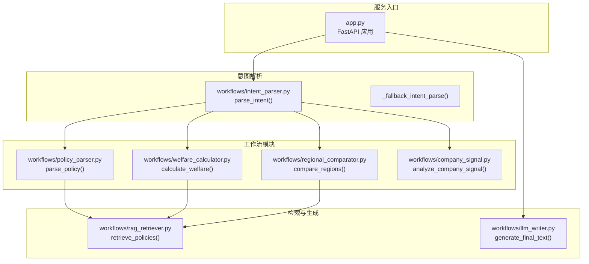
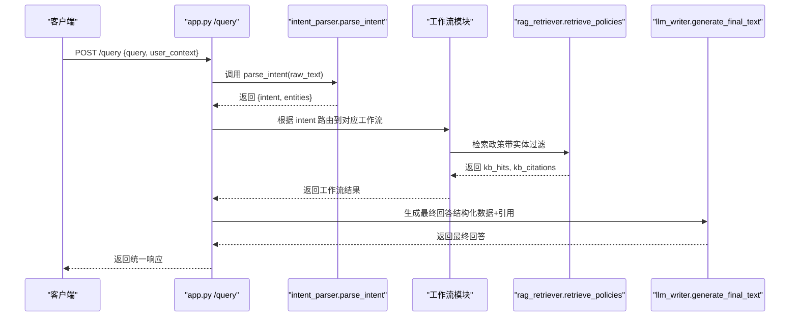
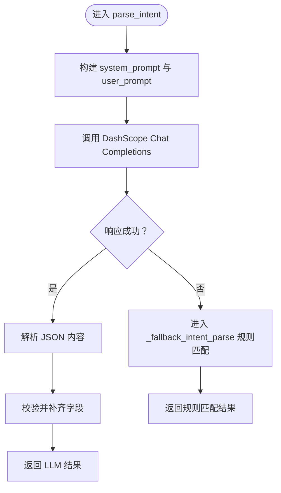
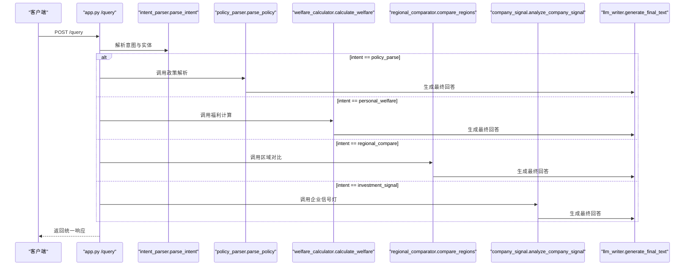
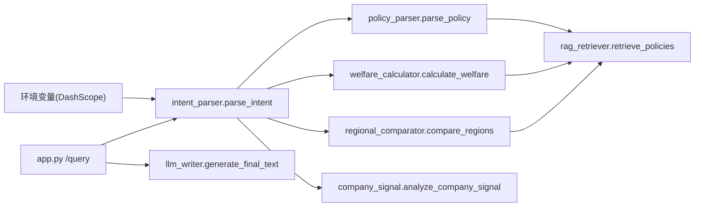

# 意图解析工作流

<cite>
**本文引用的文件**
- [workflows/intent_parser.py](file://workflows/intent_parser.py)
- [app.py](file://app.py)
- [workflows/policy_parser.py](file://workflows/policy_parser.py)
- [workflows/regional_comparator.py](file://workflows/regional_comparator.py)
- [workflows/welfare_calculator.py](file://workflows/welfare_calculator.py)
- [workflows/llm_writer.py](file://workflows/llm_writer.py)
- [workflows/rag_retriever.py](file://workflows/rag_retriever.py)
- [workflows/company_signal.py](file://workflows/company_signal.py)
- [test_query.py](file://test_query.py)
- [data/policies/policy_descriptions.md](file://data/policies/policy_descriptions.md)
</cite>

## 目录
1. [简介](#简介)
2. [项目结构](#项目结构)
3. [核心组件](#核心组件)
4. [架构总览](#架构总览)
5. [详细组件分析](#详细组件分析)
6. [依赖关系分析](#依赖关系分析)
7. [性能考量](#性能考量)
8. [故障排查指南](#故障排查指南)
9. [结论](#结论)
10. [附录](#附录)

## 简介
本文件深入解析意图解析模块 intent_parser.py 的设计与实现，重点说明其作为系统入口的意图识别与实体抽取能力。该模块通过大语言模型（LLM）对用户查询进行意图分类（policy_parse、personal_welfare、regional_compare、investment_signal），并从查询中抽取关键实体（地点、产品、公司、行业、时间、价格、能效等级等）。同时，文档阐述系统提示词（system_prompt）的设计逻辑、输出JSON格式规范、行业识别与价格提取规则，并说明降级方案 _fallback_intent_parse 在LLM调用失败时的基于规则的意图匹配机制（关键词匹配与正则表达式提取）。最后，文档展示该模块与 app.py 主流程的集成方式及其在整个工作流路由中的关键作用。

## 项目结构
本项目采用“工作流模块化”组织方式，意图解析位于 workflows 子目录，主服务入口在 app.py 中统一调度各工作流模块。知识检索与实体过滤由 rag_retriever.py 提供，其余工作流模块分别负责政策解析、区域对比、个人福利计算与企业投资信号灯分析。最终回答由 llm_writer.py 通过LLM润色生成。

图表来源
- [app.py](file://app.py#L37-L128)
- [workflows/intent_parser.py](file://workflows/intent_parser.py#L16-L175)
- [workflows/policy_parser.py](file://workflows/policy_parser.py#L6-L83)
- [workflows/regional_comparator.py](file://workflows/regional_comparator.py#L6-L91)
- [workflows/welfare_calculator.py](file://workflows/welfare_calculator.py#L7-L123)
- [workflows/llm_writer.py](file://workflows/llm_writer.py#L15-L145)
- [workflows/rag_retriever.py](file://workflows/rag_retriever.py#L215-L326)

章节来源
- [app.py](file://app.py#L1-L155)
- [workflows/intent_parser.py](file://workflows/intent_parser.py#L1-L175)

## 核心组件
- 意图解析与实体抽取：parse_intent() 通过系统提示词驱动LLM进行意图分类与实体抽取，并在LLM失败时回退到规则匹配。
- 主流程路由：app.py 的 /query 接口负责接收查询、调用 parse_intent()、根据意图路由到相应工作流、再由 llm_writer 生成最终回答。
- 检索与过滤：rag_retriever.retrieve_policies() 基于结构化过滤（地点、产品、行业、时间）与向量检索，返回 Top-K 命中与引用。
- 工作流实现：
  - 政策解析：policy_parser.parse_policy() 将检索结果结构化输出。
  - 个人福利计算：welfare_calculator.calculate_welfare() 基于价格与行业规则计算补贴。
  - 区域政策对比：regional_comparator.compare_regions() 对多个地区进行政策对比。
  - 企业投资信号灯：company_signal.analyze_company_signal() 基于企业库评分与推荐。

章节来源
- [workflows/intent_parser.py](file://workflows/intent_parser.py#L16-L175)
- [app.py](file://app.py#L37-L128)
- [workflows/rag_retriever.py](file://workflows/rag_retriever.py#L215-L326)
- [workflows/policy_parser.py](file://workflows/policy_parser.py#L6-L83)
- [workflows/welfare_calculator.py](file://workflows/welfare_calculator.py#L7-L123)
- [workflows/regional_comparator.py](file://workflows/regional_comparator.py#L6-L91)
- [workflows/company_signal.py](file://workflows/company_signal.py#L62-L150)
- [workflows/llm_writer.py](file://workflows/llm_writer.py#L15-L145)

## 架构总览
意图解析是系统入口，负责将自然语言查询转化为标准化的意图与实体，随后由主流程根据意图选择对应工作流模块执行。检索模块在政策解析、个人福利计算、区域对比中被复用，最终由LLM润色生成用户可读的回答。

图表来源
- [app.py](file://app.py#L37-L128)
- [workflows/intent_parser.py](file://workflows/intent_parser.py#L16-L125)
- [workflows/rag_retriever.py](file://workflows/rag_retriever.py#L215-L326)
- [workflows/llm_writer.py](file://workflows/llm_writer.py#L15-L145)

## 详细组件分析

### 意图解析与实体抽取（intent_parser.parse_intent）
- 功能概述
  - 使用系统提示词驱动LLM进行四类意图识别与实体抽取，输出扁平化JSON。
  - 四类意图：
    - policy_parse：政策智能解析（查询政策内容、申请条件、流程、截止时间等）
    - personal_welfare：个人福利计算（通常包含购买价格信息）
    - regional_compare：区域政策对比（对比不同地区的政策差异）
    - investment_signal：企业投资信号灯（评估企业适配性、招商推荐）
  - 实体类型：
    - 地点、产品、公司、行业、时间、价格、能效等级
- 系统提示词设计逻辑
  - 明确意图类型与实体类型，强调输出必须为严格JSON格式。
  - 提供行业识别规则与价格提取规则，确保LLM输出符合预期。
- 输出JSON规范
  - 字段：intent、entity_location、entity_product、entity_company、entity_industry、entity_time、price_paid、energy_efficiency_level。
  - 若LLM未返回完整字段，模块会填充默认值并保证字段完整性。
- LLM调用与异常处理
  - 通过 DashScope Chat Completions 接口发送system/user消息，设置温度与响应格式为JSON。
  - 超时与HTTP错误会触发异常，模块打印日志并进入降级方案。
- 降级方案 _fallback_intent_parse
  - 基于关键词与正则表达式进行规则匹配与实体抽取：
    - 意图判定：包含“能领多少/补贴金额/买了/花了”且包含数字 → personal_welfare；包含“对比/比较/哪个好” → regional_compare；包含“企业/公司/招商/投资”且不含“我们” → investment_signal。
    - 实体抽取：地点、产品、公司、时间使用正则匹配；价格使用“数字+可选单位+元”模式提取；能效等级使用“几级能效”模式提取；行业依据关键词映射到 appliance/digital/car/retail_catering。
  - 该降级方案确保在网络或模型不可用时仍能稳定返回结构化结果。

图表来源
- [workflows/intent_parser.py](file://workflows/intent_parser.py#L16-L125)

章节来源
- [workflows/intent_parser.py](file://workflows/intent_parser.py#L16-L175)

### 主流程路由（app.py /query）
- 输入输出
  - 输入：QueryRequest { query, user_context }。
  - 输出：QueryResponse { success, intent, raw_text, entities, result, final_answer, citations, error }。
- 处理步骤
  1) 调用 parse_intent(raw_text) 获取意图与实体。
  2) 根据 intent 路由到对应工作流：
     - policy_parse → policy_parser.parse_policy()
     - personal_welfare → welfare_calculator.calculate_welfare()
     - regional_compare → regional_comparator.compare_regions()
     - investment_signal → company_signal.analyze_company_signal()
  3) 调用 llm_writer.generate_final_text() 生成最终回答，附加引用。
- 错误处理
  - 对HTTP异常与通用异常进行捕获与格式化，返回统一错误响应。

图表来源
- [app.py](file://app.py#L37-L128)

章节来源
- [app.py](file://app.py#L37-L128)

### 检索与实体过滤（rag_retriever.retrieve_policies）
- 结构化过滤
  - 地点：支持城市/省份/平台名称匹配。
  - 产品：从政策的“补贴产品”字段中匹配。
- 向量检索与重排
  - 使用嵌入模型计算相似度，结合BM25与交叉编码器重排，得到Top-K命中。
- 输出
  - 返回 kb_hits（结构化政策列表）与 kb_citations（来源URL拼接）。

章节来源
- [workflows/rag_retriever.py](file://workflows/rag_retriever.py#L215-L326)
- [data/policies/policy_descriptions.md](file://data/policies/policy_descriptions.md#L1-L23)

### 政策智能解析（policy_parser.parse_policy）
- 输入：raw_text 与 entities（地点、产品、行业、时间）。
- 处理：调用检索模块，取Top-1作为主要结果，组装地域、有效期、条件、流程、材料、申领平台等字段。
- 输出：policy_title、benefit_type、benefit_amount、region、effective_period、conditions、procedures、required_materials、claiming_platform、kb_citations。

章节来源
- [workflows/policy_parser.py](file://workflows/policy_parser.py#L6-L83)
- [workflows/rag_retriever.py](file://workflows/rag_retriever.py#L215-L326)

### 个人福利计算（welfare_calculator.calculate_welfare）
- 输入：raw_text 与 entities（含 price_paid）。
- 处理：检索政策后，若缺少价格则提示；否则按行业规则计算补贴（示例规则见模块注释）。
- 输出：subsidy_amount、subsidy_breakdown、total_benefit、constraints、required_materials、claiming_platform、kb_citations。

章节来源
- [workflows/welfare_calculator.py](file://workflows/welfare_calculator.py#L7-L123)
- [workflows/rag_retriever.py](file://workflows/rag_retriever.py#L215-L326)

### 区域政策对比（regional_comparator.compare_regions）
- 输入：raw_text 与 entities（地点可为“|”分隔的多地区）。
- 处理：对每个地区独立检索Top-K，取Top-1构建对比表，汇总对比摘要。
- 输出：regions_compared、comparison_table、summary、kb_citations。

章节来源
- [workflows/regional_comparator.py](file://workflows/regional_comparator.py#L6-L91)
- [workflows/rag_retriever.py](file://workflows/rag_retriever.py#L215-L326)

### 企业投资信号灯（company_signal.analyze_company_signal）
- 输入：raw_text 与 entities（industry、location）。
- 处理：按行业加载企业库，计算评分并排序，输出推荐Top-N与行业概览，给出投资信号灯。
- 输出：recommended_companies、industry_summary、investment_signal、kb_citations。

章节来源
- [workflows/company_signal.py](file://workflows/company_signal.py#L62-L150)

### LLM润色生成（llm_writer.generate_final_text）
- 输入：intent、raw_text、entities、workflow_result、kb_citations。
- 处理：根据不同意图构造结构化上下文，调用LLM生成友好、专业的最终回答；若LLM失败则回退为直接返回结构化上下文。
- 输出：最终回答文本（可附加引用来源）。

章节来源
- [workflows/llm_writer.py](file://workflows/llm_writer.py#L15-L145)

## 依赖关系分析
- 意图解析模块依赖环境变量配置（DashScope API Base、Key、Chat Model），并通过 httpx 异步调用LLM接口。
- 主流程 app.py 依赖 intent_parser 的解析结果，按意图路由到不同工作流模块。
- 各工作流模块共享检索模块 rag_retriever，形成高内聚低耦合的模块化架构。
- llm_writer 作为统一的最终回答生成器，贯穿所有工作流。

图表来源
- [workflows/intent_parser.py](file://workflows/intent_parser.py#L16-L125)
- [app.py](file://app.py#L37-L128)
- [workflows/rag_retriever.py](file://workflows/rag_retriever.py#L215-L326)
- [workflows/llm_writer.py](file://workflows/llm_writer.py#L15-L145)

章节来源
- [workflows/intent_parser.py](file://workflows/intent_parser.py#L16-L175)
- [app.py](file://app.py#L37-L128)

## 性能考量
- 异步调用：intent_parser 与 llm_writer 均使用 httpx.AsyncClient，降低I/O阻塞。
- 超时控制：统一设置30秒超时，避免长时间等待。
- Top-K与结构化过滤：检索阶段先结构化过滤再向量召回，减少无效计算。
- 降级策略：LLM失败时走规则匹配，保障可用性与稳定性。
- 建议优化
  - 缓存常用意图与实体的LLM提示词，减少重复构建。
  - 对检索结果进行去重与评分阈值控制，提高命中质量。
  - 在高频场景下引入连接池与并发限制，避免外部服务过载。

[本节为通用指导，无需列出具体文件来源]

## 故障排查指南
- LLM调用失败
  - 现象：打印“LLM调用失败”日志，进入降级方案。
  - 排查：检查环境变量（API Base、Key、Model）是否正确；确认网络连通性；查看DashScope服务状态。
  - 参考位置：[workflows/intent_parser.py](file://workflows/intent_parser.py#L118-L125)
- 未知意图
  - 现象：主流程抛出HTTP 400错误。
  - 排查：确认 intent_parser 返回的 intent 是否在枚举范围内。
  - 参考位置：[app.py](file://app.py#L89-L91)
- 缺少实体导致工作流失败
  - 福利计算缺少价格：返回提示“缺少购买价格信息，无法计算”。
  - 区域对比缺少地区：返回提示“未指定对比地区”。
  - 企业信号缺少行业：返回提示“未指定行业”。
  - 参考位置：
    - [workflows/welfare_calculator.py](file://workflows/welfare_calculator.py#L48-L60)
    - [workflows/regional_comparator.py](file://workflows/regional_comparator.py#L19-L28)
    - [workflows/company_signal.py](file://workflows/company_signal.py#L75-L86)
- 无政策命中
  - 现象：工作流返回“未找到相关政策”或“未找到政策”。
  - 排查：检查检索实体（地点、产品、行业、时间）是否合理；确认知识库是否存在。
  - 参考位置：
    - [workflows/policy_parser.py](file://workflows/policy_parser.py#L38-L53)
    - [workflows/regional_comparator.py](file://workflows/regional_comparator.py#L59-L68)
    - [workflows/welfare_calculator.py](file://workflows/welfare_calculator.py#L36-L46)

章节来源
- [workflows/intent_parser.py](file://workflows/intent_parser.py#L118-L125)
- [app.py](file://app.py#L89-L91)
- [workflows/welfare_calculator.py](file://workflows/welfare_calculator.py#L48-L60)
- [workflows/regional_comparator.py](file://workflows/regional_comparator.py#L19-L28)
- [workflows/company_signal.py](file://workflows/company_signal.py#L75-L86)
- [workflows/policy_parser.py](file://workflows/policy_parser.py#L38-L53)

## 结论
intent_parser.py 作为系统入口，承担了意图识别与实体抽取的关键职责。通过精心设计的系统提示词与严格的JSON输出规范，它能够稳定地将多样化的用户查询映射到四种核心意图，并为后续工作流提供高质量的实体输入。在LLM不可用时，降级方案确保系统仍能返回结构化结果，提升了整体鲁棒性。与 app.py 的集成清晰明确，配合统一的检索与生成模块，形成了端到端的智能问答工作流。

[本节为总结性内容，无需列出具体文件来源]

## 附录

### 实际代码示例（以路径代替代码片段）
- 用户查询到结构化输出的典型流程
  - 示例输入：[test_query.py](file://test_query.py#L68-L77)
  - 主流程调用与路由：[app.py](file://app.py#L37-L128)
  - 意图解析与实体抽取：[workflows/intent_parser.py](file://workflows/intent_parser.py#L16-L125)
  - 政策解析工作流：[workflows/policy_parser.py](file://workflows/policy_parser.py#L6-L83)
  - 个人福利计算工作流：[workflows/welfare_calculator.py](file://workflows/welfare_calculator.py#L7-L123)
  - 区域政策对比工作流：[workflows/regional_comparator.py](file://workflows/regional_comparator.py#L6-L91)
  - 企业投资信号灯工作流：[workflows/company_signal.py](file://workflows/company_signal.py#L62-L150)
  - LLM润色生成最终回答：[workflows/llm_writer.py](file://workflows/llm_writer.py#L15-L145)

### 系统提示词与输出规范要点
- 系统提示词包含意图类型、实体类型、输出格式要求、行业识别规则、价格提取规则。
- 输出JSON字段齐全性由模块自动补齐，确保下游工作流稳定消费。
- 降级方案使用关键词与正则表达式进行意图与实体抽取，覆盖常见场景。

章节来源
- [workflows/intent_parser.py](file://workflows/intent_parser.py#L33-L74)
- [workflows/intent_parser.py](file://workflows/intent_parser.py#L102-L118)
- [workflows/intent_parser.py](file://workflows/intent_parser.py#L127-L175)