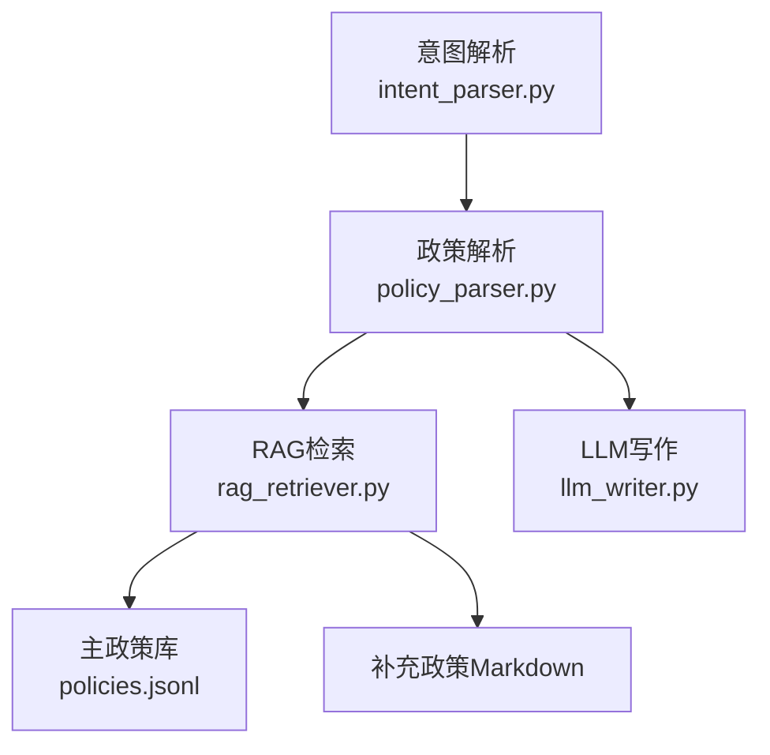
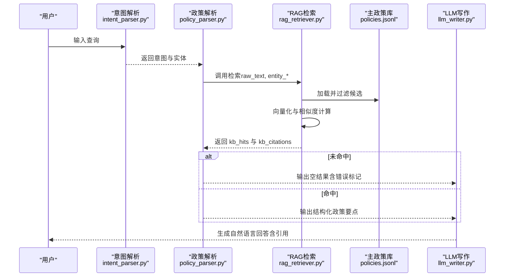
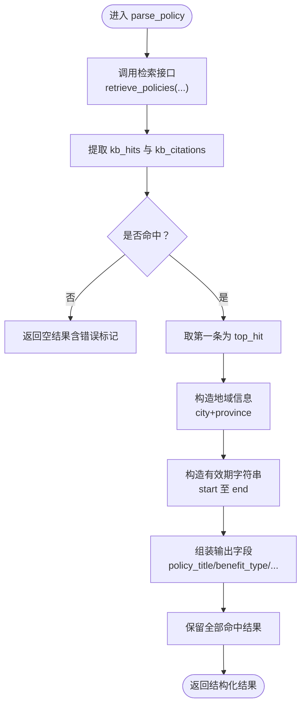
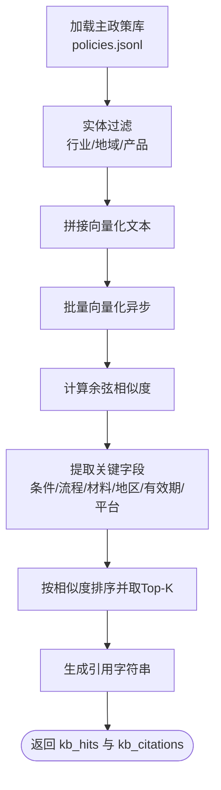
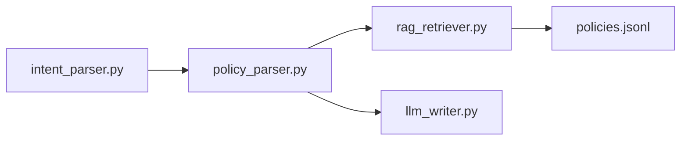

# 政策解析工作流

<cite>
**本文引用的文件**
- [workflows/policy_parser.py](file://workflows/policy_parser.py)
- [workflows/rag_retriever.py](file://workflows/rag_retriever.py)
- [workflows/intent_parser.py](file://workflows/intent_parser.py)
- [workflows/llm_writer.py](file://workflows/llm_writer.py)
- [data/policies/policies.jsonl](file://data/policies/policies.jsonl)
- [data/policies/policy_descriptions.md](file://data/policies/policy_descriptions.md)
</cite>

## 目录
1. [简介](#简介)
2. [项目结构](#项目结构)
3. [核心组件](#核心组件)
4. [架构总览](#架构总览)
5. [详细组件分析](#详细组件分析)
6. [依赖关系分析](#依赖关系分析)
7. [性能考量](#性能考量)
8. [故障排查指南](#故障排查指南)
9. [结论](#结论)

## 简介
本文件围绕“政策解析工作流”展开，聚焦 workflows/policy_parser.py 模块如何承接“policy_parse”意图，将用户查询与实体信息转化为结构化的政策要点输出。该模块通过调用 RAG 检索模块（workflows/rag_retriever.py）获取候选政策，再对检索结果进行清洗与格式化，最终输出扁平化 JSON，供后续 LLM 写作文本生成模块（workflows/llm_writer.py）使用。

## 项目结构
- 意图解析：workflows/intent_parser.py 将用户查询解析为意图与实体（地点、产品、行业、时间等）
- RAG 检索：workflows/rag_retriever.py 基于主政策库与补充政策，执行实体过滤、向量召回、排序与 Top-K 返回
- 政策解析：workflows/policy_parser.py 接收原始查询与实体，调用检索并格式化输出
- LLM 写作：workflows/llm_writer.py 基于结构化上下文生成自然语言回答

图表来源
- [workflows/intent_parser.py](file://workflows/intent_parser.py#L1-L175)
- [workflows/policy_parser.py](file://workflows/policy_parser.py#L1-L83)
- [workflows/rag_retriever.py](file://workflows/rag_retriever.py#L1-L327)
- [data/policies/policies.jsonl](file://data/policies/policies.jsonl#L1-L9)

章节来源
- [workflows/intent_parser.py](file://workflows/intent_parser.py#L1-L175)
- [workflows/policy_parser.py](file://workflows/policy_parser.py#L1-L83)
- [workflows/rag_retriever.py](file://workflows/rag_retriever.py#L1-L327)
- [data/policies/policies.jsonl](file://data/policies/policies.jsonl#L1-L9)

## 核心组件
- 意图解析（intent_parser.py）：识别“policy_parse”意图并抽取实体（地点、产品、行业、时间等），为检索提供过滤条件
- RAG 检索（rag_retriever.py）：加载主政策库，按实体过滤，向量化查询与候选，计算相似度，提取关键字段（如适用地区、有效期、申请条件、流程、材料、申领平台），排序并返回 Top-K
- 政策解析（policy_parser.py）：调用检索接口，处理无命中场景，构造地域与有效期字符串，输出扁平化 JSON
- LLM 写作（llm_writer.py）：基于结构化上下文生成自然语言回答，并附加引用来源

章节来源
- [workflows/intent_parser.py](file://workflows/intent_parser.py#L1-L175)
- [workflows/rag_retriever.py](file://workflows/rag_retriever.py#L1-L327)
- [workflows/policy_parser.py](file://workflows/policy_parser.py#L1-L83)
- [workflows/llm_writer.py](file://workflows/llm_writer.py#L1-L145)

## 架构总览
下图展示了从用户查询到最终回答的关键交互路径，重点体现 policy_parser 如何串联意图解析、RAG 检索与 LLM 写作。

图表来源
- [workflows/intent_parser.py](file://workflows/intent_parser.py#L1-L175)
- [workflows/policy_parser.py](file://workflows/policy_parser.py#L1-L83)
- [workflows/rag_retriever.py](file://workflows/rag_retriever.py#L1-L327)
- [workflows/llm_writer.py](file://workflows/llm_writer.py#L1-L145)

## 详细组件分析

### 政策解析模块（policy_parser.py）
- 输入：原始查询与实体（地点、产品、行业、时间等）
- 处理：
  - 调用 RAG 检索模块的检索接口，传入 top_k 参数
  - 若无命中，返回包含错误标记的空结果
  - 若命中，取第一条作为主要结果，构造地域信息（城市+省份）、有效期字符串
  - 输出扁平化 JSON，包含政策标题、福利类型、补贴金额、适用地区、有效期、申请条件、办理流程、所需材料、申领平台、引用、以及保留的全部命中结果
- 输出：扁平化 JSON，供 LLM 写作模块直接使用

图表来源
- [workflows/policy_parser.py](file://workflows/policy_parser.py#L1-L83)

章节来源
- [workflows/policy_parser.py](file://workflows/policy_parser.py#L1-L83)

### RAG 检索模块（rag_retriever.py）
- 主政策库加载与过滤：
  - 读取 policies.jsonl，按实体过滤（行业、地域、产品）
  - 地域推导：根据 campaign_id 推断省/市
  - 行业映射：依据 campaign_id 前缀匹配家电/数码/汽车/零售餐饮
- 向量召回与排序：
  - 拼接用于向量化的文本
  - 批量向量化（异步），计算查询向量与候选向量的余弦相似度
  - 按相似度排序，取 Top-K
- 结果提取与格式化：
  - 提取并格式化“申请条件”、“办理流程”、“所需材料”、“适用地区”、“有效期”、“福利类型/金额”、“申领平台”
  - 生成引用字符串（当前为空占位，便于后续扩展）

图表来源
- [workflows/rag_retriever.py](file://workflows/rag_retriever.py#L1-L327)
- [data/policies/policies.jsonl](file://data/policies/policies.jsonl#L1-L9)

章节来源
- [workflows/rag_retriever.py](file://workflows/rag_retriever.py#L1-L327)
- [data/policies/policies.jsonl](file://data/policies/policies.jsonl#L1-L9)

### 意图解析模块（intent_parser.py）
- 作用：识别“policy_parse”意图并抽取实体（地点、产品、行业、时间等）
- 机制：基于大模型 JSON 输出的意图识别，失败时降级为规则识别
- 输出：扁平化 JSON，供 policy_parser 使用

章节来源
- [workflows/intent_parser.py](file://workflows/intent_parser.py#L1-L175)

### LLM 写作模块（llm_writer.py）
- 作用：基于结构化上下文生成自然语言回答
- 机制：根据不同意图拼装上下文，调用大模型生成回答，附加引用来源
- 与 policy_parser 的衔接：直接消费 policy_parser 的扁平化输出

章节来源
- [workflows/llm_writer.py](file://workflows/llm_writer.py#L1-L145)

## 依赖关系分析
- policy_parser 依赖 rag_retriever 的检索接口
- intent_parser 为 policy_parser 提供实体输入
- llm_writer 依赖 policy_parser 的结构化输出
- rag_retriever 依赖主政策库（policies.jsonl）与补充政策（Markdown）

图表来源
- [workflows/intent_parser.py](file://workflows/intent_parser.py#L1-L175)
- [workflows/policy_parser.py](file://workflows/policy_parser.py#L1-L83)
- [workflows/rag_retriever.py](file://workflows/rag_retriever.py#L1-L327)
- [workflows/llm_writer.py](file://workflows/llm_writer.py#L1-L145)
- [data/policies/policies.jsonl](file://data/policies/policies.jsonl#L1-L9)

章节来源
- [workflows/intent_parser.py](file://workflows/intent_parser.py#L1-L175)
- [workflows/policy_parser.py](file://workflows/policy_parser.py#L1-L83)
- [workflows/rag_retriever.py](file://workflows/rag_retriever.py#L1-L327)
- [workflows/llm_writer.py](file://workflows/llm_writer.py#L1-L145)
- [data/policies/policies.jsonl](file://data/policies/policies.jsonl#L1-L9)

## 性能考量
- 向量化与相似度计算为异步批量处理，有助于降低延迟
- Top-K 控制在检索阶段完成，减少下游处理负担
- 当主库命中不足阈值时，检索模块预留了补充政策加载位置，便于扩展召回能力
- 输出为扁平化 JSON，便于后续 LLM 写作直接消费，减少中间转换成本

[本节为一般性建议，无需特定文件引用]

## 故障排查指南
- 未命中政策：
  - 现象：policy_parser 返回空结果并带有错误标记
  - 排查：确认意图解析是否正确识别为“policy_parse”，实体是否合理；检查 RAG 检索过滤逻辑（行业/地域/产品）
- 引用来源为空：
  - 现象：kb_citations 为空
  - 排查：当前检索返回中引用字段为空占位，可在后续扩展中填充具体 URL
- 地域与有效期为空：
  - 现象：region 或 effective_period 为空
  - 排查：确认 campaign_id 是否能被正确推导出省/市；确认 start_date/end_date 是否存在
- LLM 写作失败：
  - 现象：LLM 写作模块降级为直接返回结构化上下文
  - 排查：检查大模型 API 配置与网络连通性

章节来源
- [workflows/policy_parser.py](file://workflows/policy_parser.py#L1-L83)
- [workflows/rag_retriever.py](file://workflows/rag_retriever.py#L1-L327)
- [workflows/llm_writer.py](file://workflows/llm_writer.py#L1-L145)

## 结论
policy_parser 通过简洁的调用链路与严格的结构化输出，有效承接了“policy_parse”意图，将检索结果转化为 LLM 写作所需的清晰上下文。其对无命中场景的处理、地域与有效期的格式化、以及对引用的保留，共同保证了最终回答的质量与可追溯性。未来可在引用来源填充、补充政策召回增强等方面持续优化。