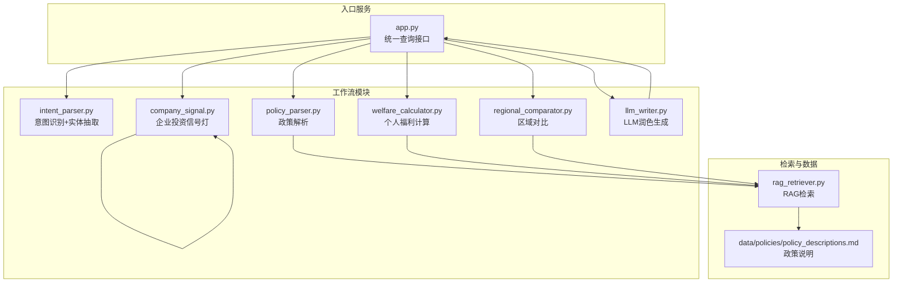
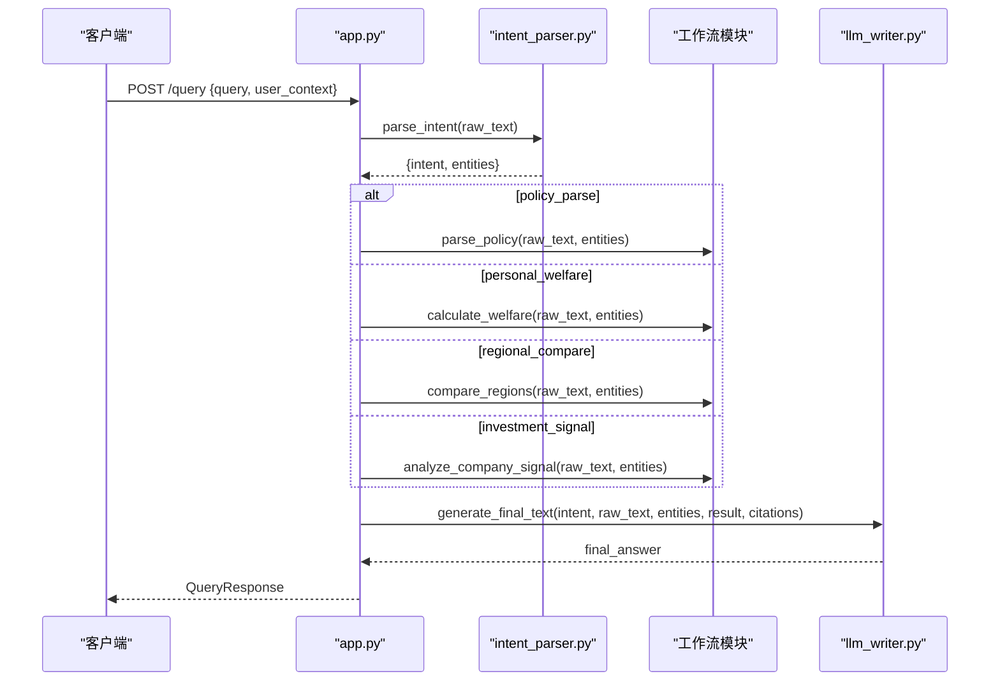
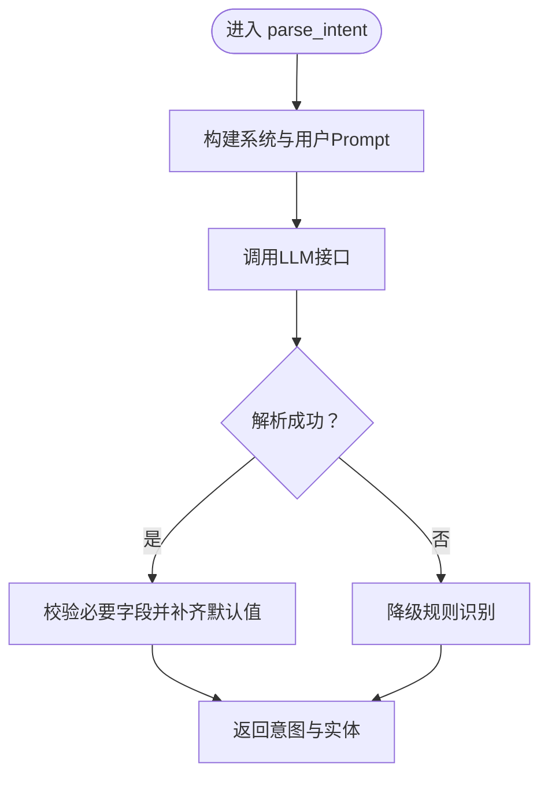
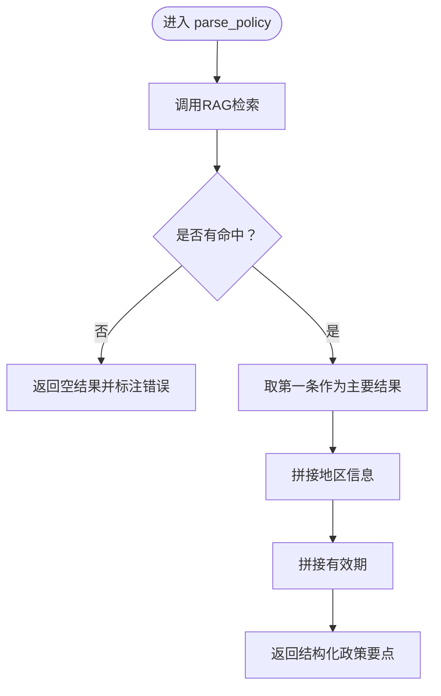
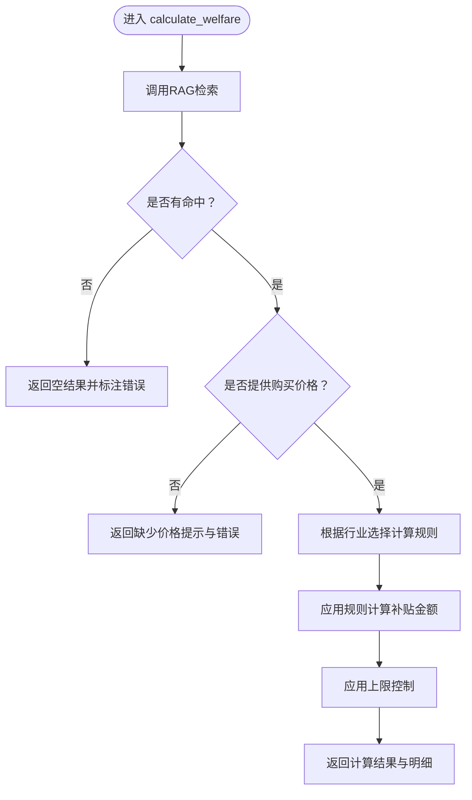
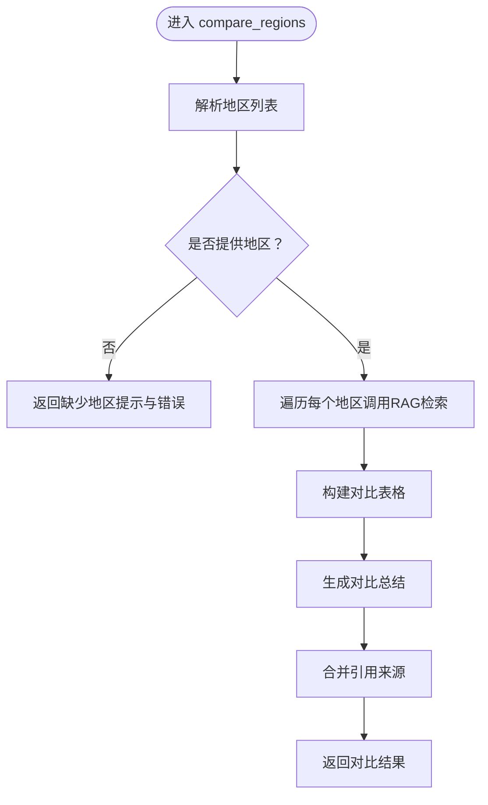
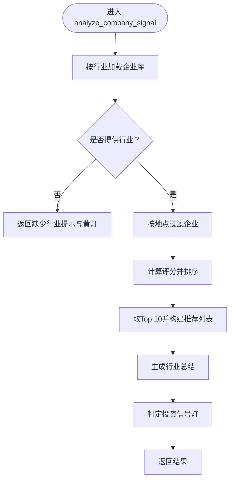
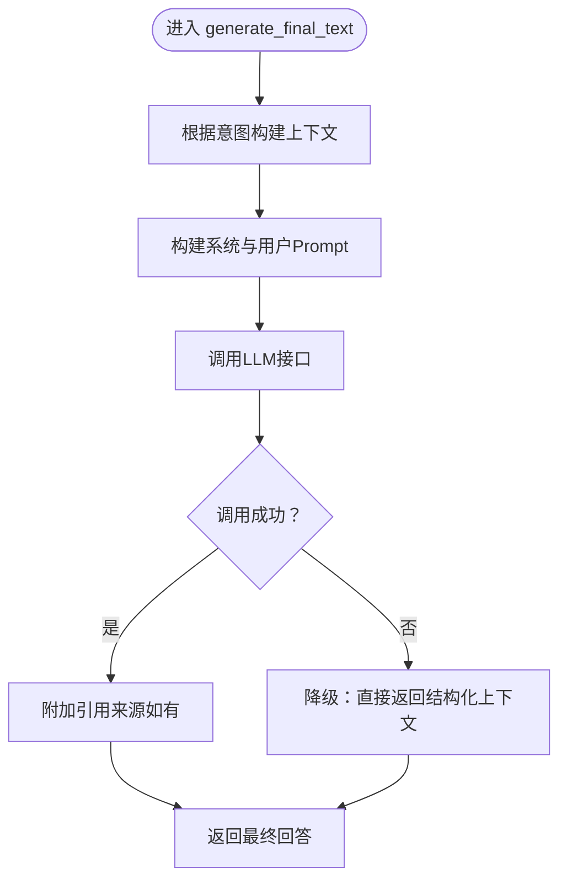
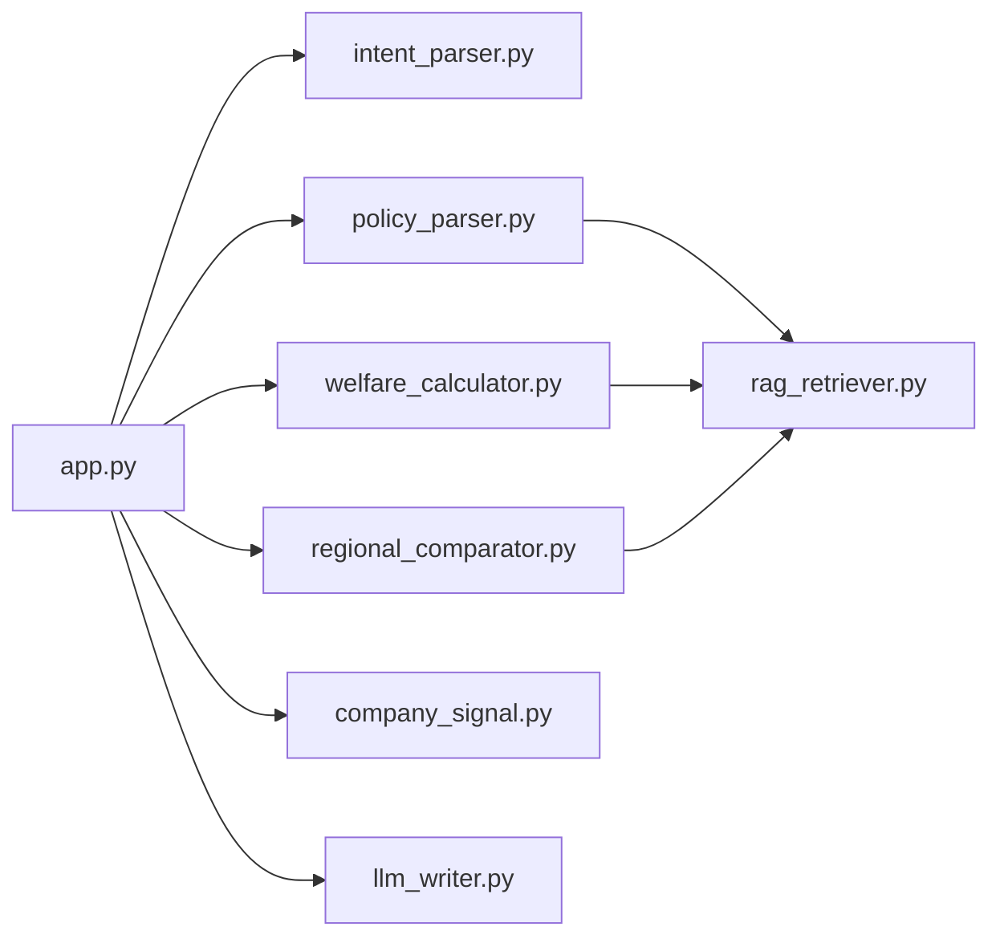

# 核心工作流

<cite>
**本文引用的文件**
- [app.py](file://app.py)
- [workflows/intent_parser.py](file://workflows/intent_parser.py)
- [workflows/policy_parser.py](file://workflows/policy_parser.py)
- [workflows/welfare_calculator.py](file://workflows/welfare_calculator.py)
- [workflows/regional_comparator.py](file://workflows/regional_comparator.py)
- [workflows/company_signal.py](file://workflows/company_signal.py)
- [workflows/llm_writer.py](file://workflows/llm_writer.py)
- [workflows/rag_retriever.py](file://workflows/rag_retriever.py)
- [data/policies/policy_descriptions.md](file://data/policies/policy_descriptions.md)
- [test_query.py](file://test_query.py)
- [test_service.py](file://test_service.py)
- [requirements.txt](file://requirements.txt)
</cite>

## 目录
1. [简介](#简介)
2. [项目结构](#项目结构)
3. [核心组件](#核心组件)
4. [架构总览](#架构总览)
5. [详细组件分析](#详细组件分析)
6. [依赖关系分析](#依赖关系分析)
7. [性能考量](#性能考量)
8. [故障排查指南](#故障排查指南)
9. [结论](#结论)
10. [附录](#附录)

## 简介
本文件聚焦系统“五大工作流模块”的核心业务逻辑，包括：
- 意图解析（intent_parser）
- 政策解析（policy_parser）
- 福利计算（welfare_calculator）
- 区域对比（regional_comparator）
- 企业投资信号灯（company_signal）
- LLM润色（llm_writer）

并解释它们在统一入口服务中的协作流程，以及与RAG检索模块的集成方式。文档提供面向技术与非技术读者的渐进式说明，并辅以可视化图示帮助理解。

## 项目结构
系统采用“入口服务 + 多工作流模块 + RAG检索”的分层设计：
- 入口服务：FastAPI 应用，负责接收请求、路由到具体工作流、调用LLM润色生成最终回答。
- 工作流模块：各自独立封装业务逻辑，统一通过RAG检索模块获取政策知识。
- RAG检索模块：加载主政策库与补充政策，执行实体过滤、向量嵌入、相似度打分与Top-K召回。
- 数据与配置：政策描述文档、测试脚本、依赖清单。

图表来源
- [app.py](file://app.py#L1-L155)
- [workflows/intent_parser.py](file://workflows/intent_parser.py#L1-L175)
- [workflows/policy_parser.py](file://workflows/policy_parser.py#L1-L83)
- [workflows/welfare_calculator.py](file://workflows/welfare_calculator.py#L1-L123)
- [workflows/regional_comparator.py](file://workflows/regional_comparator.py#L1-L91)
- [workflows/company_signal.py](file://workflows/company_signal.py#L1-L150)
- [workflows/llm_writer.py](file://workflows/llm_writer.py#L1-L145)
- [workflows/rag_retriever.py](file://workflows/rag_retriever.py#L1-L327)
- [data/policies/policy_descriptions.md](file://data/policies/policy_descriptions.md#L1-L23)

章节来源
- [app.py](file://app.py#L1-L155)
- [workflows/rag_retriever.py](file://workflows/rag_retriever.py#L1-L327)
- [data/policies/policy_descriptions.md](file://data/policies/policy_descriptions.md#L1-L23)

## 核心组件
- 统一查询接口：接收用户查询，进行意图识别、工作流路由、LLM润色与统一响应。
- 意图解析：基于LLM抽取意图与实体，支持降级规则识别。
- 政策解析：通过RAG检索政策要点并结构化输出。
- 福利计算：结合用户输入与政策规则计算可领金额。
- 区域对比：对多个地区政策进行检索与对比汇总。
- 企业信号灯：基于企业画像评分与地域过滤给出投资建议。
- LLM润色：将结构化结果转为自然语言回答。
- RAG检索：加载主政策库与补充政策，执行实体过滤、向量嵌入、相似度打分与Top-K召回。

章节来源
- [app.py](file://app.py#L1-L155)
- [workflows/intent_parser.py](file://workflows/intent_parser.py#L1-L175)
- [workflows/policy_parser.py](file://workflows/policy_parser.py#L1-L83)
- [workflows/welfare_calculator.py](file://workflows/welfare_calculator.py#L1-L123)
- [workflows/regional_comparator.py](file://workflows/regional_comparator.py#L1-L91)
- [workflows/company_signal.py](file://workflows/company_signal.py#L1-L150)
- [workflows/llm_writer.py](file://workflows/llm_writer.py#L1-L145)
- [workflows/rag_retriever.py](file://workflows/rag_retriever.py#L1-L327)

## 架构总览
统一入口服务的调用序列如下：
1) 意图解析（LLM）：识别意图与实体。
2) 工作流路由：根据意图选择对应工作流。
3) LLM润色：将工作流结果转为自然语言回答。

图表来源
- [app.py](file://app.py#L37-L128)
- [workflows/intent_parser.py](file://workflows/intent_parser.py#L16-L125)
- [workflows/llm_writer.py](file://workflows/llm_writer.py#L15-L145)

## 详细组件分析

### 意图解析（intent_parser）
- 职责：识别用户查询的意图（policy_parse、personal_welfare、regional_compare、investment_signal），并抽取实体（地点、产品、公司、行业、时间、购买价格、能效等级）。
- 输入：原始查询字符串。
- 输出：扁平化JSON，包含intent与实体字段。
- 实现要点：
  - 使用LLM进行意图识别与实体抽取，要求返回严格的JSON格式。
  - 若LLM调用失败，启用降级规则识别（正则匹配关键词与实体模式）。
  - 行业识别覆盖家电、数码、汽车、零售餐饮四类。
  - 价格提取支持“元”、“万”等单位。
- 错误处理：异常时返回默认结构并降级。

图表来源
- [workflows/intent_parser.py](file://workflows/intent_parser.py#L16-L125)
- [workflows/intent_parser.py](file://workflows/intent_parser.py#L127-L175)

章节来源
- [workflows/intent_parser.py](file://workflows/intent_parser.py#L1-L175)

### 政策解析（policy_parser）
- 职责：基于意图解析得到的实体，通过RAG检索政策要点并结构化输出。
- 输入：原始查询与实体字典。
- 输出：扁平化JSON，包含政策标题、福利类型、金额、适用地区、有效期、申请条件、办理流程、所需材料、申领平台、引用来源等。
- 实现要点：
  - 调用RAG检索模块，传入实体与top_k=5。
  - 若无命中，返回空结果并标注错误。
  - 取第一条作为主要结果，拼接地区与有效期信息。
  - 保留所有命中结果供后续参考。
- 错误处理：未命中时返回空字段与错误信息。

图表来源
- [workflows/policy_parser.py](file://workflows/policy_parser.py#L6-L83)
- [workflows/rag_retriever.py](file://workflows/rag_retriever.py#L215-L327)

章节来源
- [workflows/policy_parser.py](file://workflows/policy_parser.py#L1-L83)
- [workflows/rag_retriever.py](file://workflows/rag_retriever.py#L1-L327)

### 福利计算（welfare_calculator）
- 职责：根据用户输入（如购买价格、产品类型）与政策规则计算可领补贴金额。
- 输入：原始查询与实体字典（含价格paid）。
- 输出：扁平化JSON，包含可领金额、明细、总福利、约束条件、所需材料、申领平台、引用来源等。
- 实现要点：
  - 调用RAG检索政策，若无命中返回空结果。
  - 缺少价格信息时返回提示与错误。
  - 根据行业类别应用不同计算规则（示例规则：家电、数码、汽车等）。
  - 支持上限控制与明细拼接。
- 错误处理：未命中或缺少价格时返回相应错误信息。

图表来源
- [workflows/welfare_calculator.py](file://workflows/welfare_calculator.py#L7-L123)
- [workflows/rag_retriever.py](file://workflows/rag_retriever.py#L215-L327)

章节来源
- [workflows/welfare_calculator.py](file://workflows/welfare_calculator.py#L1-L123)
- [workflows/rag_retriever.py](file://workflows/rag_retriever.py#L1-L327)

### 区域对比（regional_comparator）
- 职责：对比不同地区的政策差异并生成总结。
- 输入：原始查询与实体字典（包含一个或多个地区，支持“|”分隔）。
- 输出：扁平化JSON，包含对比地区列表、对比表格、总结、引用来源。
- 实现要点：
  - 解析多个地区，逐个调用RAG检索并记录命中结果。
  - 生成对比总结（如各地区补贴金额与申领平台）。
  - 汇总引用来源。
- 错误处理：未指定地区时返回提示与错误。

图表来源
- [workflows/regional_comparator.py](file://workflows/regional_comparator.py#L6-L91)
- [workflows/rag_retriever.py](file://workflows/rag_retriever.py#L215-L327)

章节来源
- [workflows/regional_comparator.py](file://workflows/regional_comparator.py#L1-L91)
- [workflows/rag_retriever.py](file://workflows/rag_retriever.py#L1-L327)

### 企业投资信号灯（company_signal）
- 职责：基于企业画像评分与地域过滤，给出投资信号灯（红/黄/绿）与推荐企业列表。
- 输入：原始查询与实体字典（行业、地点）。
- 输出：扁平化JSON，包含推荐企业列表、行业总结、投资信号灯、引用来源。
- 实现要点：
  - 加载企业库（按行业划分的JSONL文件）。
  - 过滤地域（若提供），否则使用全量企业。
  - 计算评分并排序，取Top 10。
  - 生成行业总结与投资信号灯。
- 错误处理：缺少行业信息时返回黄灯与错误提示。

图表来源
- [workflows/company_signal.py](file://workflows/company_signal.py#L62-L150)

章节来源
- [workflows/company_signal.py](file://workflows/company_signal.py#L1-L150)

### LLM润色（llm_writer）
- 职责：将工作流产生的结构化结果转为自然语言回答，必要时添加引用来源。
- 输入：意图、原始查询、实体、工作流结果、引用来源。
- 输出：最终回答文本。
- 实现要点：
  - 根据意图选择不同模板，拼接关键信息（如补贴金额、条件、平台等）。
  - 调用LLM生成回答，若失败则降级为直接返回结构化上下文。
  - 在末尾附加引用来源（若有）。
- 错误处理：LLM调用失败时降级返回结构化文本。

图表来源
- [workflows/llm_writer.py](file://workflows/llm_writer.py#L15-L145)

章节来源
- [workflows/llm_writer.py](file://workflows/llm_writer.py#L1-L145)

## 依赖关系分析
- 组件耦合：
  - app.py 作为统一入口，依赖所有工作流模块与LLM润色模块。
  - policy_parser、welfare_calculator、regional_comparator 依赖 RAG 检索模块。
  - company_signal 内部依赖企业数据文件，不依赖外部LLM。
  - llm_writer 依赖外部LLM服务，但对app.py透明。
- 外部依赖：
  - LLM服务（DashScope）：通过环境变量配置API Base、Key、模型。
  - HTTP客户端：异步HTTPX用于LLM与向量服务调用。
- 潜在循环依赖：未发现循环导入；模块间为单向调用。

图表来源
- [app.py](file://app.py#L1-L155)
- [workflows/policy_parser.py](file://workflows/policy_parser.py#L1-L83)
- [workflows/welfare_calculator.py](file://workflows/welfare_calculator.py#L1-L123)
- [workflows/regional_comparator.py](file://workflows/regional_comparator.py#L1-L91)
- [workflows/rag_retriever.py](file://workflows/rag_retriever.py#L1-L327)

章节来源
- [app.py](file://app.py#L1-L155)
- [requirements.txt](file://requirements.txt#L1-L7)

## 性能考量
- RAG检索性能：
  - 向量嵌入与相似度计算为O(N)（N为候选数量），Top-K选择降低后续处理成本。
  - 批量向量化与异步HTTP调用有助于提升吞吐。
- LLM调用：
  - 意图解析与润色均采用异步HTTP调用，建议设置合理超时与重试策略。
  - 降级机制（意图解析与润色）可保障服务可用性。
- 数据规模：
  - 主政策库为JSONL格式，加载与过滤在内存中完成；建议在数据量增大时考虑分页或索引优化。
- 并发与资源：
  - FastAPI + Uvicorn适合高并发场景；注意LLM服务的并发限制与配额。

## 故障排查指南
- 常见问题与定位：
  - LLM调用失败：检查环境变量（API Base、Key、模型）、网络连通性与服务端状态。
  - RAG检索无命中：确认实体过滤条件（地点、产品、行业）是否合理；检查主政策库是否存在。
  - 意图解析降级：当LLM不可用时自动启用规则识别，观察关键词与实体提取是否符合预期。
  - 福利计算缺少价格：确保用户输入包含明确价格信息。
  - 企业信号灯无数据：确认企业数据文件是否存在且格式正确。
- 调试方法：
  - 使用测试脚本验证端点与返回结构。
  - 查看统一错误响应中的错误详情与堆栈信息。
  - 分别调用各工作流模块，逐步定位问题环节。

章节来源
- [app.py](file://app.py#L112-L128)
- [workflows/intent_parser.py](file://workflows/intent_parser.py#L121-L125)
- [workflows/llm_writer.py](file://workflows/llm_writer.py#L138-L145)
- [test_query.py](file://test_query.py#L1-L80)
- [test_service.py](file://test_service.py#L1-L75)

## 结论
该系统通过“意图识别 + 多工作流 + LLM润色”的分层设计，实现了政策问答与商业分析的统一入口。RAG检索模块为各工作流提供一致的知识支撑，企业信号灯模块引入了非LLM的结构化评分能力。整体架构清晰、模块职责明确，具备良好的扩展性与稳定性。

## 附录
- 使用示例与测试：
  - 使用测试脚本快速验证各意图与工作流。
  - 参考政策说明文档了解数据结构与字段含义。
- 开发与部署：
  - 确保安装依赖并正确配置环境变量。
  - 启动服务后访问统一查询接口与健康检查端点。

章节来源
- [test_query.py](file://test_query.py#L1-L80)
- [test_service.py](file://test_service.py#L1-L75)
- [data/policies/policy_descriptions.md](file://data/policies/policy_descriptions.md#L1-L23)
- [requirements.txt](file://requirements.txt#L1-L7)