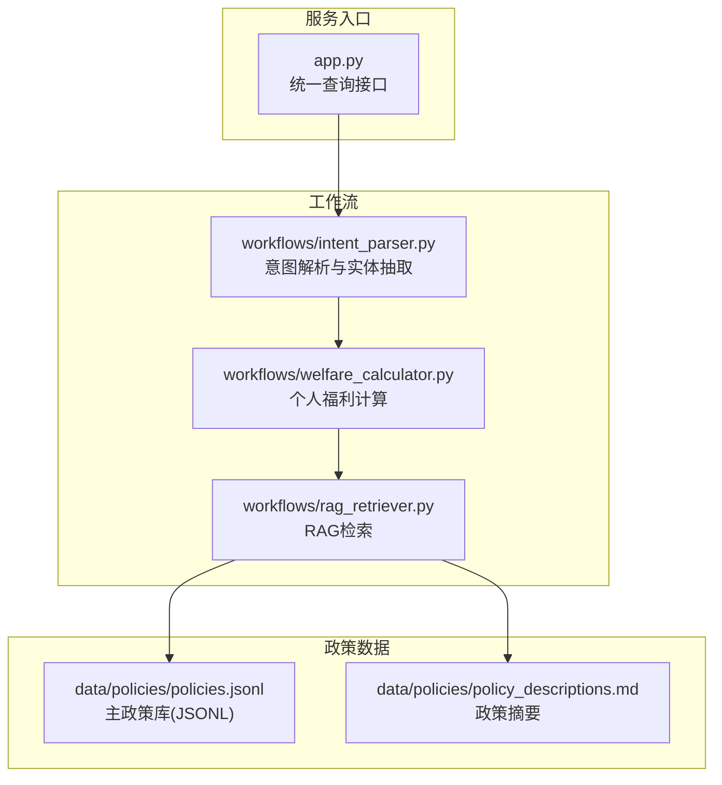
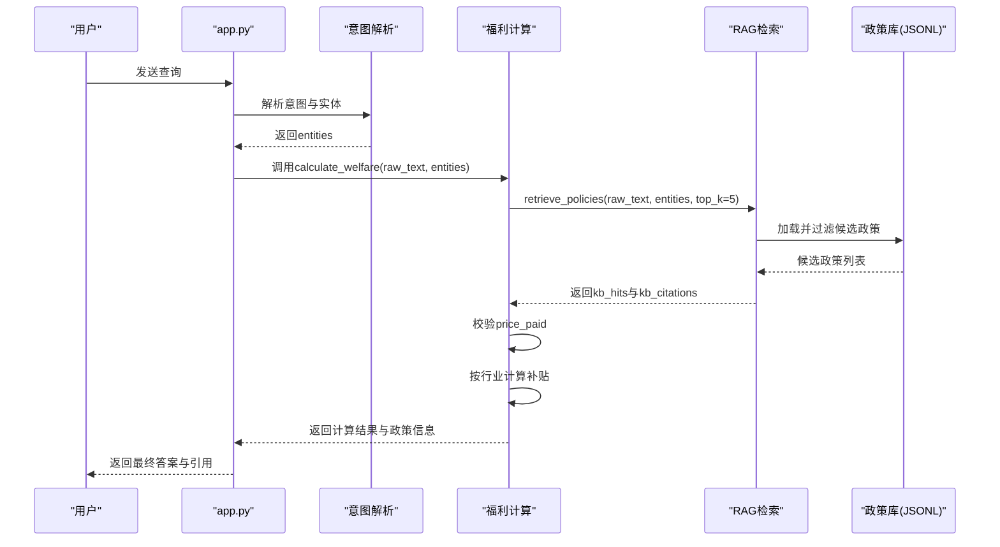
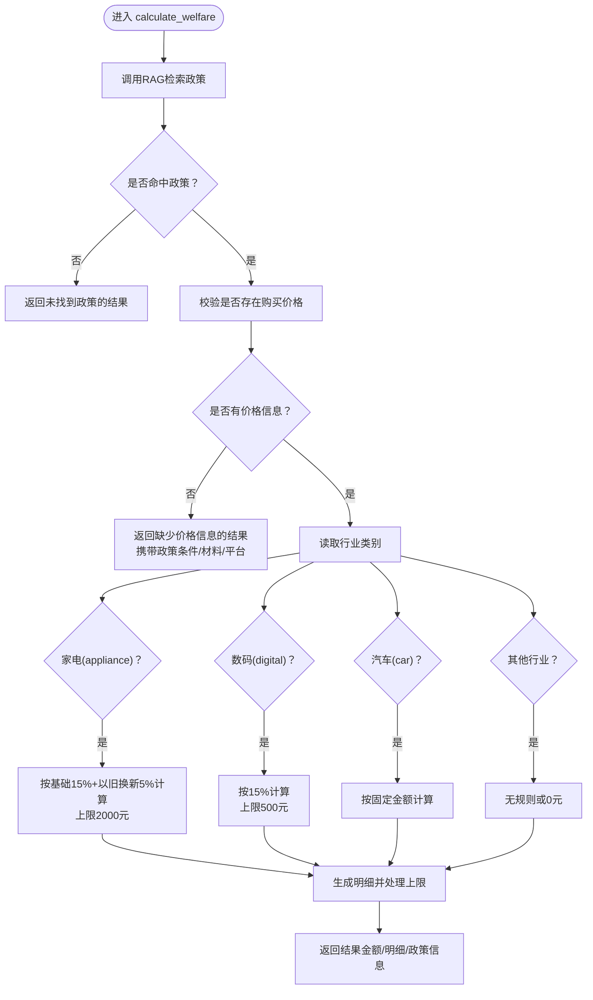
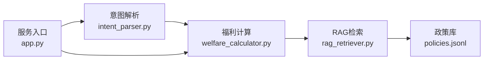

# 福利计算工作流

<cite>
**本文引用的文件**
- [workflows/welfare_calculator.py](file://workflows/welfare_calculator.py)
- [workflows/rag_retriever.py](file://workflows/rag_retriever.py)
- [workflows/intent_parser.py](file://workflows/intent_parser.py)
- [app.py](file://app.py)
- [data/policies/policies.jsonl](file://data/policies/policies.jsonl)
- [data/policies/policy_descriptions.md](file://data/policies/policy_descriptions.md)
</cite>

## 目录
1. [简介](#简介)
2. [项目结构](#项目结构)
3. [核心组件](#核心组件)
4. [架构总览](#架构总览)
5. [详细组件分析](#详细组件分析)
6. [依赖分析](#依赖分析)
7. [性能考虑](#性能考虑)
8. [故障排查指南](#故障排查指南)
9. [结论](#结论)
10. [附录](#附录)

## 简介
本文件面向“福利计算工作流”，聚焦于处理“personal_welfare”意图的模块，即根据用户提供的购买信息（如购买价格、行业类别等）计算可获得的补贴金额。该模块的核心流程包括：
- 通过RAG检索匹配的政策；
- 验证用户输入中是否包含必要的购买价格信息；
- 基于行业类别执行差异化补贴计算（家电、数码、汽车等）；
- 生成补贴明细字符串；
- 返回政策中的申请条件、所需材料、申领平台等信息。

同时，本文也讨论当前模块采用的简化实现方式，并提出未来从政策文本中动态提取计算规则的扩展方向。

## 项目结构
本模块位于工作流子目录中，与意图解析、RAG检索、主服务入口共同构成完整的智能体服务链路。

图表来源
- [app.py](file://app.py#L37-L110)
- [workflows/intent_parser.py](file://workflows/intent_parser.py#L16-L120)
- [workflows/welfare_calculator.py](file://workflows/welfare_calculator.py#L7-L123)
- [workflows/rag_retriever.py](file://workflows/rag_retriever.py#L215-L327)
- [data/policies/policies.jsonl](file://data/policies/policies.jsonl#L1-L9)
- [data/policies/policy_descriptions.md](file://data/policies/policy_descriptions.md#L1-L23)

章节来源
- [app.py](file://app.py#L37-L110)
- [workflows/intent_parser.py](file://workflows/intent_parser.py#L16-L120)
- [workflows/welfare_calculator.py](file://workflows/welfare_calculator.py#L7-L123)
- [workflows/rag_retriever.py](file://workflows/rag_retriever.py#L215-L327)
- [data/policies/policies.jsonl](file://data/policies/policies.jsonl#L1-L9)
- [data/policies/policy_descriptions.md](file://data/policies/policy_descriptions.md#L1-L23)

## 核心组件
- 意图解析与实体抽取：从用户查询中识别意图（personal_welfare）并抽取实体，包括行业、购买价格等。
- RAG检索：根据用户查询与实体过滤候选政策，返回匹配的政策列表与引用信息。
- 福利计算：基于RAG命中政策与用户输入，计算补贴金额并生成明细，同时返回政策的约束条件、所需材料、申领平台等信息。

章节来源
- [workflows/intent_parser.py](file://workflows/intent_parser.py#L16-L120)
- [workflows/rag_retriever.py](file://workflows/rag_retriever.py#L215-L327)
- [workflows/welfare_calculator.py](file://workflows/welfare_calculator.py#L7-L123)

## 架构总览
下图展示了从用户查询到最终结果返回的端到端流程。

图表来源
- [app.py](file://app.py#L37-L110)
- [workflows/intent_parser.py](file://workflows/intent_parser.py#L16-L120)
- [workflows/welfare_calculator.py](file://workflows/welfare_calculator.py#L7-L123)
- [workflows/rag_retriever.py](file://workflows/rag_retriever.py#L215-L327)
- [data/policies/policies.jsonl](file://data/policies/policies.jsonl#L1-L9)

## 详细组件分析

### calculate_welfare 函数执行流程
- 输入参数：原始文本与实体字典（包含位置、产品、行业、时间、购买价格、能效等级等）。
- 输出格式：包含可领金额、补贴明细、总福利、约束条件、所需材料、申领平台、知识库引用等键值的字典。
- 主要步骤：
  1) 调用RAG检索匹配政策，获取命中列表与引用信息。
  2) 若未命中政策，返回空金额与错误提示。
  3) 校验是否存在购买价格信息；若缺失，返回提示并携带政策中的条件、材料、平台等信息。
  4) 依据第一条命中政策与用户输入的行业类别，执行差异化补贴计算。
  5) 生成补贴明细字符串，返回完整结果。

图表来源
- [workflows/welfare_calculator.py](file://workflows/welfare_calculator.py#L7-L123)

章节来源
- [workflows/welfare_calculator.py](file://workflows/welfare_calculator.py#L7-L123)

### 补贴计算逻辑与上限处理
- 家电（appliance）
  - 计算方式：基础15% + 以旧换新5%，合计30%（简化表述）。
  - 上限：2000元（来自政策摘要与主政策库中的“price_cap”字段）。
- 数码（digital）
  - 计算方式：15%。
  - 上限：500元（来自政策摘要与主政策库中的“price_cap”字段）。
- 汽车（car）
  - 当前实现：固定金额示例（例如5000元）。
  - 实际政策：汽车类别的补贴规则更为复杂，包含分档金额（如新能源/燃油不同区间）、首保消费补贴、不同轮次的补贴金额等。当前模块采用简化规则，未来可改为从政策JSONL中读取“brackets”等字段动态计算。

章节来源
- [data/policies/policy_descriptions.md](file://data/policies/policy_descriptions.md#L12-L23)
- [data/policies/policies.jsonl](file://data/policies/policies.jsonl#L1-L9)
- [workflows/welfare_calculator.py](file://workflows/welfare_calculator.py#L65-L110)

### 补贴明细字符串生成
- 明细由多个片段组成，例如“基础补贴15%: xx元”、“以旧换新5%: xx元”、“（已达上限xxx元）”等。
- 最终通过分号连接形成可读的明细字符串，便于前端展示或LLM润色。

章节来源
- [workflows/welfare_calculator.py](file://workflows/welfare_calculator.py#L69-L111)

### 政策信息返回
- 约束条件：来自政策JSONL中的“qualification_rules”“subsidy_standard”等字段，经RAG模块整理为“conditions”。
- 所需材料：来自“required_documents”，经映射为中文材料清单。
- 申领平台：来自“claiming_platform”。

章节来源
- [workflows/rag_retriever.py](file://workflows/rag_retriever.py#L258-L304)
- [data/policies/policies.jsonl](file://data/policies/policies.jsonl#L1-L9)

### 从政策文本中动态提取计算规则的扩展方向
- 当前模块在计算部分采用硬编码的简化规则，仅用于演示。
- 未来可从政策JSONL中读取“subsidy_standard”“brackets”等字段，动态解析并执行计算，从而实现：
  - 家电：基础率、额外率、能效门槛、数量限制、价格确定方式等；
  - 数码：基础率、上限、价格确定方式等；
  - 汽车：分档金额、轮次、首保金额、不同产品类型等。
- 同时，可将“energy_efficiency_requirement”“quantity_limit”等字段纳入计算前置校验，提升准确性与合规性。

章节来源
- [data/policies/policies.jsonl](file://data/policies/policies.jsonl#L1-L9)
- [workflows/rag_retriever.py](file://workflows/rag_retriever.py#L86-L112)

## 依赖分析
- calculate_welfare 依赖 RAG 检索模块 retrieve_policies，后者负责加载主政策库、实体过滤、向量化召回、排序与Top-K返回。
- calculate_welfare 依赖 intent_parser 的实体字典，其中包含行业与购买价格等关键信息。
- app.py 将意图解析与工作流串联，统一对外提供查询接口。

图表来源
- [app.py](file://app.py#L37-L110)
- [workflows/intent_parser.py](file://workflows/intent_parser.py#L16-L120)
- [workflows/welfare_calculator.py](file://workflows/welfare_calculator.py#L7-L123)
- [workflows/rag_retriever.py](file://workflows/rag_retriever.py#L215-L327)
- [data/policies/policies.jsonl](file://data/policies/policies.jsonl#L1-L9)

章节来源
- [app.py](file://app.py#L37-L110)
- [workflows/intent_parser.py](file://workflows/intent_parser.py#L16-L120)
- [workflows/welfare_calculator.py](file://workflows/welfare_calculator.py#L7-L123)
- [workflows/rag_retriever.py](file://workflows/rag_retriever.py#L215-L327)
- [data/policies/policies.jsonl](file://data/policies/policies.jsonl#L1-L9)

## 性能考虑
- RAG检索阶段的向量化与相似度计算可能成为性能瓶颈，建议：
  - 对查询文本与候选政策文本进行批量嵌入，减少网络往返次数；
  - 在实体过滤阶段缩小候选集规模，降低后续向量计算成本；
  - 对Top-K进行合理裁剪，避免不必要的排序开销。
- 计算阶段的补贴逻辑目前为常数时间，但未来若引入分档计算，需注意分支与循环的复杂度控制。

## 故障排查指南
- 未命中政策
  - 现象：返回“未找到匹配政策”，金额与明细为空。
  - 排查：确认用户查询是否包含足够的上下文关键词；检查实体过滤是否过于严格（如地区、产品、行业）。
- 缺少购买价格
  - 现象：返回“缺少购买价格信息，无法计算”，并携带政策条件、材料、平台。
  - 排查：确认意图解析是否正确抽取了价格；若未抽取，可在用户查询中明确包含“花了X元”等语义。
- 行业不匹配
  - 现象：返回“暂无补贴规则”或0元。
  - 排查：确认行业标签是否正确；当前模块仅支持appliance、digital、car三类，其他行业默认为0。
- 上限触发
  - 现象：明细中出现“已达上限”提示。
  - 排查：确认政策摘要与主政策库中的“price_cap”字段是否正确；当前模块在家电场景中对上限进行了硬编码处理。

章节来源
- [workflows/welfare_calculator.py](file://workflows/welfare_calculator.py#L36-L60)
- [workflows/welfare_calculator.py](file://workflows/welfare_calculator.py#L69-L111)
- [workflows/rag_retriever.py](file://workflows/rag_retriever.py#L258-L304)

## 结论
本模块围绕“personal_welfare”意图，实现了从用户查询到补贴金额计算与政策信息返回的闭环。当前采用简化规则以快速演示，未来可通过从政策JSONL中动态提取计算规则，实现更贴近真实政策的精准计算，并进一步完善能效门槛、数量限制、价格确定方式等细节，提升整体准确性与可维护性。

## 附录
- 关键字段说明
  - 行业类别：appliance（家电）、digital（数码）、car（汽车）、retail_catering（零售餐饮）。
  - 购买价格：price_paid（单位：元）。
  - 政策摘要：来自policy_descriptions.md，包含各品类补贴率、上限、平台等概览信息。
  - 主政策库：来自policies.jsonl，包含每个活动的详细规则、适用产品、申请条件、所需材料、申领平台等。

章节来源
- [data/policies/policy_descriptions.md](file://data/policies/policy_descriptions.md#L12-L23)
- [data/policies/policies.jsonl](file://data/policies/policies.jsonl#L1-L9)