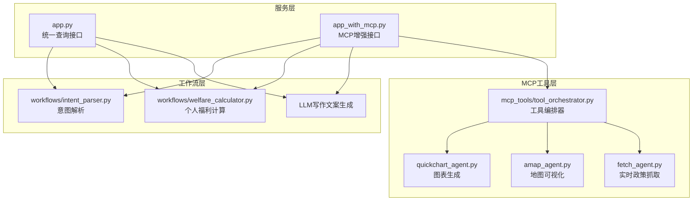
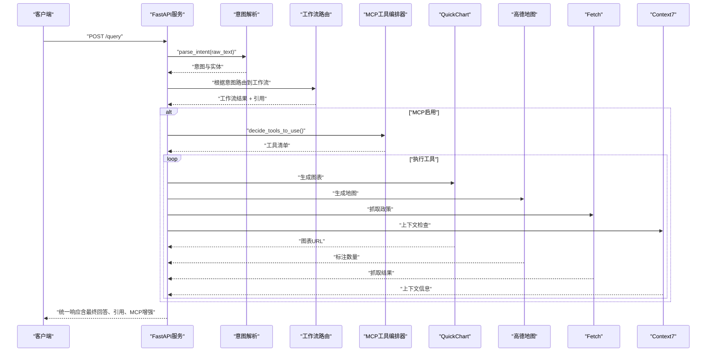
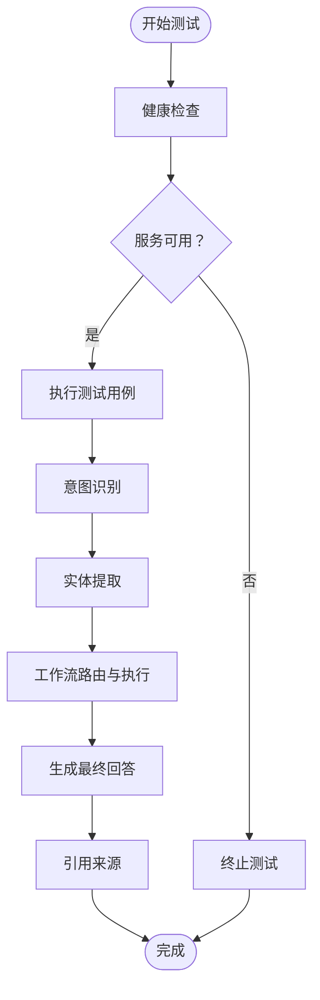
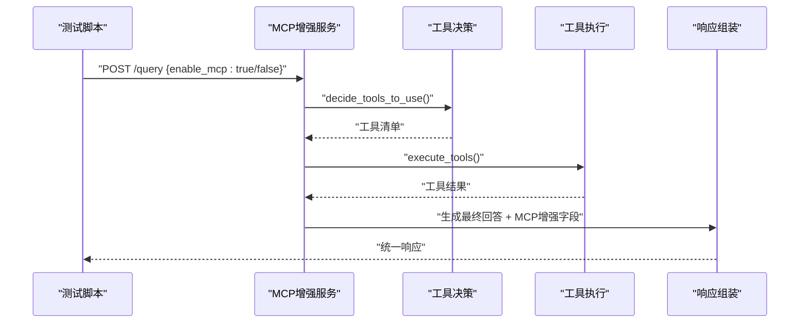
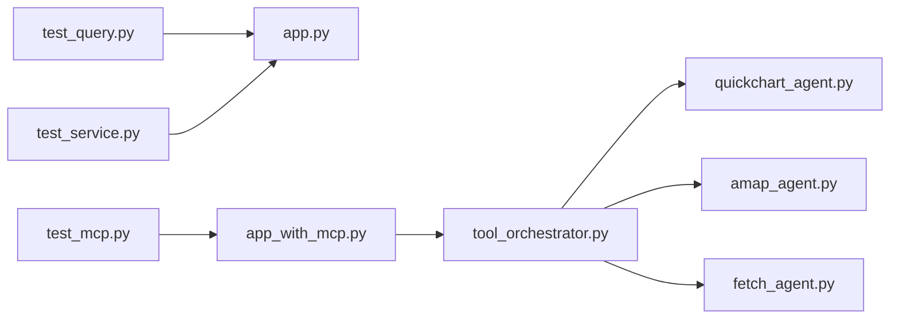

# 测试策略

<cite>
**本文引用的文件**
- [test_query.py](file://test_query.py)
- [test_service.py](file://test_service.py)
- [test_mcp.py](file://test_mcp.py)
- [app.py](file://app.py)
- [app_with_mcp.py](file://app_with_mcp.py)
- [workflows/intent_parser.py](file://workflows/intent_parser.py)
- [workflows/welfare_calculator.py](file://workflows/welfare_calculator.py)
- [mcp_tools/tool_orchestrator.py](file://mcp_tools/tool_orchestrator.py)
- [mcp_tools/quickchart_agent.py](file://mcp_tools/quickchart_agent.py)
- [mcp_tools/amap_agent.py](file://mcp_tools/amap_agent.py)
- [mcp_tools/fetch_agent.py](file://mcp_tools/fetch_agent.py)
- [requirements.txt](file://requirements.txt)
</cite>

## 目录
1. [引言](#引言)
2. [项目结构](#项目结构)
3. [核心组件](#核心组件)
4. [架构总览](#架构总览)
5. [详细组件分析](#详细组件分析)
6. [依赖关系分析](#依赖关系分析)
7. [性能考量](#性能考量)
8. [故障排查指南](#故障排查指南)
9. [结论](#结论)
10. [附录](#附录)

## 引言
本测试策略文档旨在系统化地梳理与完善本项目的测试体系，确保系统在持续迭代过程中的稳定性与可靠性。文档聚焦三类测试：
- 主API端点测试：验证统一查询接口在不同用户输入下的意图解析、工作流路由与最终回答一致性。
- 内部服务/工作流单元测试：验证核心业务逻辑（如意图解析、个人福利计算等）的正确性与鲁棒性。
- MCP工具集成测试：验证外部工具（图表、地图、实时政策、上下文对话）的连通性与功能完整性。

同时，文档提供测试环境搭建、执行方式与结果解读方法，并强调测试在持续集成与代码质量保障中的关键作用。

## 项目结构
项目采用“服务层 + 工作流层 + MCP工具层”的分层架构：
- 服务层：FastAPI应用，提供统一查询与健康检查接口；MCP增强版应用提供上下文管理、工具编排与对话历史保存。
- 工作流层：包含意图解析、政策解析、个人福利计算、区域对比、企业信号灯、LLM润色等模块。
- MCP工具层：QuickChart图表、高德地图、Fetch实时政策、Context7上下文管理等工具代理。

图表来源
- [app.py](file://app.py#L1-L155)
- [app_with_mcp.py](file://app_with_mcp.py#L1-L222)
- [workflows/intent_parser.py](file://workflows/intent_parser.py#L1-L175)
- [workflows/welfare_calculator.py](file://workflows/welfare_calculator.py#L1-L123)
- [mcp_tools/tool_orchestrator.py](file://mcp_tools/tool_orchestrator.py#L1-L200)
- [mcp_tools/quickchart_agent.py](file://mcp_tools/quickchart_agent.py#L1-L128)
- [mcp_tools/amap_agent.py](file://mcp_tools/amap_agent.py#L1-L92)
- [mcp_tools/fetch_agent.py](file://mcp_tools/fetch_agent.py#L1-L78)

章节来源
- [app.py](file://app.py#L1-L155)
- [app_with_mcp.py](file://app_with_mcp.py#L1-L222)
- [workflows/intent_parser.py](file://workflows/intent_parser.py#L1-L175)
- [workflows/welfare_calculator.py](file://workflows/welfare_calculator.py#L1-L123)
- [mcp_tools/tool_orchestrator.py](file://mcp_tools/tool_orchestrator.py#L1-L200)
- [mcp_tools/quickchart_agent.py](file://mcp_tools/quickchart_agent.py#L1-L128)
- [mcp_tools/amap_agent.py](file://mcp_tools/amap_agent.py#L1-L92)
- [mcp_tools/fetch_agent.py](file://mcp_tools/fetch_agent.py#L1-L78)

## 核心组件
- 统一查询接口（app.py）：负责接收查询请求、进行意图解析、路由到相应工作流、生成最终回答并返回统一响应模型。
- MCP增强接口（app_with_mcp.py）：在统一接口基础上增加上下文检查、工具决策与执行、对话历史保存等能力。
- 工作流模块：
  - 意图解析：基于大模型与规则的双通道识别，输出意图与实体。
  - 个人福利计算：结合RAG检索与规则计算，输出补贴金额与明细。
- MCP工具模块：
  - 工具编排器：根据意图与工作流结果决策所需工具集合，并串行执行。
  - QuickChart：生成对比图、企业评分图、流程图等。
  - 高德地图：生成产业分布地图标注。
  - Fetch：模拟抓取政策信息。
  - Context7：上下文相关性检查与对话融合。

章节来源
- [app.py](file://app.py#L1-L155)
- [app_with_mcp.py](file://app_with_mcp.py#L1-L222)
- [workflows/intent_parser.py](file://workflows/intent_parser.py#L1-L175)
- [workflows/welfare_calculator.py](file://workflows/welfare_calculator.py#L1-L123)
- [mcp_tools/tool_orchestrator.py](file://mcp_tools/tool_orchestrator.py#L1-L200)
- [mcp_tools/quickchart_agent.py](file://mcp_tools/quickchart_agent.py#L1-L128)
- [mcp_tools/amap_agent.py](file://mcp_tools/amap_agent.py#L1-L92)
- [mcp_tools/fetch_agent.py](file://mcp_tools/fetch_agent.py#L1-L78)

## 架构总览
下图展示了从客户端到服务、再到工作流与MCP工具的整体调用链路与数据流向。

图表来源
- [app.py](file://app.py#L37-L128)
- [app_with_mcp.py](file://app_with_mcp.py#L47-L188)
- [workflows/intent_parser.py](file://workflows/intent_parser.py#L16-L125)
- [mcp_tools/tool_orchestrator.py](file://mcp_tools/tool_orchestrator.py#L29-L155)
- [mcp_tools/quickchart_agent.py](file://mcp_tools/quickchart_agent.py#L8-L55)
- [mcp_tools/amap_agent.py](file://mcp_tools/amap_agent.py#L8-L74)
- [mcp_tools/fetch_agent.py](file://mcp_tools/fetch_agent.py#L9-L59)

## 详细组件分析

### 主API端点测试（test_query.py）
目标：验证统一查询接口在典型用户场景下的意图识别、实体提取、工作流结果与最终回答的一致性。
- 测试要点
  - 健康检查：确认服务可用性。
  - 多场景查询：政策解析、个人福利计算、区域对比、企业信号灯等。
  - 输出校验：意图、实体、工作流结果、最终回答、引用来源等字段完整性。
- 执行方式
  - 启动服务后直接运行脚本，或通过命令行传参进行单次查询测试。
- 结果解读
  - 成功：返回HTTP 200，输出包含意图、实体、结果与最终回答。
  - 失败：返回错误状态码或异常信息，需检查服务日志与网络连通性。

图表来源
- [test_query.py](file://test_query.py#L1-L80)
- [app.py](file://app.py#L130-L151)

章节来源
- [test_query.py](file://test_query.py#L1-L80)
- [app.py](file://app.py#L1-L155)

### 服务测试套件（test_service.py）
目标：提供更完整的服务端测试流程，覆盖健康检查与多类查询场景。
- 测试要点
  - 健康检查：验证服务存活。
  - 查询测试：依次覆盖政策解析、个人福利计算、区域对比、企业信号灯等。
  - 结果打印：便于人工核对意图、实体、结果与最终回答。
- 执行方式
  - 在服务已启动的前提下运行脚本，自动串联各项测试。
- 结果解读
  - 若健康检查失败，提示服务未启动，需先运行服务再重试。

章节来源
- [test_service.py](file://test_service.py#L1-L75)
- [app.py](file://app.py#L130-L151)

### MCP工具集成测试（test_mcp.py）
目标：验证MCP增强版接口在启用/禁用工具模式下的行为，重点检验工具决策、执行与结果融合。
- 测试要点
  - 工具启用/禁用：对比开启MCP与关闭MCP的结果差异。
  - 工具增强：QuickChart图表、高德地图标注、Fetch抓取、Context7上下文。
  - 对话历史：验证对话ID生成与关联问题的上下文融合。
- 执行方式
  - 启动MCP增强版服务后运行脚本，按顺序执行多轮测试。
- 结果解读
  - 成功：显示意图、最终回答与MCP增强字段；若存在图表/地图/抓取/上下文，分别展示对应统计信息。

图表来源
- [test_mcp.py](file://test_mcp.py#L1-L91)
- [app_with_mcp.py](file://app_with_mcp.py#L47-L188)
- [mcp_tools/tool_orchestrator.py](file://mcp_tools/tool_orchestrator.py#L29-L155)

章节来源
- [test_mcp.py](file://test_mcp.py#L1-L91)
- [app_with_mcp.py](file://app_with_mcp.py#L1-L222)
- [mcp_tools/tool_orchestrator.py](file://mcp_tools/tool_orchestrator.py#L1-L200)

### 工作流与工具实现要点（面向测试）
- 意图解析（workflows/intent_parser.py）
  - 双通道：大模型优先，失败时降级为规则识别。
  - 字段完备性：保证返回结构包含意图与全部实体字段。
  - 测试建议：构造包含价格、地区、产品、行业等实体的查询，验证实体提取准确性。
- 个人福利计算（workflows/welfare_calculator.py）
  - RAG检索：确保检索命中后再进行计算。
  - 计算规则：按行业与价格计算补贴，注意上限控制。
  - 测试建议：提供带价格与不带价格的查询，验证错误分支与正常分支。
- MCP工具编排（mcp_tools/tool_orchestrator.py）
  - 工具决策：基于意图、实体与工作流结果进行大模型驱动决策，失败时走规则降级。
  - 工具执行：串行执行QuickChart、高德地图、Fetch、Context7。
  - 测试建议：针对区域对比、企业信号灯等场景，验证图表与地图生成；针对包含“最新/更新/现在”等词的查询，验证Fetch触发。

章节来源
- [workflows/intent_parser.py](file://workflows/intent_parser.py#L1-L175)
- [workflows/welfare_calculator.py](file://workflows/welfare_calculator.py#L1-L123)
- [mcp_tools/tool_orchestrator.py](file://mcp_tools/tool_orchestrator.py#L1-L200)
- [mcp_tools/quickchart_agent.py](file://mcp_tools/quickchart_agent.py#L1-L128)
- [mcp_tools/amap_agent.py](file://mcp_tools/amap_agent.py#L1-L92)
- [mcp_tools/fetch_agent.py](file://mcp_tools/fetch_agent.py#L1-L78)

## 依赖关系分析
- 测试脚本依赖
  - test_query.py/test_service.py 依赖 FastAPI 应用提供的 /query 与 /health 接口。
  - test_mcp.py 依赖 MCP 增强版应用提供的 /query 接口与工具增强字段。
- 工具依赖
  - MCP工具依赖外部服务（QuickChart、高德地图、Fetch），测试时需关注网络连通性与超时设置。
- 运行时依赖
  - Python运行时与FastAPI生态（uvicorn、httpx、requests、pydantic等）。

图表来源
- [test_query.py](file://test_query.py#L1-L80)
- [test_service.py](file://test_service.py#L1-L75)
- [test_mcp.py](file://test_mcp.py#L1-L91)
- [app.py](file://app.py#L1-L155)
- [app_with_mcp.py](file://app_with_mcp.py#L1-L222)
- [mcp_tools/tool_orchestrator.py](file://mcp_tools/tool_orchestrator.py#L1-L200)
- [mcp_tools/quickchart_agent.py](file://mcp_tools/quickchart_agent.py#L1-L128)
- [mcp_tools/amap_agent.py](file://mcp_tools/amap_agent.py#L1-L92)
- [mcp_tools/fetch_agent.py](file://mcp_tools/fetch_agent.py#L1-L78)

章节来源
- [requirements.txt](file://requirements.txt#L1-L7)
- [app.py](file://app.py#L1-L155)
- [app_with_mcp.py](file://app_with_mcp.py#L1-L222)
- [test_query.py](file://test_query.py#L1-L80)
- [test_service.py](file://test_service.py#L1-L75)
- [test_mcp.py](file://test_mcp.py#L1-L91)

## 性能考量
- 超时与并发
  - 接口与工具调用均设置了超时，避免阻塞；建议在测试环境中适当放宽超时以便观察工具执行耗时。
- 工具执行成本
  - QuickChart与高德地图等外部服务可能受网络与限流影响，建议在CI中对工具执行进行可选开关或降级策略。
- 日志与可观测性
  - 服务端在异常时会输出堆栈信息，测试阶段应关注错误字段与最终回答中的错误提示，便于定位问题。

## 故障排查指南
- 服务未启动
  - 现象：健康检查失败或请求超时。
  - 处理：先启动对应服务（普通版或MCP增强版），再运行测试脚本。
- LLM调用失败
  - 现象：意图解析或工具决策返回降级结果。
  - 处理：检查环境变量（API基地址、API密钥、模型名）是否正确配置。
- 工具执行异常
  - 现象：QuickChart/高德地图/Fetch返回失败或报错。
  - 处理：检查网络连通性、外部服务可用性与超时设置；必要时在测试中跳过工具执行或使用降级方案。
- 响应字段缺失
  - 现象：最终回答、引用来源或MCP增强字段为空。
  - 处理：确认工作流路由是否正确、实体提取是否完整、工具决策是否命中。

章节来源
- [test_service.py](file://test_service.py#L1-L75)
- [test_mcp.py](file://test_mcp.py#L1-L91)
- [workflows/intent_parser.py](file://workflows/intent_parser.py#L121-L175)
- [mcp_tools/tool_orchestrator.py](file://mcp_tools/tool_orchestrator.py#L92-L155)

## 结论
本测试策略围绕主API端点、内部工作流与MCP工具三层展开，既覆盖了端到端的功能验证，也关注了核心逻辑与外部集成的稳定性。通过规范化的测试执行与结果解读，能够有效支撑持续集成与交付过程中的质量保障。

## 附录

### 测试环境搭建与执行
- 环境准备
  - 安装依赖：参考运行时依赖列表。
  - 配置LLM环境变量：API基地址、API密钥、模型名等。
- 启动服务
  - 普通版：运行服务脚本，监听端口8000。
  - MCP增强版：运行MCP增强服务脚本，监听端口8001。
- 执行测试
  - 主API端点测试：运行测试脚本，或传入命令行参数进行单次查询。
  - 服务测试套件：运行测试脚本，自动串联健康检查与多场景查询。
  - MCP工具测试：运行测试脚本，观察工具决策与执行结果。
- 结果解读
  - 成功：HTTP 200，输出包含意图、实体、工作流结果、最终回答与引用来源；MCP增强版还包含图表/地图/抓取/上下文等字段。
  - 失败：检查服务日志、网络连通性与LLM配置。

章节来源
- [requirements.txt](file://requirements.txt#L1-L7)
- [app.py](file://app.py#L130-L151)
- [app_with_mcp.py](file://app_with_mcp.py#L190-L222)
- [test_query.py](file://test_query.py#L1-L80)
- [test_service.py](file://test_service.py#L1-L75)
- [test_mcp.py](file://test_mcp.py#L1-L91)