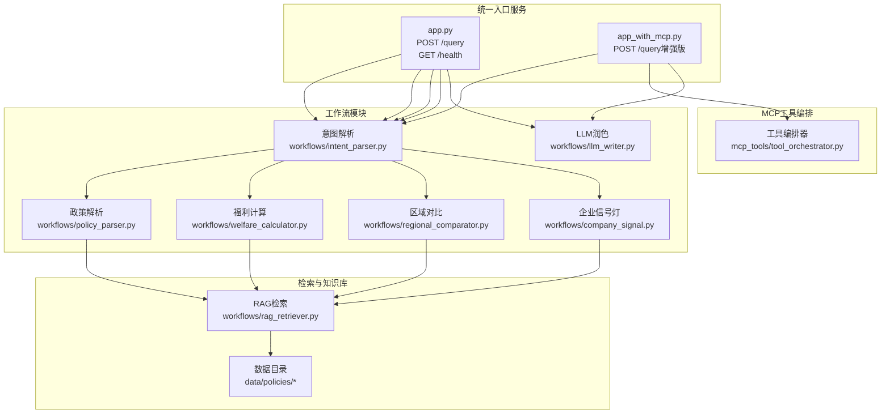
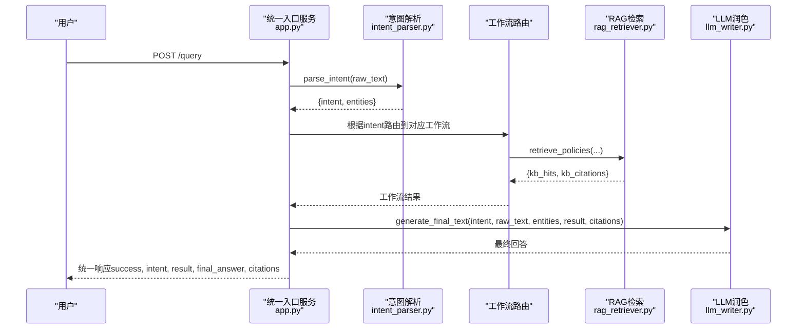
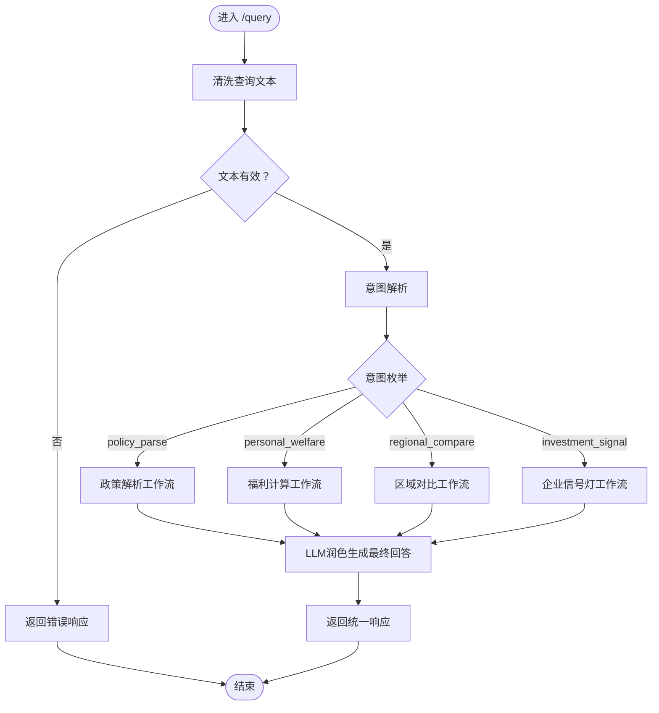
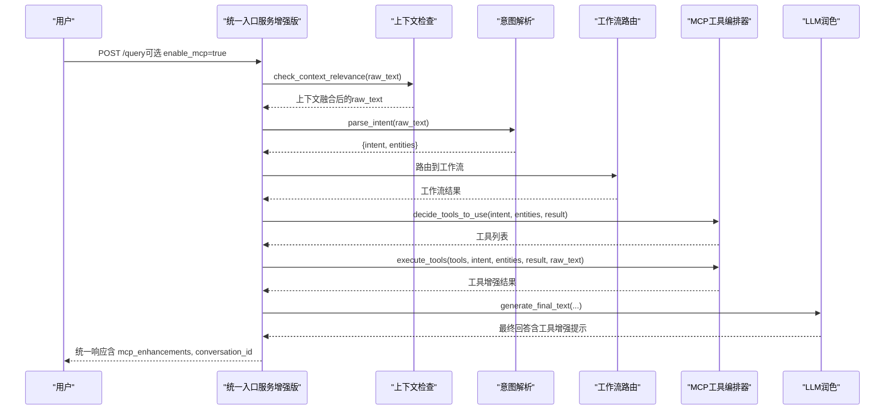
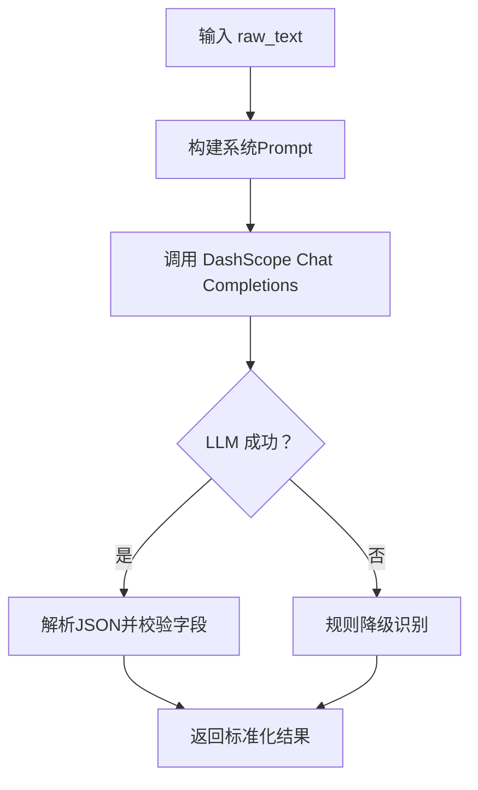
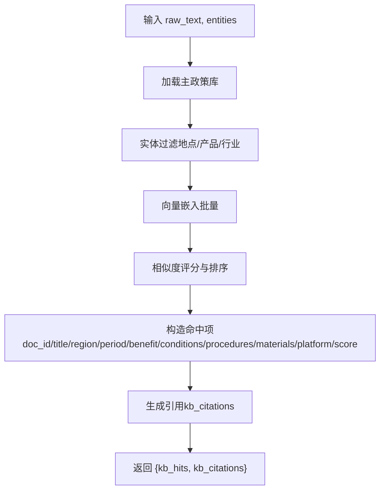
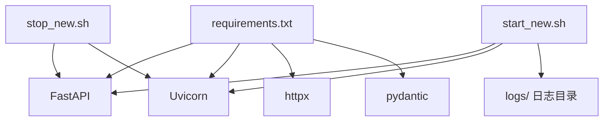

# 项目概述

<cite>
**本文引用的文件**
- [PPT架构.md](file://PPT架构.md)
- [新架构说明.md](file://新架构说明.md)
- [泉策通开发文档.md](file://泉策通开发文档.md)
- [app.py](file://app.py)
- [app_with_mcp.py](file://app_with_mcp.py)
- [workflows/intent_parser.py](file://workflows/intent_parser.py)
- [workflows/policy_parser.py](file://workflows/policy_parser.py)
- [workflows/welfare_calculator.py](file://workflows/welfare_calculator.py)
- [workflows/rag_retriever.py](file://workflows/rag_retriever.py)
- [workflows/llm_writer.py](file://workflows/llm_writer.py)
- [mcp_tools/tool_orchestrator.py](file://mcp_tools/tool_orchestrator.py)
- [requirements.txt](file://requirements.txt)
- [start_new.sh](file://start_new.sh)
- [stop_new.sh](file://stop_new.sh)
- [data/policies/policy_descriptions.md](file://data/policies/policy_descriptions.md)
</cite>

## 目录
1. [引言](#引言)
2. [项目结构](#项目结构)
3. [核心组件](#核心组件)
4. [架构总览](#架构总览)
5. [详细组件分析](#详细组件分析)
6. [依赖关系分析](#依赖关系分析)
7. [性能考量](#性能考量)
8. [故障排查指南](#故障排查指南)
9. [结论](#结论)
10. [附录](#附录)

## 引言
《泉策通》是一个面向城市消费政策的AI智能体系统，定位为“基于AI的城市消费政策智能解析与投资洞察系统”。其核心愿景是让政策“看得见、算得清、拿得到”，并通过“一核四擎双知识库”实现从市民福利计算到企业投资信号分析的双向赋能闭环。系统以模块化工作流为核心，结合统一入口服务与MCP工具编排，提供从意图解析、工作流路由、RAG检索、结果处理到LLM润色的完整数据流，支撑C端（市民）与B/G端（企业与政府）的协同价值创造。

## 项目结构
项目采用“统一入口服务 + 模块化工作流 + MCP工具编排”的组织方式：
- 统一入口服务：提供单一端口与统一接口，负责意图解析、工作流路由与最终回答生成。
- 工作流模块：按意图划分，分别处理政策解析、个人福利计算、区域对比与企业信号灯。
- MCP工具编排：在增强版服务中引入，按需调用图表、地图、抓取与上下文管理工具，提升可视化与交互体验。
- 数据与知识库：政策主库与补充政策文档统一存放于data目录，便于检索与维护。

**图表来源**
- [app.py](file://app.py#L37-L110)
- [app_with_mcp.py](file://app_with_mcp.py#L47-L170)
- [workflows/intent_parser.py](file://workflows/intent_parser.py#L16-L120)
- [workflows/policy_parser.py](file://workflows/policy_parser.py#L6-L83)
- [workflows/welfare_calculator.py](file://workflows/welfare_calculator.py#L7-L123)
- [workflows/rag_retriever.py](file://workflows/rag_retriever.py#L215-L327)
- [workflows/llm_writer.py](file://workflows/llm_writer.py#L15-L145)
- [mcp_tools/tool_orchestrator.py](file://mcp_tools/tool_orchestrator.py#L23-L155)
- [data/policies/policy_descriptions.md](file://data/policies/policy_descriptions.md#L1-L23)

**章节来源**
- [PPT架构.md](file://PPT架构.md#L60-L80)
- [新架构说明.md](file://新架构说明.md#L1-L80)
- [泉策通开发文档.md](file://泉策通开发文档.md#L1-L45)

## 核心组件
- 统一入口服务（FastAPI）
  - 提供单一端口与统一接口，负责意图解析、工作流路由与最终回答生成。
  - 增强版服务支持MCP工具编排，按需生成图表、地图、抓取实时政策并管理上下文。
- 意图解析引擎（LLM驱动）
  - 识别用户查询的意图与实体，输出标准化结构，支持降级规则识别。
- RAG检索模块
  - 统一加载主政策库与补充政策文档，执行实体过滤、向量召回与排序，输出命中结果与引用。
- 工作流引擎
  - 政策解析、个人福利计算、区域对比、企业信号灯四类工作流，分别产出结构化结果。
- LLM润色引擎
  - 基于结构化结果生成用户可读的最终回答，并附加引用来源。
- MCP工具编排器
  - 按意图与结果自动决策工具使用，执行图表生成、地图可视化、实时抓取与上下文管理。

**章节来源**
- [app.py](file://app.py#L37-L110)
- [app_with_mcp.py](file://app_with_mcp.py#L47-L170)
- [workflows/intent_parser.py](file://workflows/intent_parser.py#L16-L120)
- [workflows/rag_retriever.py](file://workflows/rag_retriever.py#L215-L327)
- [workflows/policy_parser.py](file://workflows/policy_parser.py#L6-L83)
- [workflows/welfare_calculator.py](file://workflows/welfare_calculator.py#L7-L123)
- [workflows/llm_writer.py](file://workflows/llm_writer.py#L15-L145)
- [mcp_tools/tool_orchestrator.py](file://mcp_tools/tool_orchestrator.py#L23-L155)

## 架构总览
系统从旧架构（多服务、多端口）演进到新架构（单服务、单端口、模块化函数调用），核心变化包括：
- 统一入口服务：单一服务与端口，内部完成全部工作流调用。
- 意图识别升级：由关键词匹配升级为大模型驱动的严格JSON输出。
- 数据整理：统一放置于data/目录，便于管理与扩展。
- 工作流模块化：以函数调用替代HTTP服务间调用，扁平化输出，简化部署与维护。
- MCP工具编排：在增强版服务中引入，按需调用工具，提升可视化与交互体验。

**图表来源**
- [app.py](file://app.py#L37-L110)
- [workflows/intent_parser.py](file://workflows/intent_parser.py#L16-L120)
- [workflows/rag_retriever.py](file://workflows/rag_retriever.py#L215-L327)
- [workflows/llm_writer.py](file://workflows/llm_writer.py#L15-L145)

**章节来源**
- [新架构说明.md](file://新架构说明.md#L1-L80)
- [PPT架构.md](file://PPT架构.md#L60-L80)
- [泉策通开发文档.md](file://泉策通开发文档.md#L1-L45)

## 详细组件分析

### 统一入口服务（app.py）
- 职责
  - 接收统一查询请求，执行意图解析、工作流路由与最终回答生成。
  - 提供健康检查与根路径信息。
- 关键流程
  - 输入校验与清理。
  - 调用意图解析模块，提取意图与实体。
  - 根据意图路由到对应工作流（政策解析、个人福利、区域对比、企业信号灯）。
  - 调用LLM润色生成最终回答，并返回统一响应结构。
- 错误处理
  - 捕获HTTP异常与通用异常，返回统一错误结构，便于前端与平台处理。

**图表来源**
- [app.py](file://app.py#L37-L110)

**章节来源**
- [app.py](file://app.py#L37-L110)

### 统一入口服务（增强版 app_with_mcp.py）
- 在统一入口服务基础上，增加MCP工具编排能力：
  - 上下文检查与融合，支持多轮对话。
  - 自动决策工具使用（图表、地图、抓取、上下文）。
  - 将工具增强结果融入最终回答，并可保存对话历史。
- 适合需要更强可视化与交互体验的场景。

**图表来源**
- [app_with_mcp.py](file://app_with_mcp.py#L47-L170)
- [mcp_tools/tool_orchestrator.py](file://mcp_tools/tool_orchestrator.py#L23-L155)

**章节来源**
- [app_with_mcp.py](file://app_with_mcp.py#L47-L170)
- [mcp_tools/tool_orchestrator.py](file://mcp_tools/tool_orchestrator.py#L23-L155)

### 意图解析引擎（workflows/intent_parser.py）
- 职责
  - 使用大模型进行意图识别与实体抽取，输出标准化JSON。
  - 若LLM失败，降级为规则识别，保障稳定性。
- 输出字段
  - 意图枚举（policy_parse、personal_welfare、regional_compare、investment_signal）。
  - 实体（地点、产品、公司、行业、时间、价格、能效等级等）。
- 降级策略
  - 基于关键词与正则规则提取意图与实体，确保系统可用性。

**图表来源**
- [workflows/intent_parser.py](file://workflows/intent_parser.py#L16-L120)

**章节来源**
- [workflows/intent_parser.py](file://workflows/intent_parser.py#L16-L120)

### RAG检索模块（workflows/rag_retriever.py）
- 职责
  - 加载主政策库与补充政策文档，执行实体过滤、向量召回与排序。
  - 输出命中结果与引用（kb_hits、kb_citations）。
- 数据来源
  - 主政策库：policies.jsonl（JSONL格式）。
  - 补充政策：按行业分类的Markdown文档。
- 过滤与召回
  - 结构化过滤（地点、产品、行业）。
  - 向量嵌入与余弦相似度评分，Top-K排序。
  - 引用来源统一拼接，去重合并。

**图表来源**
- [workflows/rag_retriever.py](file://workflows/rag_retriever.py#L215-L327)
- [data/policies/policy_descriptions.md](file://data/policies/policy_descriptions.md#L1-L23)

**章节来源**
- [workflows/rag_retriever.py](file://workflows/rag_retriever.py#L215-L327)
- [data/policies/policy_descriptions.md](file://data/policies/policy_descriptions.md#L1-L23)

### 政策解析工作流（workflows/policy_parser.py）
- 职责
  - 调用RAG检索，提取政策标题、福利类型、金额、适用地区、有效期、条件、流程、材料、申领平台等。
  - 保留所有命中结果供LLM参考。
- 输出
  - 结构化政策卡片字段与引用。

**章节来源**
- [workflows/policy_parser.py](file://workflows/policy_parser.py#L6-L83)

### 个人福利计算工作流（workflows/welfare_calculator.py）
- 职责
  - 基于RAG命中政策与用户输入的价格等信息，计算可领金额与明细。
  - 输出补贴金额、明细、约束条件、所需材料、申领平台与引用。
- 注意
  - 当缺少价格信息或未命中政策时，返回明确错误提示。

**章节来源**
- [workflows/welfare_calculator.py](file://workflows/welfare_calculator.py#L7-L123)

### LLM润色引擎（workflows/llm_writer.py）
- 职责
  - 根据不同意图模板，将结构化结果转为用户可读的自然语言回答。
  - 附加引用来源，确保可追溯性。
- 降级策略
  - 若LLM调用失败，直接返回结构化数据，保障可用性。

**章节来源**
- [workflows/llm_writer.py](file://workflows/llm_writer.py#L15-L145)

### MCP工具编排器（mcp_tools/tool_orchestrator.py）
- 职责
  - 决策是否需要MCP工具（图表、地图、抓取、上下文）。
  - 执行工具并返回增强结果，融入最终回答。
- 工具能力
  - QuickChart：对比图、柱状图、流程图。
  - Amap：产业分布地图。
  - Fetch：实时政策抓取。
  - Context7：上下文对话管理。
- 降级策略
  - 若LLM决策失败，采用规则降级，按意图与结果类型选择工具。

**章节来源**
- [mcp_tools/tool_orchestrator.py](file://mcp_tools/tool_orchestrator.py#L23-L155)

## 依赖关系分析
- 技术栈
  - Web框架：FastAPI
  - 大模型：DashScope（Chat Completions 与 Embeddings）
  - 数据格式：JSONL（政策/企业）+ Markdown（补充政策）
- 依赖文件
  - requirements.txt：定义核心依赖（FastAPI、Uvicorn、httpx、pydantic等）。
- 启停脚本
  - start_new.sh：安装依赖、创建日志目录、后台启动服务。
  - stop_new.sh：通过PID或进程名停止服务。

**图表来源**
- [requirements.txt](file://requirements.txt#L1-L7)
- [start_new.sh](file://start_new.sh#L1-L35)
- [stop_new.sh](file://stop_new.sh#L1-L36)

**章节来源**
- [requirements.txt](file://requirements.txt#L1-L7)
- [start_new.sh](file://start_new.sh#L1-L35)
- [stop_new.sh](file://stop_new.sh#L1-L36)

## 性能考量
- 部署简化
  - 单服务、单端口，减少运维复杂度与资源占用。
- 延迟降低
  - 函数内部调用替代HTTP请求，减少网络往返与序列化开销。
- 可维护性
  - 统一代码库与模块化设计，便于版本演进与问题定位。
- 检索效率
  - 结构化过滤先行，再进行向量召回与排序，兼顾召回精度与性能。
- LLM调用
  - 严格JSON输出与降级策略，提高稳定性与可预期性。

[本节为一般性讨论，无需具体文件分析]

## 故障排查指南
- 健康检查
  - 访问 GET /health，确认服务状态与版本。
- 常见错误
  - 查询内容为空：返回错误响应，检查客户端请求。
  - 未知意图：检查意图解析模块输出，确认LLM或规则识别是否正常。
  - RAG未命中：检查实体过滤条件与数据目录是否存在。
  - LLM调用失败：检查DashScope配置与网络连通性。
- 日志与定位
  - 查看 logs/app.log，定位异常堆栈与错误详情。
- 停止服务
  - 使用 stop_new.sh 或手动查找并终止进程。

**章节来源**
- [app.py](file://app.py#L130-L138)
- [app_with_mcp.py](file://app_with_mcp.py#L190-L199)
- [start_new.sh](file://start_new.sh#L21-L31)
- [stop_new.sh](file://stop_new.sh#L8-L33)

## 结论
《泉策通》通过“一核四擎双知识库”架构，将政策理解、解析、计算与洞察整合为统一的智能体服务。新架构以单服务、单端口与模块化函数调用为核心，显著简化部署、降低延迟并提升维护性。配合MCP工具编排，系统在C端提供“看得见、算得清、拿得到”的政策服务，在B/G端提供“可量化、可追踪”的投资信号与策略建议，助力城市政策运营力的提升。

[本节为总结性内容，无需具体文件分析]

## 附录
- 数据目录结构
  - data/policies/policies.jsonl：主政策库（JSONL）。
  - data/policies/policy_descriptions.md：政策描述与字段说明。
  - data/policies/<行业>/：补充政策（Markdown）。
- 接口与示例
  - POST /query：统一查询接口。
  - GET /health：健康检查。
- 启停脚本
  - start_new.sh：启动服务。
  - stop_new.sh：停止服务。

**章节来源**
- [data/policies/policy_descriptions.md](file://data/policies/policy_descriptions.md#L1-L23)
- [新架构说明.md](file://新架构说明.md#L81-L149)
- [start_new.sh](file://start_new.sh#L1-L35)
- [stop_new.sh](file://stop_new.sh#L1-L36)