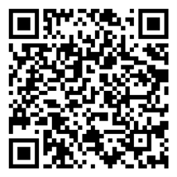

# 济南市2025年下半年第一轮汽车消费补贴活动公告

## 一、活动时间

- **购车时间：** 2025年7月1日0时至2025年7月31日24时
  - *（以参与活动的汽车销售企业开具的《机动车销售统一发票》时间为准）*
- **补贴资料申报及修改时间：** 2025年7月10日10时至2025年8月5日24时

> 参加本次活动的个人消费者和企业（单位）须在规定时间之内完成补贴资料申报及修改。

## 二、活动范围

活动期限内，在济南市参加活动的车企购置**非营运乘用车新车**的：
- **个人**（限购1辆）
- **企业（单位）**（行政、事业单位除外，限购3辆）

**不限户籍和上牌地区。**

## 三、补贴金额与标准

本次活动资金补贴额度共计 **1200万元**，**先到先得，申领额度用完即止**。

以下补贴标准所参照的发票金额以《机动车销售统一发票》上所载**不含税价**为准，不含车辆装潢、挂牌等其他费用。

| 购车发票金额（不含税价）     | 汽车消费礼包总额 | 加油储值卡（价值）   | 新车商业保险补贴 |
| :--------------------------- | :--------------- | :------------------- | :--------------- |
| 10万元（不含）以下           | 1900元           | 1000元（价值1100元） | 800元            |
| 10万元（含）至15万元（不含） | 3200元           | 2000元（价值2200元） | 1000元           |
| 15万元（含）至25万元（不含） | 4800元           | 3000元（价值3300元） | 1500元           |
| 25万元（含）至40万元（不含） | 6400元           | 4000元（价值4400元） | 2000元           |
| 40万元（含）以上             | 8500元           | 5000元（价值5500元） | 3000元           |

## 四、申领程序

### （一）申领方式
申请人在完成车辆上牌，取得《机动车登记证书》和《机动车行驶证》后，即可通过以下方式申领：

**方式一：扫描活动二维码进行申领。**
***

**方式二：登录“工银e生活”APP**
**具体路径：** “首页” -> “济南特惠”专区 -> “汽车消费补贴”。

### （二）补贴申报资料
需在线提交以下资料的清晰原件照片/电子件：
1.  **身份证明：**
    - 个人：购车人**身份证**原件正反面照片。
    - 企业（单位）：**营业执照**（或民办非企业登记证）照片。
2.  所购车辆的《**机动车销售统一发票**》原件照片（须为活动期内首次开具的“发票联”）。
3.  所购车辆《**机动车登记证书**》原件第1、2页照片。
4.  **收款账户：**
    - 个人：购车人**银行卡**正反面照片。
    - 企业（单位）：**银行对公账户**信息。
5.  **机动车商业保险保险单**（电子保单，保单生效日期须在活动期内，保障期限为1年）。
6.  可正常接收短信的**手机号码**。

> **请确保所有图片资料清晰、完整，并旋转至正常可视角度。**

### （三）补贴审核
- **审核流程：** 系统初审 -> 第三方机构复审。按提交顺序审核。
- **进度查询：** 申领人需及时登录平台查看审核进度。
- **资料修改：** 因资料问题被退回的，**5日之内**未完成修改，或经**3次**修改后仍不合格，视为审核未通过。

### （四）补贴发放流程
1.  **公示：** 审核通过名单将在济南市商务局官网公示（5个工作日）。
2.  **发放：**
    - **保险补贴：** 公示无异议后，发放至个人银行卡或企业对公账户。
    - **加油储值卡：** 个人/企业可自行前往**中石油**或**中石化**领取，有效期为 **90天**（具体规则以油企发布为准）。

## 五、注意事项

1.  **信息一致性：** 确保发票、行驶证、登记证书、银行卡（账户）所有人信息与机动车所有人（单位）一致。
2.  **真实性责任：** 申领人须对资料真实性负责，对骗取财政补贴的，将取消资格，追缴资金，并追究法律责任。
3.  **销售企业责任：** 汽车销售企业严禁协助骗取补贴，违者将取消所涉车辆资格并追究责任。
4.  **活动监督：** 如因恶意套取补贴导致财政资金风险，主办方有权**提前终止活动**。

## 六、客服咨询热线

本次活动提供 **7×24小时** 专业客服：
- **中国工商银行客服：** `95588`
- **中石油客服：** `956100`
- **中石化客服：** `95105888`、`95105988`

> 后续活动开展时间以 **济南市商务局官网** 或 “**商务济南**” 公众号通知为准。

---
**活动解释权归济南市商务局所有。**

*